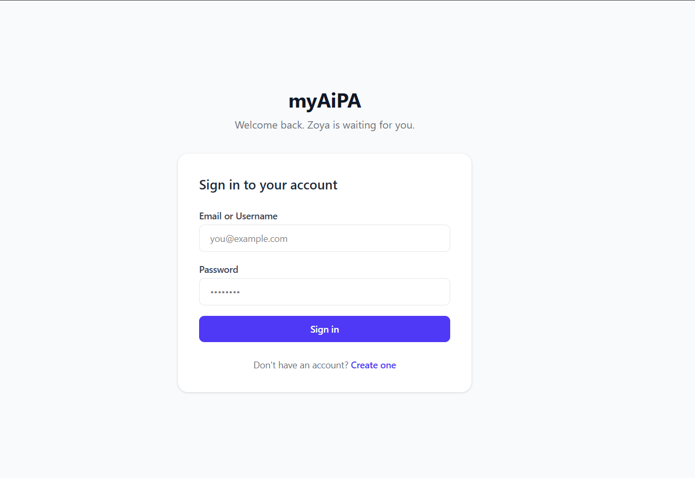
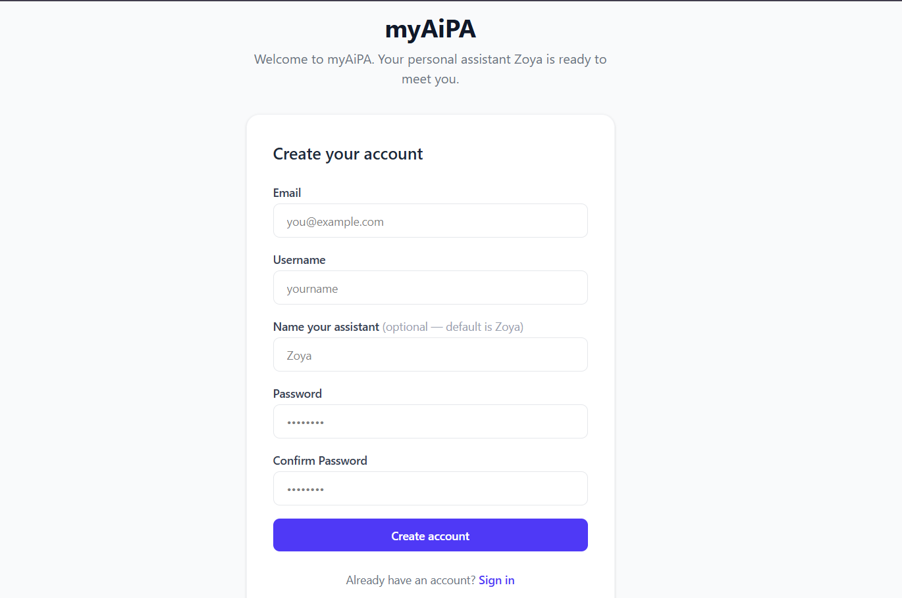
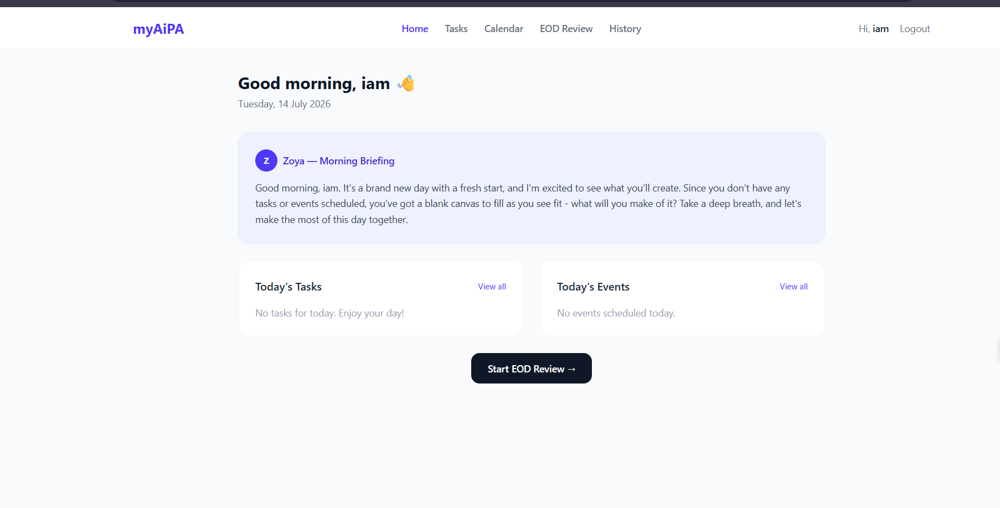
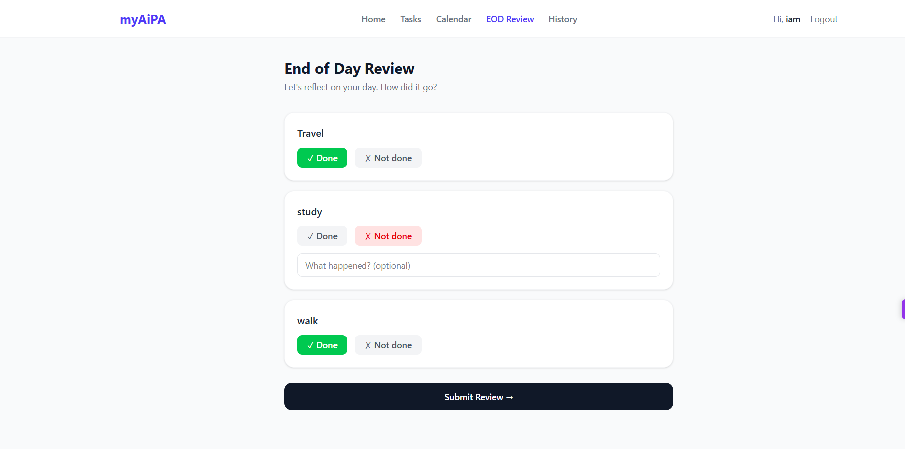
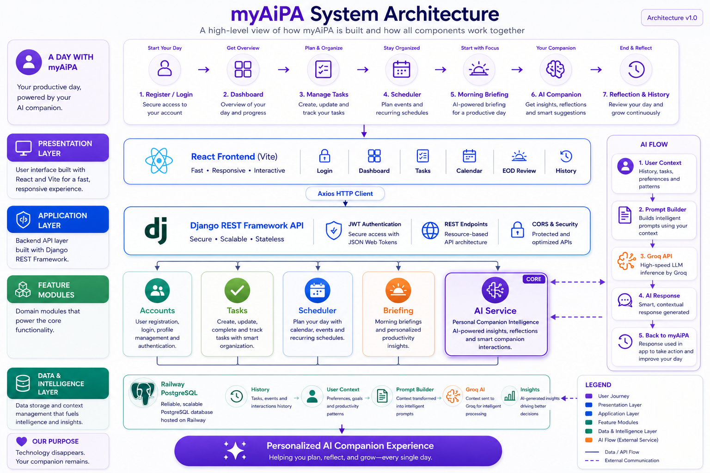
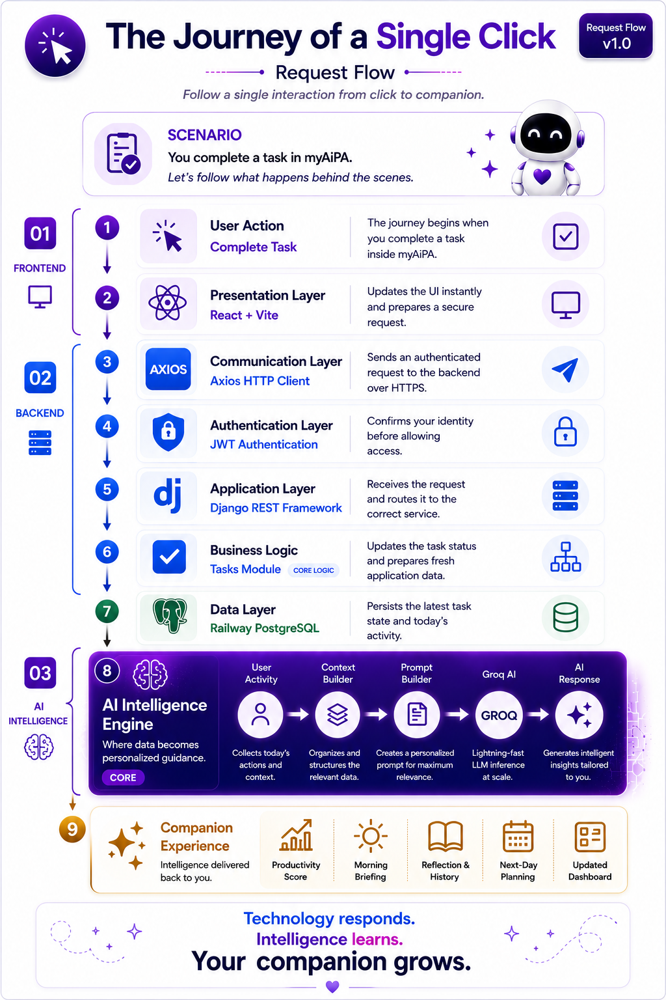
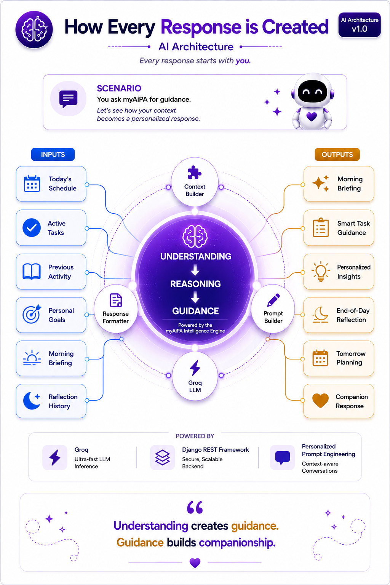

<p align="center">
  
</p>

<h1 align="center">myAiPA</h1>

<h3 align="center">
Your Digital Personal Assistant.
</h3>

<p align="center">
Helping people spend less time managing life<br>
and more time living it.
</p>

<p align="center">
<i>"The future of personal assistance should belong to everyone."</i>
</p>

---

<p align="center">

Building a future where every individual has access to the guidance,
organization, and support of a world-class personal assistant.

<b>Starting there. Growing far beyond it.</b>

</p>


# 📚 Documentation Navigation

> Quickly navigate through every section of the **myAiPA** documentation.

<details>
<summary><strong>📖 Click to Expand Complete Documentation</strong></summary>

<br>

## 🌍 Product Vision

- [1. The Future We Believe In](#1-the-future-we-believe-in)

- [2. Why myAiPA Exists](#2-why-myaipa-exists)

- [3. Vision](#3-vision)

- [4. Mission](#4-mission)

- [5. Product Philosophy](#5-product-philosophy)

- [6. What is myAiPA?](#6-what-is-myaipa)

---

## ✨ Product Features

- [7. What myAiPA Can Do](#7-what-is-myaipa-can-do)

  - [7.1 Morning Greetings](#71-morning-greetings)

  - [7.2 Morning Briefings](#72-morning-briefings)

  - [7.3 Task Management](#73-task-management)

  - [7.4 Smart Scheduling](#74-smart-scheduling)

  - [7.5 End of Day Review](#75-end-of-day-review)

  - [7.6 Productivity Score](#76-productivity-score)

  - [7.7 Next Day Planning](#77-next-day-planning)

  - [7.8 History](#78-history)

---

## 🖼 Product Showcase

- [8. Product Showcase](#8-product-showcase)

  - [8.1 Welcome](#81-welcome)

  - [8.2 Authentication](#82-authentication)

    - [Login](#login)

    - [Register](#register)

  - [8.3 Dashboard](#83-dashboard)

  - [8.4 Morning Greetings](#84-morning-greetings)

  - [8.5 Morning Briefings](#85-morning-briefings)

  - [8.6 Tasks](#86-tasks)

  - [8.7 Scheduler](#87-scheduler)

  - [8.8 End of Day Review](#88-end-of-day-review)

  - [8.9 Productivity Score](#89-productivity-score)

  - [8.10 Next Day Planning](#810-next-day-planning)

  - [8.11 History](#811-history)

---

## 🏗 Technology & Architecture

- [9. Technology Stack](#9-technology-stack)

  - [9.1 Overview](#91-overview)

  - [9.2 Frontend](#92-frontend)

  - [9.3 Backend](#93-backend)

  - [9.4 Database](#94-database)

  - [9.5 AI](#95-ai)

  - [9.6 Authentication](#96-authentication)

  - [9.7 Deployment](#97-deployment)

  - [9.8 Development Tools](#98-development-tools)

  - [9.9 Why These Technologies](#99-why-these-technologies)

  - [9.10 Final Thoughts](#910-final-thoughts)

---

- [10. System Architecture](#10-system-architecture)

  - [10.1 Design Principles](#101-design-principles)

  - [10.2 System Overview](#102-system-overview)

  - [10.3 Understanding the Architecture](#103-understanding-the-architecture)

    - [10.3.1 Experience Layer](#1031-experience-layer)

    - [10.3.2 Application Layer](#1032-application-layer)

    - [10.3.3 Data Layer](#1033-data-layer)

    - [10.3.4 Intelligence Layer](#1034-intelligence-layer)

  - [10.4 Request Lifecycle](#104-request-lifecycle)

  - [10.5 Following a Request](#105-following-a-request)

    - [10.5.1 User Interaction](#1051-user-interaction)

    - [10.5.2 Request Processing](#1052-request-processing)

    - [10.5.3 Context & Intelligence](#1053-context--intelligence)

    - [10.5.4 Response Delivery](#1054-response-delivery)

  - [10.6 Architectural Decisions](#106-architectural-decisions)

  - [10.7 Key Takeaways](#107-key-takeaways)

---

## 🏛 Project Architecture

- [11. Project Structure](#11-project-structure)

  - [11.1 Behind the Scenes of myAiPA](#111-behind-the-scenes-of-myaipa)

  - [11.2 Complete Repository Structure](#112-complete-repository-structure)

  - [11.3 Repository Organization Philosophy](#113-repository-organization-philosophy)

---

### 🔧 Backend Architecture

- [11.4 Backend Architecture](#114-backend-architecture)

  - [11.4.1 Accounts](#1141-accounts)

  - [11.4.2 Tasks](#1142-tasks)

  - [11.4.3 Scheduler](#1143-scheduler)

  - [11.4.4 Briefing](#1144-briefing)

  - [11.4.5 AI Service](#1145-ai-service)

  - [11.4.6 Core](#1146-core)

---

### 🎨 Frontend Architecture

- [11.5 Frontend Architecture](#115-frontend-architecture)

  - [11.5.1 Pages](#1151-pages)

  - [11.5.2 Components](#1152-components)

  - [11.5.3 Context API](#1153-context-api)

  - [11.5.4 API Layer](#1154-api-layer)

  - [11.5.5 Routing](#1155-routing)

  - [11.5.6 Styling](#1156-styling)

  - [11.5.7 Frontend Design Philosophy](#1157-frontend-design-philosophy)

  - [11.5.8 Frontend Request Flow](#1158-frontend-request-flow)

  - [11.5.9 API Communication Flow](#1159-api-communication-flow)

  - [11.5.10 Authentication Flow](#11510-authentication-flow)

  - [11.5.11 Protected Routes](#11511-protected-routes)

  - [11.5.12 Authentication Architecture](#11512-authentication-architecture)

  - [11.5.13 Why JWT?](#11513-why-jwt)

---

### 🤖 AI Processing

- [11.6 AI Processing Flow](#116-ai-processing-flow)

  - [11.6.1 Morning Briefing](#1161-morning-briefing)

  - [11.6.2 End of Day Reflection](#1162-end-of-day-reflection)

  - [11.6.3 Next Day Planning](#1163-next-day-planning)

  - [11.6.4 Why the AI Lives Inside the Backend](#1164-why-the-ai-lives-inside-the-backend)

---

### 🗄 Database Architecture

- [11.7 Database Architecture](#117-database-architecture)

  - [11.7.1 User](#1171-user)

  - [11.7.2 Tasks](#1172-tasks)

  - [11.7.3 Events](#1173-events)

  - [11.7.4 Daily Logs](#1174-daily-logs)

  - [11.7.5 Relationships](#1175-relationships)

  - [11.7.6 Why This Design?](#1176-why-this-design)

---

### ☁ Deployment Architecture

- [11.8 Deployment Architecture](#118-deployment-architecture)

  - [11.8.1 Frontend Deployment](#1181-frontend-deployment)

  - [11.8.2 Backend Deployment](#1182-backend-deployment)

  - [11.8.3 Database](#1183-database)

  - [11.8.4 AI Infrastructure](#1184-ai-infrastructure)

  - [11.8.5 Production Configuration](#1185-production-configuration)

  - [11.8.6 Why This Architecture?](#1186-why-this-architecture)

---

### 🔄 Complete Request Lifecycle

- [11.9 Complete End-to-End Request Lifecycle](#119-complete-end-to-end-request-lifecycle)

  - [11.9.1 A Single Architecture for Every Feature](#1191-a-single-architecture-for-every-feature)

  - [11.9.2 Separation of Responsibilities](#1192-separation-of-responsibilities)

  - [11.9.3 Architectural Philosophy](#1193-architectural-philosophy)

  - [11.9.4 Looking Ahead](#1194-looking-ahead)

---

## ⚙️ Development & Setup

- [12. Getting Started](#12-getting-started)

  - [12.1 Welcome to myAiPA](#121-welcome-to-myaipa)

  - [12.2 What You'll Have at the End](#122-what-youll-have-at-the-end)

  - [12.3 Before You Begin](#123-before-you-begin)

    - [12.3.1 Required Software](#1231-required-software)

    - [12.3.2 Required Service](#1232-required-service)

    - [12.3.3 Recommended Knowledge](#1233-recommended-knowledge)

    - [12.3.4 Supported Platforms](#1234-supported-platforms)

  - [12.4 Clone the Repository](#124-clone-the-repository)

  - [12.5 Understanding the Repository](#125-understanding-the-repository)

  - [12.6 Setting Up the Backend](#126-setting-up-the-backend)

    - [Step 1 — Create Virtual Environment](#step-1--create-virtual-environment)

    - [Step 2 — Activate Virtual Environment](#step-2--activate-virtual-environment)

    - [Step 3 — Install Dependencies](#step-3--install-dependencies)

    - [Step 4 — Configure Environment](#step-4--configure-environment)

    - [Step 5 — Apply Migrations](#step-5--apply-migrations)

    - [Step 6 — Create Superuser (Optional)](#step-6--create-superuser-optional)

    - [Step 7 — Start Backend Server](#step-7--start-backend-server)

  - [12.7 Setting Up the Frontend](#127-setting-up-the-frontend)

    - [Step 1 — Install Dependencies](#step-1--install-dependencies-1)

    - [Step 2 — Start Frontend](#step-2--start-frontend)

  - [12.8 Launching myAiPA](#128-launching-myaipa)

  - [12.9 Verify Your Installation](#129-verify-your-installation)

  - [12.10 Your First Experience](#1210-your-first-experience)

  - [12.11 Common Issues & Solutions](#1211-common-issues--solutions)

  - [12.12 Where to Go Next](#1212-where-to-go-next)

  - [12.13 Thank You](#1213-thank-you)

---

## 🔌 API Reference & Integration Guide

- [13. API Reference & Integration Guide](#13-api-reference--integration-guide)

  - [13.1 The Communication Layer Behind myAiPA](#131-the-communication-layer-behind-myaipa)

  - [13.2 API Architecture Overview](#132-api-architecture-overview)

---

### 🏛 API Design

- [13.3 API Design Philosophy](#133-api-design-philosophy)

  - [13.3.1 RESTful by Design](#1331-restful-by-design)

  - [13.3.2 Domain-Driven Organization](#1332-domain-driven-organization)

  - [13.3.3 Stateless Communication](#1333-stateless-communication)

  - [13.3.4 JSON-First Communication](#1334-json-first-communication)

  - [13.3.5 Predictable URL Structure](#1335-predictable-url-structure)

  - [13.3.6 Separation of Responsibilities](#1336-separation-of-responsibilities)

  - [13.3.7 Built for Growth](#1337-built-for-growth)

---

### 🌐 Base URLs

- [13.4 Base URLs](#134-base-urls)

  - [13.4.1 Local Development](#1341-local-development)

  - [13.4.2 Production](#1342-production)

  - [13.4.3 Consistent API Structure](#1343-consistent-api-structure)

---

### 🔐 Authentication

- [13.5 Authentication Model](#135-authentication-model)

  - [13.5.1 Why JWT?](#1351-why-jwt)

  - [13.5.2 Authentication Lifecycle](#1352-authentication-lifecycle)

  - [13.5.3 Authorization Header](#1353-authorization-header)

  - [13.5.4 Public vs Protected Endpoints](#1354-public-vs-protected-endpoints)

  - [13.5.5 Automatic Token Management](#1355-automatic-token-management)

  - [13.5.6 Security by Design](#1356-security-by-design)

---

### 📨 Requests & Responses

- [13.6 Request & Response Standards](#136-request--response-standards)

  - [13.6.1 Request Format](#1361-request-format)

  - [13.6.2 Response Format](#1362-response-format)

  - [13.6.3 Content Type](#1363-content-type)

  - [13.6.4 HTTP Methods](#1364-http-methods)

  - [13.6.5 Authentication](#1365-authentication)

  - [13.6.6 HTTP Status Codes](#1366-http-status-codes)

  - [13.6.7 Request Validation](#1367-request-validation)

  - [13.6.8 Consistency Across the Entire API](#1368-consistency-across-the-entire-api)

---

## 👤 Authentication API

- [13.7 Authentication API](#137-authentication-api)

  - [13.7.1 Module Responsibilities](#1371-module-responsibilities)

  - [13.7.2 Authentication Module Architecture](#1372-authentication-module-architecture)

  - [13.7.3 Authentication Workflow](#1373-authentication-workflow)

---

- [13.8 Register](#138-register)

  - [13.8.1 Purpose](#1381-purpose)

  - [13.8.2 Endpoint Information](#1382-endpoint-information)

  - [13.8.3 Request Body](#1383-request-body)

  - [13.8.4 Success Response](#1384-success-response)

  - [13.8.5 Validation Rules](#1385-validation-rules)

  - [13.8.6 Security Considerations](#1386-security-considerations)

  - [13.8.7 Internal Processing](#1387-internal-processing)

  - [13.8.8 Notes](#1388-notes)

---

- [13.9 Login](#139-login)

  - [13.9.1 Purpose](#1391-purpose)

  - [13.9.2 Endpoint Information](#1392-endpoint-information)

  - [13.9.3 Request Body](#1393-request-body)

  - [13.9.4 Success Response](#1394-success-response)

  - [13.9.5 Validation Rules](#1395-validation-rules)

  - [13.9.6 Security Considerations](#1396-security-considerations)

  - [13.9.7 Internal Processing](#1397-internal-processing)

  - [13.9.8 Notes](#1398-notes)

---

- [13.10 Token Refresh](#1310-token-refresh)

  - [13.10.1 Purpose](#13101-purpose)

  - [13.10.2 Endpoint Information](#13102-endpoint-information)

  - [13.10.3 Request Body](#13103-request-body)

  - [13.10.4 Success Response](#13104-success-response)

  - [13.10.5 Validation Rules](#13105-validation-rules)

  - [13.10.6 Security Considerations](#13106-security-considerations)

  - [13.10.7 Internal Processing](#13107-internal-processing)

  - [13.10.8 Notes](#13108-notes)

---

- [13.11 Logout](#1311-logout)

  - [13.11.1 Purpose](#13111-purpose)

  - [13.11.2 Endpoint Information](#13112-endpoint-information)

  - [13.11.3 Request Body](#13113-request-body)

  - [13.11.4 Success Response](#13114-success-response)

  - [13.11.5 Validation Rules](#13115-validation-rules)

  - [13.11.6 Security Considerations](#13116-security-considerations)

  - [13.11.7 Internal Processing](#13117-internal-processing)

  - [13.11.8 Notes](#13118-notes)

---

- [13.12 Get Current User (/me/)](#1312-get-current-user-me)

  - [13.12.1 Purpose](#13121-purpose)

  - [13.12.2 Endpoint Information](#13122-endpoint-information)

  - [13.12.3 Request Body](#13123-request-body)

  - [13.12.4 Example Request](#13124-example-request)

  - [13.12.5 Success Response](#13125-success-response)

  - [13.12.6 Response Explanation](#13126-response-explanation)

  - [13.12.7 Validation Rules](#13127-validation-rules)

  - [13.12.8 Security Considerations](#13128-security-considerations)

  - [13.12.9 Internal Processing](#13129-internal-processing)

  - [13.12.10 Notes](#131210-notes)

---

- [13.13 Update Profile](#1313-update-profile)

  - [13.13.1 Purpose](#13131-purpose)

  - [13.13.2 Endpoint Information](#13132-endpoint-information)

  - [13.13.3 Request Body](#13133-request-body)

  - [13.13.4 Example Request](#13134-example-request)

  - [13.13.5 Success Response](#13135-success-response)

  - [13.13.6 Response Explanation](#13136-response-explanation)

  - [13.13.7 Validation Rules](#13137-validation-rules)

  - [13.13.8 Security Considerations](#13138-security-considerations)

  - [13.13.9 Internal Processing](#13139-internal-processing)

  - [13.13.10 Notes](#131310-notes)

---

- [13.14 Change Password](#1314-change-password)

  - [13.14.1 Purpose](#13141-purpose)

  - [13.14.2 Endpoint Information](#13142-endpoint-information)

  - [13.14.3 Request Body](#13143-request-body)

  - [13.14.4 Example Request](#13144-example-request)

  - [13.14.5 Success Response](#13145-success-response)

  - [13.14.6 Response Explanation](#13146-response-explanation)

  - [13.14.7 Validation Rules](#13147-validation-rules)

  - [13.14.8 Security Considerations](#13148-security-considerations)

  - [13.14.9 Internal Processing](#13149-internal-processing)

  - [13.14.10 Notes](#131410-notes)

---

- [13.15 Password Reset Request](#1315-password-reset-request)

  - [13.15.1 Purpose](#13151-purpose)

  - [13.15.2 Endpoint Information](#13152-endpoint-information)

  - [13.15.3 Request Body](#13153-request-body)

  - [13.15.4 Example Request](#13154-example-request)

  - [13.15.5 Success Response](#13155-success-response)

  - [13.15.6 Response Explanation](#13156-response-explanation)

  - [13.15.7 Validation Rules](#13157-validation-rules)

  - [13.15.8 Security Considerations](#13158-security-considerations)

  - [13.15.9 Internal Processing](#13159-internal-processing)

  - [13.15.10 Notes](#131510-notes)

---

- [13.16 Password Reset Confirmation](#1316-password-reset-confirmation)

  - [13.16.1 Purpose](#13161-purpose)

  - [13.16.2 Endpoint Information](#13162-endpoint-information)

  - [13.16.3 Request Body](#13163-request-body)

  - [13.16.4 Example Request](#13164-example-request)

  - [13.16.5 Success Response](#13165-success-response)

  - [13.16.6 Response Explanation](#13166-response-explanation)

  - [13.16.7 Validation Rules](#13167-validation-rules)

  - [13.16.8 Security Considerations](#13168-security-considerations)

  - [13.16.9 Internal Processing](#13169-internal-processing)

  - [13.16.10 Notes](#131610-notes)

---

### 🔒 Authentication Security

- [13.17 Authentication Security Summary](#1317-authentication-security-summary)

  - [13.17.1 JWT-Based Authentication](#13171-jwt-based-authentication)

  - [13.17.2 Secure Password Storage](#13172-secure-password-storage)

  - [13.17.3 Strong Password Validation](#13173-strong-password-validation)

  - [13.17.4 Refresh Token Blacklisting](#13174-refresh-token-blacklisting)

  - [13.17.5 Rate Limiting](#13175-rate-limiting)

  - [13.17.6 Email Enumeration Protection](#13176-email-enumeration-protection)

  - [13.17.7 Timing Attack Protection](#13177-timing-attack-protection)

  - [13.17.8 Serializer-Based Validation](#13178-serializer-based-validation)

  - [13.17.9 User Data Isolation](#13179-user-data-isolation)

---

- [13.18 Authentication Module Summary](#1318-authentication-module-summary)

---

### ✅ Tasks API

- [13.19 Tasks API](#1319-tasks-api)

  - [13.19.1 Module Overview](#13191-module-overview)

  - [13.19.2 Get Tasks](#13192-get-tasks)

  - [13.19.3 Create Task](#13193-create-task)

  - [13.19.4 Get Single Task](#13194-get-single-task)

  - [13.19.5 Update Task](#13195-update-task)

  - [13.19.6 Delete Task](#13196-delete-task)

  - [13.19.7 Get Today's Tasks](#13197-get-todays-tasks)

  - [13.19.8 Update Task Status](#13198-update-task-status)

  - [13.19.9 Tasks Module Summary](#13199-tasks-module-summary)

---

### 📅 Scheduler API

- [13.20 Scheduler API](#1320-scheduler-api)

  - [13.20.1 Purpose](#13201-purpose)

  - [13.20.2 Module Overview](#13202-module-overview)

  - [13.20.3 Scheduler Module Architecture](#13203-scheduler-module-architecture)

  - [13.20.4 Get Events](#13204-get-events)

  - [13.20.5 Create Event](#13205-create-event)

  - [13.20.6 Get Single Event](#13206-get-single-event)

  - [13.20.7 Update Event](#13207-update-event)

  - [13.20.8 Delete Event](#13208-delete-event)

  - [13.20.9 Get Today's Events](#13209-get-todays-events)

  - [13.20.10 Scheduler Module Summary](#132010-scheduler-module-summary)

---

### 🌅 Briefing API

- [13.21 Briefing API](#1321-briefing-api)

  - [13.21.1 Purpose](#13211-purpose)

  - [13.21.2 Module Overview](#13212-module-overview)

  - [13.21.3 Get Morning Briefing](#13213-get-morning-briefing)

  - [13.21.4 Get EOD Tasks](#13214-get-eod-tasks)

  - [13.21.5 Submit EOD Review](#13215-submit-eod-review)

  - [13.21.6 Save Next-Day Plan](#13216-save-next-day-plan)

  - [13.21.7 Briefing History](#13217-briefing-history)

  - [13.21.8 Briefing Module Summary](#13218-briefing-module-summary)

---

### 🔄 Complete API Request Lifecycle

- [13.22 Complete API Request Lifecycle](#1322-complete-api-request-lifecycle)

  - [13.22.1 High-Level Request Flow](#13221-high-level-request-flow)

  - [13.22.2 Complete Request Lifecycle](#13222-complete-request-lifecycle)

  - [13.22.3 Putting Everything Together](#13223-putting-everything-together)

  - [13.22.4 Request Lifecycle Summary](#13224-request-lifecycle-summary)

---

### ⚠️ Error Handling

- [13.23 Error Handling](#1323-error-handling)

  - [13.23.1 Purpose](#13231-purpose)

  - [13.23.2 Error Handling Philosophy](#13232-error-handling-philosophy)

  - [13.23.3 Error Handling Flow](#13233-error-handling-flow)

  - [13.23.4 Standard Error Response Format](#13234-standard-error-response-format)

  - [13.23.5 Example Validation Error Response](#13235-example-validation-error-response)

  - [13.23.6 Example Business Logic Error Response](#13236-example-business-logic-error-response)

  - [13.23.7 Response Design Principles](#13237-response-design-principles)

  - [13.23.8 HTTP Status Codes](#13238-http-status-codes)

  - [13.23.9 Validation Errors](#13239-validation-errors)

  - [13.23.10 Database Integrity & Transaction Safety](#132310-database-integrity--transaction-safety)

  - [13.23.11 AI Service Error Isolation](#132311-ai-service-error-isolation)

  - [13.23.12 Error Handling Summary](#132312-error-handling-summary)

---

### 🧪 Testing Philosophy

- [13.24 Testing Philosophy](#1324-testing-philosophy)

  - [13.24.1 Testing Workflow](#13241-testing-workflow)

  - [13.24.2 What Was Tested](#13242-what-was-tested)

  - [13.24.3 Error & Edge Case Testing](#13243-error--edge-case-testing)

  - [13.24.4 Testing Environment](#13244-testing-environment)

  - [13.24.5 Testing Summary](#13245-testing-summary)

---

### 📘 API Summary

- [13.25 API Summary](#1325-api-summary)

  - [13.25.1 Purpose](#13251-purpose)

  - [13.25.2 Core Design Principles](#13252-core-design-principles)

  - [13.25.3 Engineering Highlights](#13253-engineering-highlights)

  - [13.25.4 Overall Backend Architecture](#13254-overall-backend-architecture)

  - [13.25.5 Closing Thoughts](#13255-closing-thoughts)

---

### 🌍 Environment Variables

- [14. Environment Variables](#14-environment-variables)

  - [14.1 Backend Environment Variables](#141-backend-environment-variables)

  - [14.2 Example Backend .env](#142-example-backend-env)

  - [14.3 Frontend Environment Variables](#143-frontend-environment-variables)

  - [14.4 Example Frontend .env](#144-example-frontend-env)

  - [14.5 Configuration Notes](#145-configuration-notes)

  - [14.6 Summary](#146-summary)

---

### 🤖 AI Architecture

- [15. AI Architecture](#15-ai-architecture)

  - [15.1 The Role of AI in myAiPA](#151-the-role-of-ai-in-myaipa)

  - [15.2 AI Architecture Overview](#152-ai-architecture-overview)

  - [15.3 How Every Response Is Created](#153-how-every-response-is-created)

  - [15.4 Context Engineering](#154-context-engineering)

    - [15.4.1 Morning Briefing Context](#1541-morning-briefing-context)

    - [15.4.2 End-of-Day Review Context](#1542-end-of-day-review-context)

    - [15.4.3 Tomorrow Planning Context](#1543-tomorrow-planning-context)

    - [15.4.4 Why This Design?](#1544-why-this-design)

    - [15.4.5 Section Summary](#1545-section-summary)

  - [15.5 Prompt & Personality Architecture](#155-prompt--personality-architecture)

    - [15.5.1 Personality Architecture](#1551-personality-architecture)

    - [15.5.2 Feature-Specific Prompt Templates](#1552-feature-specific-prompt-templates)

      - [Morning Briefing Prompt](#morning-briefing-prompt)

      - [End-of-Day Review Prompt](#end-of-day-review-prompt)

      - [Tomorrow Planning Prompt](#tomorrow-planning-prompt)

    - [15.5.3 Prompt Composition](#1553-prompt-composition)

      - [Assistant Personality](#assistant-personality)

      - [Feature-Specific Prompt Template](#feature-specific-prompt-template)

      - [Dynamic User Context](#dynamic-user-context)

    - [15.5.4 Why This Design?](#1554-why-this-design)

    - [15.5.5 Summary](#1555-summary)

  - [15.6 AI Service Layer](#156-ai-service-layer)

    - [15.6.1 Why an AI Service Layer?](#1561-why-an-ai-service-layer)

    - [15.6.2 Centralized AI Gateway](#1562-centralized-ai-gateway)

    - [15.6.3 AI Provider Abstraction](#1563-ai-provider-abstraction)

    - [15.6.4 Model Configuration](#1564-model-configuration)

    - [15.6.5 Reliability & Fault Tolerance](#1565-reliability--fault-tolerance)

    - [15.6.6 Summary](#1566-summary)

  - [15.7 AI-Powered Experiences](#157-ai-powered-experiences)

    - [15.7.1 Starting the Day](#1571-starting-the-day)

    - [15.7.2 Supporting the Day](#1572-supporting-the-day)

    - [15.7.3 Reflecting on the Day](#1573-reflecting-on-the-day)

    - [15.7.4 Preparing for Tomorrow](#1574-preparing-for-tomorrow)

    - [15.7.5 The Complete Daily AI Journey](#1575-the-complete-daily-ai-journey)

    - [15.7.6 Summary](#1576-summary)

  - [15.8 Chapter Summary](#158-chapter-summary)

---

### 🛡️ Security

- [16. Security](#16-security)

  - [16.1 Why Security Matters](#161-why-security-matters)

  - [16.2 Identity Protection](#162-identity-protection)

  - [16.3 Access Control](#163-access-control)

  - [16.4 Data Protection](#164-data-protection)

  - [16.5 Secure Communication](#165-secure-communication)

  - [16.6 Secure Engineering Practices](#166-secure-engineering-practices)

  - [16.7 Security Philosophy](#167-security-philosophy)

  - [16.8 Chapter Summary](#168-chapter-summary)

---

### 🚀 Future Roadmap

- [17. Future Roadmap](#17-future-roadmap)

  - [17.1 The Journey Has Just Begun](#171-the-journey-has-just-begun)

  - [17.2 Evolution of Intelligence](#172-evolution-of-intelligence)

  - [17.3 Evolution of Assistance](#173-evolution-of-assistance)

  - [17.4 Evolution of the Ecosystem](#174-evolution-of-the-ecosystem)

  - [17.5 Long-Term Vision](#175-long-term-vision)

  - [17.6 Chapter Summary](#176-chapter-summary)

---

### 🧠 Challenges & Learnings

- [18. Challenges & Learnings](#18-challenges--learnings)

  - [18.1 Building from Human Problems](#181-building-from-human-problems)

  - [18.2 Learning to Think Like an Engineer](#182-learning-to-think-like-an-engineer)

  - [18.3 Learning Through Uncertainty](#183-learning-through-uncertainty)

  - [18.4 Learning Through Iteration](#184-learning-through-iteration)

  - [18.5 Engineering Philosophy](#185-engineering-philosophy)

  - [18.6 Chapter Summary](#186-chapter-summary)

---

### 🤝 Contributing

- [19. Contributing](#19-contributing)

  - [19.1 Contribution Philosophy](#191-contribution-philosophy)

  - [19.2 Ways to Contribute](#192-ways-to-contribute)

  - [19.3 Contribution Guidelines](#193-contribution-guidelines)

  - [19.4 Appreciation & Collaboration](#194-appreciation--collaboration)

  - [19.5 Chapter Summary](#195-chapter-summary)

---

### 📜 License

- [20. License](#20-license)

---

<p align="center">
<strong>✨ You've reached the end of the Navigation.</strong><br>
<sub>Continue reading below to begin the journey through myAiPA.</sub>
</p>

</details>


# 🌍 1. The Future We Believe In

> **"The future of personal assistance should belong to everyone."**

We believe that world-class personal assistance shouldn't be limited by profession, wealth, or circumstance. Every individual deserves access to the guidance, organization, and support that helps them make better decisions, reduce mental burden, stay focused on what truly matters, and live each day with greater clarity and confidence.

Today, technology gives us the opportunity to make that future possible.

We envision a future where every individual has access to a trusted digital personal assistant that begins by delivering the experience of having a world-class human personal assistant and continues to grow beyond human capabilities through intelligence, memory, personalization, automation, and continuous learning.

This isn't just the future we imagine.

It's the future myAiPA is being built to create.


# 🌟 2. Why myAiPA Exists

Every product begins with a question.

Ours began with one simple thought.

> **Why should the experience of having a world-class personal assistant be available to only a few, when it has the potential to improve the daily lives of everyone?**

That question led to the creation of **myAiPA**.

A great personal assistant does much more than manage a calendar or organize tasks. They bring clarity when life feels overwhelming, help prioritize what matters most, reduce mental burden, keep people accountable, encourage progress, and create the space to focus on living rather than constantly trying to manage life.

For many people, that kind of support has never been accessible.

We believe it should be.

myAiPA was created with the belief that every individual deserves access to the guidance, organization, and support of a world-class personal assistant—not because they hold a particular role or position, but because every person's time, goals, and life matter.

Our journey begins by recreating that experience in a digital form.

But it doesn't end there.

As myAiPA evolves, it aims to go far beyond what any human personal assistant can offer through intelligence, memory, personalization, automation, and continuous learning—becoming a trusted companion that helps people spend less time managing life and more time living it.

Because improving a life doesn't happen all at once.

It happens by improving each day that builds it.


# 🌍 3. Vision

> **Building the future where every individual has access to a world-class personal assistant that helps them live their best life.**

We envision a future where personal assistance is no longer a privilege, but something every individual can access.

Our vision is to build the world's most trusted digital personal assistant—one that helps people organize their lives, make better decisions, reduce mental burden, continuously improve, and ultimately spend more time living the life they want to live.

myAiPA begins by recreating the experience of having a world-class human personal assistant.

Our long-term vision is to go far beyond human capabilities through intelligence, memory, personalization, automation, and continuous learning, creating an assistant that grows alongside every individual throughout their life.


# 🎯 4. Mission

> **Helping every individual spend less time managing life and more time living it.**

Our mission is to build a trusted digital personal assistant that helps people organize their lives, reduce mental burden, make better decisions, stay focused on what matters most, and continuously improve one day at a time.

Every feature we build, every decision we make, and every improvement we introduce is guided by one purpose:

**To help people live more intentionally, more effectively, and with greater peace of mind.**


# 🧭 5. Product Philosophy

Every feature we build should move us one step closer to our vision of making world-class personal assistance accessible to everyone.

Technology will continue to evolve, but the principles behind myAiPA should remain constant. These principles guide every product decision we make and define the kind of digital personal assistant we aspire to build.

## We believe a great digital personal assistant should...

- Help people spend less time managing life and more time living it.
- Reduce mental burden instead of creating more complexity.
- Adapt to every individual instead of expecting individuals to adapt to it.
- Help people make better decisions without taking away their freedom to choose.
- Encourage, support, and guide without judging.
- Be proactive when helpful and respectful when silence is better.
- Learn and grow alongside every individual through memory, personalization, and continuous learning.
- Earn trust through transparency, reliability, privacy, and security.
- Begin by delivering the experience of a world-class human personal assistant, then continuously evolve beyond human capabilities through intelligence, automation, and innovation.
- Help people improve one day at a time, because great lives are built through great days.

These principles are more than product guidelines.

They represent the values that shape every decision we make as we continue building myAiPA.


# 🤖 6. What is myAiPA?

myAiPA is a digital personal assistant built to help people spend less time managing life and more time living it.

Imagine starting every day with a trusted personal assistant who already understands your goals, priorities, responsibilities, and schedule. Instead of wondering *"What should I do next?"*, you begin your day with clarity.

A great personal assistant doesn't simply manage a calendar or remind you about tasks. They help you identify what matters most, organize your day, keep you focused, reduce mental burden, hold you accountable, encourage your progress, and help you reflect so tomorrow can be even better.

That is the experience myAiPA is being built to deliver.

It begins by bringing the guidance, organization, and support of a world-class human personal assistant into a digital experience that is accessible to everyone.

But that is only the beginning.

Our long-term vision is to build an assistant that goes beyond what any human personal assistant could ever provide—through intelligence, memory, personalization, automation, and continuous learning. An assistant that grows with every individual, understands them better over time, and becomes a trusted partner throughout their journey.

Whether you're managing your responsibilities, building better habits, pursuing meaningful goals, making important decisions, or simply trying to bring more clarity to everyday life, myAiPA is designed to support you every step of the way.

Because the ultimate goal of a personal assistant isn't simply better productivity.

**It's helping people live better lives.**


# ✨ 7. What myAiPA Can Do

myAiPA is designed to support you throughout your day—from the moment you begin your morning to the time you prepare for tomorrow.

## 🌅 7.1 Start Your Day with Clarity

Begin each day knowing what matters most.

- Personalized morning greeting
- AI-powered morning briefing
- Daily priorities
- Intelligent daily agenda
- Smart scheduling
- Important reminders

---

## ✅ 7.2 Stay Organized

Manage your responsibilities with clarity and confidence.

- Create, update, and organize tasks
- Smart prioritization
- Deadline management
- Progress tracking
- Daily planning

---

## 🌙 7.3 Reflect, Learn & Prepare for Tomorrow

Every day is an opportunity to grow.

At the end of the day, myAiPA helps you review your progress, celebrate what you've accomplished, understand what didn't go as planned, and reflect without judgment. Together, you prepare a better plan for tomorrow—turning each day into a step toward continuous improvement.

- AI-powered end-of-day review
- Guided daily reflection
- Progress review
- Intelligent planning for tomorrow

---

## 🤖 7.4 AI That Supports the Moments That Matter

In Version 1, AI is intentionally focused on the moments where it creates the greatest impact.

Rather than trying to do everything, myAiPA uses AI to support your daily journey through:

- Personalized morning greetings and briefings
- End-of-day reflection and introspection
- Intelligent planning for the next day

Our goal isn't to build another AI chatbot.

Our goal is to build a digital personal assistant that uses AI with purpose—helping people live with greater clarity, confidence, and intention.

---

## 🌱 7.5 This Is Only Version 1

Every great product starts somewhere.

myAiPA is just getting started.

The vision has always been much bigger than the first release. Every update brings us one step closer to building the digital personal assistant we imagine—one that begins with the experience of a world-class human personal assistant and grows far beyond human capabilities through intelligence, memory, personalization, automation, and continuous learning.

This is only the beginning.


# 🌅 8. Your First Day with myAiPA

> *"Every meaningful journey begins with a single day.*
>
> *Let's experience yours."*

The best way to understand myAiPA isn't by reading about its features.

It's by experiencing what it feels like to have a digital personal assistant by your side.

Imagine tomorrow morning.

Before your day becomes busy...

Before notifications compete for your attention...

Before responsibilities start pulling you in different directions...

Someone is already waiting.

Someone who knows what matters today.

Someone who helps you organize your work, manage your time, reflect on your progress, and prepare for tomorrow.

Welcome to your first day with **myAiPA**.

---

<p align="center">


## 🌅 8.1 Today's Journey

**👋 Welcome** → **🌤 Dashboard** → **🌅 Morning Greeting** → **📋 Morning Briefing** → **✅ Tasks** → **📅 Scheduler** → **🌙 Reflection** → **🤖 AI Insights** → **🌅 Tomorrow Planning** → **📖 Your Journey**

</p>

---


# 👋 8.2 It Begins Here

> *"Every journey begins with a single step."*

Today is your first day with **myAiPA**.

Before your plans, your meetings, your deadlines, or your responsibilities begin...

there's one simple thing to do.

Open the door.

Signing in isn't just about accessing an application.

It's the beginning of a relationship with a digital personal assistant that will stay with you throughout your day.

Whether you're here for the first time or returning for another morning, the experience starts with simplicity.

No unnecessary steps.

No distractions.

Just a calm beginning.

<p align="center">
  
</p>

<p align="center">
  
</p>

> ## ✨ At a Glance
>
> ### 🚪 What happens here
>
> - 🔐 Secure authentication
> - 👤 Create your personal workspace
> - ✨ Clean and distraction-free onboarding
> - 🚀 Get started within moments
>
> ### ❤️ Why it matters
>
> First impressions matter.
>
> Your personal assistant shouldn't begin with complexity.
>
> It should simply welcome you and get out of your way.

---

<p align="center">

### 💭 One thought to remember

*"Every great journey begins with a door worth opening."*

</p>

➡️ **Step inside... your day is already waiting for you.**


# 🏠 8.3 Welcome Home

> *"A productive day doesn't begin with doing more.*
>
> *It begins with knowing exactly where you stand."*

The moment you step inside myAiPA, your day begins to take shape.

This isn't just another dashboard filled with numbers and widgets.

It's your personal command center.

A place where everything important comes together before the day begins.

Instead of switching between multiple apps to understand what's happening, you immediately see the information that matters most.

Your assistant has already organized it for you.

Your priorities.

Your progress.

Your schedule.

Your next steps.

Everything is calm.

Everything is clear.

Everything is ready.

<p align="center">
  
</p>

> ## ✨ At a Glance
>
> ### 🧭 What you'll find here
>
> - 📋 A complete overview of your day
> - ✅ Your current task progress
> - 📅 Your upcoming schedule
> - 🌅 Access to your Morning Experience
> - 🌙 Access to your End-of-Day Reflection
> - 🚀 Quick navigation across myAiPA
>
> ### ❤️ Why it matters
>
> A great personal assistant doesn't wait for you to ask,
>
> **"What should I do today?"**
>
> They already know.
>
> The Dashboard gives you clarity before your day becomes busy, allowing you to spend less time figuring things out and more time making meaningful progress.

---

<p align="center">

### 💭 One thought to remember

*"Clarity is where productive days begin."*

</p>

➡️ **And before talking about work... your assistant simply wants to say good morning.**


# 🌅 8.4 Good Morning

> *"Every great day begins long before the first task is completed.*
>
> *It begins with how you start the morning."*

Before your schedule.

Before your priorities.

Before your responsibilities begin.

myAiPA simply takes a moment to welcome you.

Not with another notification.

Not with another reminder.

But with a warm, personal greeting that makes technology feel a little more human.

It's a small moment.

Yet sometimes the smallest moments shape the rest of the day.

<p align="center">
  
</p>

> ## ✨ At a Glance
>
> ### 🌞 What you'll experience
>
> - 👋 A warm and welcoming start to your day
> - 💬 A personalized greeting generated for you
> - 🌱 A calm moment before the day becomes busy
> - ❤️ A more human interaction with your digital assistant
>
> ### ❤️ Why it matters
>
> Most productivity tools begin by asking you to work.
>
> myAiPA begins by acknowledging that you're a person first.
>
> A great personal assistant doesn't only organize your schedule.
>
> They make sure your day begins on the right note.

---

<p align="center">

### 💭 One thought to remember

*"A better day begins with a better morning."*

</p>

➡️ **Now that your day has begun... let's understand what truly matters today.**


# 📋 8.5 Morning Briefing

> *"A productive day doesn't begin by doing more.*
>
> *It begins by knowing what deserves your attention."*

A great personal assistant doesn't wait for you to ask,

*"What should I do today?"*

They've already prepared the answer.

Every morning, myAiPA reviews your tasks, schedule, priorities, and commitments to create a personalized Morning Briefing that helps you begin the day with confidence.

Instead of spending the first part of your morning deciding where to start, you begin with clarity.

The goal isn't to tell you how to spend every minute.

The goal is to help you focus on what matters most.

<p align="center">
  
</p>

> ## ✨ At a Glance
>
> ### 📌 What you'll receive
>
> - 🎯 Your highest priorities for today
> - 📋 An organized overview of your day
> - 📅 Important schedules and commitments
> - ⚡ Clear direction before you begin working
> - 🤖 An AI-generated morning briefing designed specifically for you
>
> ### ❤️ Why it matters
>
> Most people don't struggle because they lack motivation.
>
> They struggle because they don't know where to begin.
>
> When someone helps you understand what deserves your attention first, the rest of the day becomes easier to navigate.

---

<p align="center">

### 💭 One thought to remember

*"Clarity creates confidence. Confidence creates action."*

</p>

➡️ **Now that you know what matters... let's start making progress.**


# ✅ 8.6 Organize Your Work

> *"Every meaningful achievement begins with a single commitment.*
>
> *Every commitment deserves to be remembered."*

Ideas are easy to have.

Remembering them.

Organizing them.

Prioritizing them.

Actually completing them.

That's where life becomes difficult.

A great personal assistant never lets an important commitment disappear.

Instead, they capture it, organize it, remind you about it, and help you see it through.

That's exactly what myAiPA is designed to do.

Let's follow the journey of a single task.

---

## 📋 8.6.1 See Everything That Needs Your Attention

Every productive day begins with clarity.

Before adding something new, you should immediately understand what already deserves your attention.

The Task Dashboard gives you a clear view of your responsibilities so nothing important is forgotten.

<p align="center">
  
</p>

> ## ✨ At a Glance
>
> ### 📌 What you'll find
>
> - 📋 All your current tasks
> - 🎯 Clearly organized priorities
> - 📊 Progress at a glance
> - ⚡ A focused workspace
>
> ### ❤️ Why it matters
>
> You shouldn't have to remember everything.
>
> Your personal assistant should remember it for you.

---

<p align="center">

### 💭 One thought to remember

*"Clarity turns responsibility into action."*

</p>

➡️ **Now let's capture something important before it's forgotten.**

---

## ➕ 8.6.2 Capture a New Commitment

The moment something becomes important...

capture it.

Whether it's a meeting.

A personal goal.

An assignment.

Or simply something you don't want to forget.

Adding a task should take only a few moments.

Because ideas shouldn't disappear while you're busy trying to organize them.

<p align="center">
  
</p>

> ## ✨ At a Glance
>
> ### 📌 What you'll do
>
> - ➕ Create new tasks
> - 📝 Add descriptions
> - 🎯 Set priorities
> - 📅 Prepare work for later
>
> ### ❤️ Why it matters
>
> The easiest task to complete is the one you never forget.

---

<p align="center">

### 💭 One thought to remember

*"Every completed goal begins as a captured idea."*

</p>

➡️ **Now your commitment has become part of your day.**

---

## 📌 8.6.3 Turn an Idea Into a Plan

Once created, your task becomes part of your organized workspace.

No more scattered notes.

No more forgotten reminders.

Just one trusted place where every commitment has a home.

<p align="center">
  
</p>

> ## ✨ At a Glance
>
> ### 📌 What you'll see
>
> - ✅ Newly created task
> - 📋 Organized task list
> - 🎯 Ready for action
>
> ### ❤️ Why it matters
>
> Organization isn't about having more lists.
>
> It's about always knowing where everything belongs.

---

<p align="center">

### 💭 One thought to remember

*"An organized mind begins with an organized system."*

</p>

➡️ **Now it's time to start making progress.**

---

## 🔄 8.6.4 Watch Progress Happen

Great personal assistants don't just record work.

They help you keep moving forward.

As your day unfolds, updating task status becomes effortless.

One small action.

One step closer.

One less thing on your mind.

<p align="center">
  
</p>

> ## ✨ At a Glance
>
> ### 📌 What you'll do
>
> - 🔄 Update progress
> - 📊 Track completion
> - 🎯 Stay accountable
>
> ### ❤️ Why it matters
>
> Progress creates momentum.
>
> Momentum creates consistency.

---

<p align="center">

### 💭 One thought to remember

*"Small progress every day creates extraordinary results."*

</p>

➡️ **And eventually... the most satisfying moment arrives.**

---

## 🎉 8.6.5 Celebrate Completion

Every completed task is more than another checkmark.

It's a promise you've kept to yourself.

As tasks are completed, your workspace becomes lighter, clearer, and more focused on what still matters.

<p align="center">
  
</p>

> ## ✨ At a Glance
>
> ### 📌 What you'll experience
>
> - ✔ Completed tasks
> - 🎉 Visible progress
> - 📈 Growing consistency
> - 🌱 A sense of accomplishment
>
> ### ❤️ Why it matters
>
> Productivity isn't about being busy.
>
> It's about consistently finishing what matters most.

---

<p align="center">

### 💭 One thought to remember

*"Every completed task is a promise kept."*

</p>

➡️ **Now that your work is organized... it's time to organize your time.**


# 📅 8.7 Organize Your Time

> *"Time is life's most valuable resource.*
>
> *How you spend your time is how you spend your life."*

Knowing what needs to be done is only half the journey.

Knowing **when** to do it is what transforms intention into action.

A great personal assistant doesn't simply keep a list of your responsibilities.

They help you find the right place for each one within your day.

Not everything deserves your attention at the same time.

The right task at the wrong time creates stress.

The right task at the right time creates progress.

Let's organize your day.

---

## 📅  8.7.1 See Your Schedule

Your schedule is where your commitments become visible.

Instead of trying to remember every meeting, event, deadline, and responsibility, everything is organized into one clear timeline.

You always know what's ahead.

<p align="center">
  
</p>

> ## ✨ At a Glance
>
> ### 📌 What you'll find
>
> - 📅 Your complete daily schedule
> - 🕒 Upcoming commitments
> - 📋 Organized timeline of your day
> - 🚀 One place to understand what's ahead
>
> ### ❤️ Why it matters
>
> A clear schedule removes uncertainty.
>
> When you know what comes next, your mind can focus on doing the work instead of remembering it.

---

<p align="center">

### 💭 One thought to remember

*"A clear schedule creates a calmer mind."*

</p>

➡️ **Now let's give every commitment its place.**

---

## ➕ 8.7.2 Schedule What Matters

Every commitment deserves a home.

Whether it's an important meeting...

Dedicated study time...

A workout...

Or simply time to think...

myAiPA helps you intentionally place it into your day.

Instead of reacting to time...

you begin designing it.

<p align="center">
  
</p>

> ## ✨ At a Glance
>
> ### 📌 What you'll do
>
> - ➕ Create schedules
> - 🕒 Choose the right time
> - 📅 Plan your day intentionally
> - 🎯 Protect time for what matters
>
> ### ❤️ Why it matters
>
> Time doesn't become meaningful by accident.
>
> It becomes meaningful when you decide what deserves it.

---

<p align="center">

### 💭 One thought to remember

*"If everything is important, nothing truly is."*

</p>

➡️ **Every commitment now has a place in your day.**

---

## 🌤 8.7.3 See Your Day Come Together

One by one...

Your commitments become a complete day.

Instead of scattered plans and mental reminders, you now have a schedule that gives structure to your time without taking away your flexibility.

Your day is no longer a collection of random tasks.

It's a thoughtfully organized plan.

<p align="center">
  
</p>

> ## ✨ At a Glance
>
> ### 📌 What you'll experience
>
> - 📅 A fully organized schedule
> - 🎯 Clear visibility into your day
> - ⚡ Better focus throughout the day
> - 🌱 More intentional use of your time
>
> ### ❤️ Why it matters
>
> Every hour has the potential to move your life forward.
>
> Organizing your time helps ensure those hours are spent on what truly matters.

---

<p align="center">

### 💭 One thought to remember

*"Your calendar is more than a schedule. It's a reflection of your priorities."*

</p>

➡️ **As the day comes to an end... it's time to look back and learn from it.**


# 🌙 8.8 Reflect On Your Day

> *"Growth doesn't happen by accident.*
>
> *It begins with honest reflection."*

As the day comes to an end, myAiPA doesn't simply ask what you completed.

It invites you to pause.

To slow down.

To look back before rushing into tomorrow.

Because the goal isn't to judge your day.

The goal is to understand it.

Every completed task...

Every unfinished responsibility...

Every unexpected challenge...

Every small victory...

Becomes an opportunity to learn.

Let's take a moment to reflect.

---

## 🌙 8.8.1 Your Evening Workspace

Before reviewing the day, myAiPA brings everything together into one calm place.

Your accomplishments.

Your remaining tasks.

Your progress.

Your day.

Nothing hidden.

Nothing overwhelming.

Just an honest picture of how today unfolded.

<p align="center">
  
</p>

> ## ✨ At a Glance
>
> ### 📌 What you'll find
>
> - 🌙 Your End-of-Day Dashboard
> - ✅ Completed work
> - ⏳ Remaining responsibilities
> - 📊 A clear overview of today's progress
>
> ### ❤️ Why it matters
>
> You can't improve what you never stop to observe.
>
> Reflection begins with awareness.

---

<p align="center">

### 💭 One thought to remember

*"Awareness is the first step toward improvement."*

</p>

➡️ **Now it's time to look beyond what happened... and understand why it happened.**

---

## 💭 8.8.2 Honest Introspection

Every day tells a story.

Sometimes it goes exactly as planned.

Sometimes it doesn't.

myAiPA encourages you to think honestly about your day.

What went well?

What didn't?

What distracted you?

What are you proud of?

There's no judgment.

No punishment.

Only reflection.

Because understanding today is what makes tomorrow better.

<p align="center">
  
</p>

> ## ✨ At a Glance
>
> ### 📌 What you'll reflect on
>
> - 💭 Your thoughts about the day
> - 🎉 Wins worth celebrating
> - ⚠️ Challenges you faced
> - 🌱 Lessons you discovered
>
> ### ❤️ Why it matters
>
> Most people finish the day and immediately move on.
>
> Growth belongs to those who pause long enough to understand it.

---

<p align="center">

### 💭 One thought to remember

*"Reflection transforms experience into wisdom."*

</p>

➡️ **Once you've reflected honestly... it's time to complete today's story.**

---

## ✅ 8.8.3 Completing Your End-of-Day Review

Reflection becomes meaningful when it's captured.

Your End-of-Day Review brings together everything you've accomplished, everything you've learned, and everything you want to carry into tomorrow.

Instead of ending the day with unanswered questions, you end it with clarity.

Every review becomes another step in your journey of continuous improvement.

<p align="center">
  
</p>

> ## ✨ At a Glance
>
> ### 📌 What happens here
>
> - 📝 Complete your daily review
> - 🎯 Capture today's lessons
> - 🌱 Build a habit of reflection
> - 📖 Prepare the foundation for tomorrow
>
> ### ❤️ Why it matters
>
> Great personal assistants don't only help you plan your day.
>
> They help you understand it.
>
> Every day reviewed is another opportunity to become a little better than yesterday.

---

<p align="center">

### 💭 One thought to remember

*"The best way to improve tomorrow is to understand today."*

</p>

➡️ **You've reflected on your day. Now let your AI companion help you discover what you might have missed.**


# 🤖 8.8.4 Learn With AI

> *"The best assistants don't simply tell you what happened.*
>
> *They help you understand it."*

After you've reflected on your day, myAiPA joins the conversation.

Not to judge.

Not to criticize.

Not to tell you that you should have done better.

Instead, it helps you see your day from a different perspective.

It celebrates your progress.

It recognizes your efforts.

It identifies patterns you may not have noticed.

And it encourages you to keep improving, one day at a time.

Because the goal isn't perfection.

The goal is continuous growth.

---

## 📊 8.8.5 Understand Your Productivity

Your daily Productivity Score isn't designed to measure your worth.

It's designed to help you understand your day.

By looking at your completed work, unfinished commitments, and overall progress, myAiPA provides a simple reflection of how your day unfolded.

Not as a judgment.

But as feedback.

<p align="center">
  
</p>

> ## ✨ At a Glance
>
> ### 📌 What you'll receive
>
> - 📊 Your daily productivity score
> - 🎉 Recognition of your achievements
> - 🌱 Encouragement to keep improving
> - 🤖 AI-generated insights based on your day
>
> ### ❤️ Why it matters
>
> Numbers alone don't improve people.
>
> Understanding does.
>
> A great personal assistant helps you learn from your day without making you feel guilty about it.

---

<p align="center">

### 💭 One thought to remember

*"Progress grows where encouragement replaces judgment."*

</p>

➡️ **Now that you've understood today... let's prepare for tomorrow.**


# 🌅 8.9 Prepare Tomorrow

> *"The best way to build a better tomorrow is to prepare for it today."*

One day has ended.

You've completed your work.

You've reflected on your experiences.

You've learned from today's successes and challenges.

Now it's time to look ahead.

A great personal assistant doesn't wait until tomorrow morning to start thinking about tomorrow.

Preparation begins today.

Before you leave for the day, myAiPA helps you organize tomorrow while everything is still fresh in your mind.

Because tomorrow shouldn't begin with uncertainty.

It should begin with clarity.

---

## 🌅 8.9.1 Tomorrow Starts Today

Using everything you've accomplished, reflected on, and learned today, myAiPA helps you prepare for what's next.

Your priorities.

Your important commitments.

Your focus.

Instead of waking up wondering where to begin, tomorrow already has direction.

<p align="center">
  
</p>

> ## ✨ At a Glance
>
> ### 📌 What you'll find
>
> - 🌅 Your planning workspace for tomorrow
> - 🎯 Tomorrow's priorities
> - 📋 A fresh beginning for the next day
> - 🤖 AI assistance while planning ahead
>
> ### ❤️ Why it matters
>
> Every great day is usually prepared the day before.
>
> Planning ahead reduces decision fatigue, lowers stress, and allows you to begin tomorrow with confidence instead of confusion.

---

<p align="center">

### 💭 One thought to remember

*"Tomorrow rewards the preparation you make today."*

</p>

➡️ **Let's turn tomorrow's priorities into a clear plan.**

---

## ✍️ 8.9.2 Design Tomorrow

Planning isn't about filling every hour of your calendar.

It's about deciding what truly deserves your attention.

myAiPA helps you intentionally prepare tomorrow by organizing your priorities before the day even begins.

The goal isn't to predict the future.

The goal is to be ready for it.

<p align="center">
  
</p>

> ## ✨ At a Glance
>
> ### 📌 What you'll do
>
> - 📝 Plan tomorrow intentionally
> - 🎯 Decide your most important priorities
> - 🌱 Carry today's lessons into tomorrow
> - 🤖 Receive AI support while planning
>
> ### ❤️ Why it matters
>
> Every decision you make tonight is one less decision you'll have to make tomorrow morning.
>
> That allows you to begin your day with focus instead of hesitation.

---

<p align="center">

### 💭 One thought to remember

*"The future isn't something you wait for. It's something you prepare for."*

</p>

➡️ **Your next day is ready. All that's left is to begin it.**


# 🌙 8.10 A Day Well Lived

> *"Every day is a small part of your life.*
>
> *How you end the day shapes how you'll begin the next."*

The day is now complete.

Your work has been organized.

Your time has been respected.

You've reflected on your experiences.

You've learned from today.

You've prepared for tomorrow.

Before saying goodnight, myAiPA brings everything together.

Not to remind you of what you didn't finish.

But to show you everything you accomplished.

Every completed task.

Every lesson learned.

Every step forward.

No matter how small.

Because progress isn't measured by perfect days.

It's measured by consistently moving forward.

<p align="center">
  
</p>

> ## ✨ At a Glance
>
> ### 📌 What you'll see
>
> - 🌙 Your completed End-of-Day Review
> - ✅ Everything you accomplished today
> - 🌱 Lessons you'll carry forward
> - 🌅 A day successfully prepared for tomorrow
>
> ### ❤️ Why it matters
>
> A great personal assistant never lets you end the day feeling lost.
>
> They help you recognize how far you've come, appreciate your progress, and leave with confidence that tomorrow already has direction.

---

<p align="center">

### 💭 One thought to remember

*"A meaningful life is built one well-lived day at a time."*

</p>

➡️ **Tomorrow will become another chapter in your story.**


# 📖 8.11 Your Journey

> *"Great lives aren't changed by one extraordinary day.*
>
> *They're changed by hundreds of ordinary days lived with intention."*

Today is over.

Tomorrow is ready.

But this story doesn't end here.

Because myAiPA was never built to help you have **one productive day.**

It was built to help you build a better life...

one day at a time.

Every morning you begin with clarity.

Every task you complete.

Every schedule you keep.

Every evening you reflect.

Every lesson you learn.

Every tomorrow you prepare.

None of those moments disappear.

They become part of your journey.

Week after week.

Month after month.

Year after year.

Slowly, almost invisibly, small improvements begin to compound into meaningful change.

One day, you look back and realize...

you're no longer the same person who started.

<p align="center">
  
</p>

> ## ✨ At a Glance
>
> ### 📌 What you'll discover
>
> - 📖 Your complete journey over time
> - 📅 Every completed day
> - 🌱 Your personal growth
> - 📈 The consistency you've built
> - 💭 A record of your reflections and progress
>
> ### ❤️ Why it matters
>
> Real transformation rarely happens overnight.
>
> It happens through small, consistent improvements repeated over weeks, months, and years.
>
> Your history isn't just a record of what you've done.
>
> It's the story of who you're becoming.

---

<p align="center">

### 💭 One thought to remember

*"A better life isn't built in a day. It's built one intentional day at a time."*

</p>

---


## 🌍 8.12 And This Is Only The Beginning

Everything you've experienced in this showcase represents **Version 1** of myAiPA.

Today, myAiPA helps you organize your work.

Protect your time.

Reflect on your day.

Learn from your experiences.

And prepare for tomorrow.

But this is only the first step.

Our vision is far greater.

We believe every individual deserves a personal assistant that understands them, grows with them, and helps them make better decisions throughout life.

Not just managing tasks.

Not just organizing schedules.

But helping people use their most valuable resource...

their time.

Because time is life.

And helping someone use their time better means helping them live their life better.

This is where the journey begins.

Welcome to **myAiPA**.


# 📦 9. Technology Stack

> **🧭 What you'll discover in this chapter**
>
> Every experience inside **myAiPA** is made possible by thoughtful engineering. In this chapter, we'll step beyond the interface and discover the technologies quietly working together to power every task, every reflection, and every AI interaction.
>
> **Together, we'll explore:**
>
> - 🎨 The technologies shaping the user experience
> - ⚙️ The engineering powering the application's core
> - 🗄️ The data layer preserving every productivity journey
> - 🤖 The intelligence behind your personal AI companion
> - ☁️ The deployment architecture bringing myAiPA to life
> - 🔐 The security foundations protecting every user
> - 🛠️ The tools that supported the development journey
> - 💡 The philosophy behind every engineering decision

---

# 9.1 Building the Foundation

The best technology is often invisible.

When using **myAiPA**, you don't think about APIs, databases, authentication, or deployment pipelines.

You simply organize your day.

Complete your tasks.

Receive your Morning Briefing.

Reflect on your progress.

Prepare for tomorrow.

Behind each of those moments is an ecosystem of technologies working together with one shared purpose—creating an experience that feels simple, intuitive, and reliable.

Rather than chasing the newest frameworks or the largest technology stack, **myAiPA** was built around solving real problems with modern, production-oriented technologies.

Because great software isn't defined by how many technologies it uses—

it's defined by how well they work together.

---

# 🎨 9.2 Frontend Experience

> **Every journey begins with a single interaction.**

The frontend is where users experience **myAiPA** for the very first time. From authentication to dashboards, task management, scheduling, and AI conversations, every interaction is designed to feel fast, intuitive, and distraction-free.

| Technology | Responsibility |
| :--------- | :------------- |
| **React.js** | Builds a modular, component-driven user interface |
| **JavaScript (ES6+)** | Powers application logic and dynamic behaviour |
| **React Router** | Enables seamless navigation throughout the application |
| **Axios** | Connects the frontend with backend APIs |
| **Tailwind CSS** | Creates a modern, responsive design system |
| **HTML5** | Provides semantic application structure |
| **CSS3** | Refines layouts, styling, and responsiveness |

---

# ⚙️ 9.3 Backend Engine

> **The system responsible for everything users never see—but always experience.**

The backend orchestrates every feature inside **myAiPA**. It authenticates users, manages tasks and schedules, processes business logic, communicates with the AI layer, and connects every part of the application into one cohesive system.

| Technology | Responsibility |
| :--------- | :------------- |
| **Python** | Core backend programming language |
| **Django** | Secure and scalable backend framework |
| **Django REST Framework** | Builds RESTful APIs connecting frontend and backend |
| **Simple JWT** | Provides secure token-based authentication |
| **Django ORM** | Simplifies relational database operations |
| **django-cors-headers** | Enables secure communication across services |

---

# 🗄️ 9.4 Data Layer

> **Every productive day deserves a reliable memory.**

Tasks completed today become habits tomorrow.

Schedules become routines.

Reflections become growth.

The data layer quietly preserves every meaningful interaction, ensuring that each productivity journey continues from where the last one ended.

| Technology | Responsibility |
| :--------- | :------------- |
| **SQLite** | Lightweight database for local development |
| **PostgreSQL (Railway)** | Production-grade relational database |

---

# 🤖 9.5 Intelligence Layer

> **The heart of Version 1.**

Artificial Intelligence is what transforms **myAiPA** from a productivity application into a **personal AI companion**.

Instead of simply tracking what users have done, the AI walks alongside them throughout the day—welcoming them each morning, delivering personalized briefings, encouraging meaningful reflection, and helping them prepare for tomorrow with thoughtful guidance.

Version 1 introduces the beginning of that journey, laying the foundation for a companion that grows alongside its users over time.

| Technology | Responsibility |
| :--------- | :------------- |
| **Groq API** | Delivers fast AI inference |
| **Large Language Models (LLMs)** | Generate personalized guidance and reflections |
| **Prompt Engineering** | Produces structured, contextual, and reliable AI responses |

---

# ☁️ 9.6 Deployment & Infrastructure

> **Built for more than local development.**

A modern application deserves a modern deployment strategy.

myAiPA separates the frontend, backend, and production database into dedicated services, creating an architecture that is scalable, maintainable, and ready to support future growth.

| Technology | Responsibility |
| :--------- | :------------- |
| **Vercel** | Hosts the React frontend |
| **Railway** | Hosts the Django backend |
| **Railway PostgreSQL** | Manages the production database |

---

# 🔐 9.7 Security Foundation

> **Trust begins long before the first login.**

Productivity data is personal.

Protecting user accounts, securing API communication, and safeguarding sensitive configuration are not optional features—they are fundamental parts of the application's architecture.

| Technology | Responsibility |
| :--------- | :------------- |
| **JWT Authentication** | Secure stateless authentication |
| **Django Authentication** | Password hashing and account management |
| **Environment Variables** | Protect sensitive configuration and API keys |
| **CORS Configuration** | Enables secure communication between frontend and backend |

---

# 🛠️ 9.8 Development Ecosystem

> **Every great product is built long before it is deployed.**

Behind every feature, every improvement, every bug fix, and every deployment is a workflow that transformed an idea into a real product.

| Tool | Responsibility |
| :--- | :------------- |
| **Git** | Version control |
| **GitHub** | Source code hosting and collaboration |
| **PyCharm** | Primary development environment |
| **Postman** | API development and testing |

---

# 💡 9.9 Engineering Philosophy

Technology alone doesn't build great products.

Thoughtful engineering does.

Every technology inside **myAiPA** has a clear responsibility. Nothing was added simply because it was popular or trending. Every engineering decision was guided by one simple question:

> **"Will this help create a better experience for the people using myAiPA?"**

That philosophy shaped every part of the project—from choosing React for an intuitive user experience, Django for a secure and maintainable backend, and Groq for fast AI-powered guidance, to deploying the application using a modern production architecture.

The result is a technology stack where every component has a purpose, every layer supports the next, and every decision contributes to the long-term vision of building a personal AI companion that grows alongside its users.

---

## 🏗️ 9.10 Behind the Technology

You've now stepped beyond the interface and discovered the technologies that power **myAiPA**.

But technologies alone don't explain how an application comes to life.

The real story begins when these layers start communicating with one another.

How does a task created on the frontend reach the database?

How does the AI know when to generate a Morning Briefing?

How does authentication protect every request?

How do all these independent technologies work together as one seamless system?

**That's the journey waiting in the next chapter, where we'll step inside the architecture that connects every piece of myAiPA together.**


# 🏗️ 10. System Architecture

> *Built for clarity. Designed for growth.*

Every meaningful experience begins long before a user clicks a button.

It begins with architecture.

The decisions made long before a feature is released quietly shape every interaction that follows—how information flows, how responsibilities are separated, how systems communicate, and how the application evolves over time.

While users experience myAiPA through conversations, task management, intelligent planning, and daily reflections, those experiences are supported by an architecture designed around clarity, modularity, and long-term maintainability.

Rather than building features in isolation, myAiPA was designed as a collection of focused components that work together through clearly defined responsibilities. This approach keeps the application easier to understand, easier to maintain, and ready to evolve as new capabilities are introduced.

This section explores that invisible foundation.

---

# 10.1 Design Principles

Every architectural decision throughout myAiPA is guided by a small set of engineering principles. These principles shape not only how the application is built today, but also how it can continue to grow in the future.

| Principle | Philosophy |
|-----------|------------|
| 🧩 **Simplicity** | Every component is responsible for one clear purpose. Simple systems are easier to understand, maintain, and improve. |
| 🔗 **Separation of Concerns** | The frontend, backend, database, and AI layer remain independent while collaborating through well-defined interfaces. |
| ⚡ **API-First Communication** | Every interaction follows structured REST APIs, creating predictable communication throughout the application. |
| 📈 **Designed to Evolve** | The architecture is intentionally modular, allowing new features to integrate naturally without disrupting existing functionality. |

Together, these principles provide the foundation for every feature within myAiPA.

---

# 10.2 System Overview

Before exploring individual components, it helps to step back and see the complete picture.

The following diagram illustrates how every major part of myAiPA works together—from the user interface to the backend services, database, AI layer, and external integrations.

<p align="center">
  
</p>

---

# 10.3 Understanding the Architecture

Although each layer has a distinct responsibility, they are designed to work together as a single, cohesive system. By keeping responsibilities clearly separated, the application remains easier to extend, easier to maintain, and easier to reason about as it grows.

## 🌐 10.3.1 Experience Layer

The journey begins with the user.

Built with React, the frontend is responsible for presenting information, collecting user interactions, and delivering an intuitive experience. It focuses entirely on the interface while leaving business logic and data processing to the layers beneath it.

---

## ⚙️ 10.3.2 Application Layer

The backend acts as the coordination layer of the application.

Developed with Django and Django REST Framework, it authenticates users, validates requests, applies business rules, manages feature-specific workflows, and coordinates communication between every other part of the system.

This central responsibility ensures that every interaction follows a consistent and reliable lifecycle.

---

## 🗄️ 10.3.3 Data Layer

Every meaningful interaction contributes to the user's long-term context.

Tasks, schedules, reflections, productivity history, and user preferences are securely stored, allowing myAiPA to build upon previous activity instead of treating every interaction as an isolated event.

Persistent data transforms individual actions into continuous personal progress.

---

## 🤖 10.3.4 Intelligence Layer

Artificial intelligence is implemented as a dedicated service rather than being embedded directly into the application's core logic.

When intelligent assistance is required, the backend gathers the relevant context, prepares structured prompts, communicates with the AI service, and transforms the resulting response into meaningful guidance for the user.

Keeping AI independent allows intelligent capabilities to evolve without increasing complexity throughout the rest of the application.

> **The complete AI workflow is explored later in the AI Architecture section.**

---

> *Architecture is most successful when users never have to think about it.*
>
> *They simply experience the confidence it creates.*

---

# 10.4 Request Lifecycle

Understanding the structure explains where every component belongs.

Understanding a request explains how those components work together.

The following diagram follows one complete interaction—from the moment a user performs an action to the moment a personalized response is delivered.

<p align="center">
  
</p>

---

# 10.5 Following a Request

Although every feature serves a different purpose, every interaction follows the same architectural pattern. A consistent request lifecycle keeps the application predictable, secure, and maintainable while making future development significantly easier.

## ① User Interaction

Every journey begins with intent.

Whether creating a task, scheduling an event, completing an end-of-day reflection, or requesting a morning briefing, the frontend captures the interaction and sends a structured request to the backend through the application's REST API.

---

## ② Request Processing

After receiving the request, the backend authenticates the user, validates the input, applies business rules, and determines which application services are required.

This centralized workflow ensures that every feature behaves consistently regardless of its purpose.

---

## ③ Context & Intelligence

When personalization is required, the application gathers the relevant context from the database.

Recent tasks, schedules, historical activity, reflections, and user preferences are combined to provide the AI with the information needed to generate guidance that reflects the user's own journey rather than generic responses.

---

## ④ Response Delivery

Once processing is complete, the backend assembles the final response and returns it to the frontend.

The user experiences a clean and meaningful result—whether that is an updated dashboard, a personalized morning briefing, an insightful reflection, or a thoughtfully planned tomorrow.

The complexity remains behind the scenes.

The experience remains effortless.

---

> *Every effortless experience is supported by countless intentional engineering decisions working together behind the scenes.*

---

# 10.6 Architectural Decisions

Architecture is not simply about connecting components.

It is about making decisions that allow software to remain understandable today while continuing to evolve tomorrow.

| Design Decision | Why It Matters |
|-----------------|----------------|
| 🧩 **Modular Design** | Clear boundaries between features improve readability, testing, and long-term maintainability. |
| 🔄 **Consistent Request Lifecycle** | A predictable flow simplifies debugging, development, and future enhancements. |
| 🤖 **Independent Intelligence Layer** | AI capabilities evolve independently without increasing complexity inside the core application. |
| 🚀 **Scalable Foundation** | New features integrate naturally without requiring architectural redesign. |

These decisions may remain invisible to users, but together they shape every experience myAiPA delivers.

---

# 10.7 Key Takeaways

The architecture of myAiPA is built around one central philosophy:

- ✅ Clear responsibilities create maintainable software.
- ✅ Consistent communication creates predictable systems.
- ✅ Independent intelligence enables personalization without increasing architectural complexity.
- ✅ Modular design allows the application to grow while remaining simple to understand.

Together, these principles create a foundation that supports not only the features available today, but also the ideas that will shape tomorrow.

---

Architecture isn't defined by the number of components it contains.

It's defined by how naturally those components work together.

When every responsibility is clear, every interaction becomes simpler, every feature becomes easier to build, and every improvement becomes easier to make.

The best architecture rarely asks to be noticed.

It simply makes everything else possible.


# 🏗️ 11. Project Structure

## 11.1 Behind the Scenes of myAiPA

Up to this point, we've explored **what myAiPA does**.

You've seen the vision behind the product, the problems it solves, the experience it creates for its users, and the journey that unfolds from the moment someone signs in until they finish their day with an End of Day Review.

But every product has another story.

The story that users never see.

Behind every morning briefing, every scheduled event, every completed task, and every AI-generated reflection is an architecture designed to keep the entire system organized, maintainable, and ready to grow.

For me, writing code has never been just about making features work.

It's about building systems that remain understandable months later, are easy to extend with new ideas, and allow different parts of the application to evolve without constantly affecting one another.

That philosophy shaped the architecture of **myAiPA** from the very beginning.

Instead of building one large application where every feature depends on every other feature, myAiPA is organized into independent modules with clearly defined responsibilities. Each part of the project has a single purpose, communicates through well-defined boundaries, and contributes to the product without introducing unnecessary complexity into the rest of the codebase.

The result is a repository that is not only easier to develop today, but one that can continue growing as myAiPA evolves into a much larger personal productivity platform.

In this chapter, we'll take a complete tour of that architecture—from the overall repository structure to the individual backend applications, frontend organization, configuration files, and the design decisions that bring the entire system together.


## 📂 11.2 Complete Repository Structure

The repository is organized as a full-stack monorepo with a clear separation between the backend API and the React frontend. Each module has a single responsibility, making the project easier to understand, maintain, and extend as new features are added.

```text
myAiPA/
│
├── backend/
│   │
│   ├── accounts/
│   │   ├── models.py
│   │   ├── serializers.py
│   │   ├── views.py
│   │   ├── urls.py
│   │   ├── permissions.py
│   │   └── admin.py
│   │
│   ├── tasks/
│   │   ├── models.py
│   │   ├── serializers.py
│   │   ├── views.py
│   │   ├── services.py
│   │   ├── urls.py
│   │   └── admin.py
│   │
│   ├── scheduler/
│   │   ├── models.py
│   │   ├── serializers.py
│   │   ├── views.py
│   │   ├── services.py
│   │   ├── urls.py
│   │   └── admin.py
│   │
│   ├── briefing/
│   │   ├── models.py
│   │   ├── serializers.py
│   │   ├── views.py
│   │   ├── services.py
│   │   ├── prompts.py
│   │   ├── urls.py
│   │   └── admin.py
│   │
│   ├── ai_service/
│   │   ├── groq_client.py
│   │   ├── prompt_builder.py
│   │   ├── ai_response.py
│   │   └── utils.py
│   │
│   ├── core/
│   │   ├── settings.py
│   │   ├── settings_production.py
│   │   ├── urls.py
│   │   ├── wsgi.py
│   │   └── asgi.py
│   │
│   ├── manage.py
│   └── requirements.txt
│
├── frontend/
│   │
│   ├── public/
│   │   ├── favicon.ico
│   │   └── logo.svg
│   │
│   ├── src/
│   │   │
│   │   ├── api/
│   │   │   └── axios.js
│   │   │
│   │   ├── assets/
│   │   │
│   │   ├── components/
│   │   │   ├── Navbar.jsx
│   │   │   ├── ProtectedRoute.jsx
│   │   │   └── PublicRoute.jsx
│   │   │
│   │   ├── context/
│   │   │   └── AuthContext.jsx
│   │   │
│   │   ├── pages/
│   │   │   ├── Login.jsx
│   │   │   ├── Register.jsx
│   │   │   ├── Dashboard.jsx
│   │   │   ├── Tasks.jsx
│   │   │   ├── Scheduler.jsx
│   │   │   ├── EODReview.jsx
│   │   │   └── History.jsx
│   │   │
│   │   ├── App.jsx
│   │   ├── main.jsx
│   │   └── index.css
│   │
│   ├── package.json
│   ├── vite.config.js
│   └── vercel.json
│
├── README.md
└── .gitignore
```

### 11.3 Repository Organization Philosophy

Rather than grouping code by technology, myAiPA is organized by **business domains**.

Each backend application owns its own models, serializers, business logic, API endpoints, and administration configuration. This modular architecture keeps features isolated, reduces coupling between modules, and makes future development significantly easier.

The frontend follows a similar philosophy by separating reusable UI components, global application state, API communication, and feature pages into dedicated directories. Every page represents a complete user workflow, while shared functionality remains centralized and reusable.

This structure allows the project to remain clean, scalable, and easy to navigate as new capabilities are introduced without creating unnecessary complexity.


## 11.4 Backend Architecture

The backend of **myAiPA** follows a modular Django architecture where every major responsibility is isolated into its own application. Instead of placing every model, API, and business rule inside a single project, each domain owns its own codebase while sharing the same authentication system, database, and API layer.

This separation keeps the project easier to understand, easier to extend, and significantly easier to maintain as new features are introduced.

The backend is divided into five independent applications, each responsible for a single business domain.

---

### 11.4.1 Accounts

Responsible for everything related to user identity and authentication.

**Responsibilities**

- User registration
- User login
- JWT authentication
- User profile management
- Personal AI assistant name
- Authentication validation

**Key Files**

```
accounts/
├── models.py
├── serializers.py
├── views.py
├── urls.py
└── permissions.py
```

---

### 11.4.2 Tasks

Responsible for personal task management throughout the application.

Every task created by the user lives inside this module.

**Responsibilities**

- Create tasks
- Update task status
- Delete tasks
- Priority management
- Due date tracking
- Overdue detection
- Dashboard task summaries
- EOD task collection

**Key Files**

```
tasks/
├── models.py
├── serializers.py
├── views.py
├── urls.py
└── services.py
```

---

### 11.4.3 Scheduler

Responsible for calendar events and daily scheduling.

Unlike tasks, scheduled events are tied to specific dates and times, allowing myAiPA to generate accurate morning briefings and daily plans.

**Responsibilities**

- Event creation
- Event updates
- Event deletion
- Today's schedule
- Calendar integration
- Event retrieval for AI briefing

**Key Files**

```
scheduler/
├── models.py
├── serializers.py
├── views.py
├── urls.py
└── services.py
```

---

### 11.4.4 Briefing

The intelligence layer of myAiPA.

This application is responsible for transforming raw user data into meaningful conversations, reflections, summaries, and planning experiences.

Instead of simply storing information, it combines tasks, schedules, history, and AI responses into personalized daily guidance.

**Responsibilities**

- Morning Briefing generation
- End-of-Day Review
- Productivity score calculation
- Daily history logging
- Next day planning
- Reflection summaries
- Closing messages

**Key Files**

```
briefing/
├── models.py
├── serializers.py
├── views.py
├── urls.py
├── services.py
└── prompts.py
```

---

### 11.4.5 AI Service

The communication layer between Django and the Large Language Model.

This application ensures that the rest of the backend never interacts directly with the AI provider. Instead, every prompt flows through a single centralized service responsible for prompt construction, API communication, and response handling.

This design makes it possible to replace the underlying AI provider in the future without changing the business logic of the application.

**Responsibilities**

- AI communication
- Prompt execution
- Response handling
- Error handling
- AI abstraction layer

**Key Files**

```
ai_service/
├── prompts.py
└── clients.py
```

---

### 11.4.6 Core

The project's central configuration layer.

Unlike the feature applications above, the **core** module does not contain business logic. Instead, it provides the shared infrastructure required for every application to operate together.

**Responsibilities**

- Global project settings
- URL routing
- Production configuration
- Middleware configuration
- Database configuration
- Static file configuration
- Application registration

**Key Files**

```
core/
├── settings.py
├── settings_production.py
├── urls.py
├── wsgi.py
└── asgi.py
```

---

By separating authentication, task management, scheduling, AI orchestration, and project configuration into dedicated applications, myAiPA follows a clean modular architecture where each component has a single responsibility. This organization keeps the codebase maintainable today while making future expansion significantly easier as new capabilities are added.


## 11.5 Frontend Architecture

While the backend is responsible for business logic and data management, the frontend is responsible for transforming that functionality into an intuitive experience.

myAiPA's frontend is built as a modern Single Page Application (SPA) using **React** and **Vite**, allowing pages to update instantly without requiring full page reloads. Every screen is designed around one principle:

> **The user should feel like they are interacting with a personal assistant—not navigating a traditional web application.**

To achieve this, the frontend follows a clean, component-driven architecture where every responsibility has a dedicated place.

---

### 11.5.1 Pages

The `pages/` directory contains every complete screen that the user can navigate to.

Each page is responsible for one feature of the application while delegating reusable functionality to components and shared utilities.

| Page | Responsibility |
|------|----------------|
| Login | Authenticate existing users |
| Register | Create new accounts |
| Dashboard | Morning greeting, AI briefing, today's overview |
| Tasks | Complete task management |
| Scheduler | Calendar and event management |
| EOD Review | Guided end-of-day reflection workflow |
| History | Daily productivity history and previous AI conversations |

This separation ensures every feature remains independent and easy to maintain as the application grows.

---

### 11.5.2 Components

Instead of duplicating interface code across multiple pages, reusable UI elements are extracted into the `components/` directory.

Examples include:

- Navigation Bar
- Protected Route wrapper
- Shared layout components
- Future reusable cards, dialogs and UI widgets

Keeping reusable elements isolated dramatically reduces duplication while maintaining consistency throughout the application.

---

### 11.5.3 Context API

Application-wide state is managed using React Context.

Instead of passing authentication data through multiple component layers (prop drilling), the entire application can access user information from a single source.

The Auth Context is responsible for:

- Managing authenticated user information
- Storing access and refresh tokens
- Login state management
- Logout functionality
- Session persistence across page refreshes

This creates a centralized authentication layer that every page can depend upon.

---

### 11.5.4 API Layer

Communication with the Django backend is centralized inside a dedicated API module.

Rather than allowing every page to configure HTTP requests independently, the application uses a shared Axios instance that automatically handles:

- Base API URL
- JWT Authentication headers
- Token inclusion
- Shared request configuration
- Consistent API communication

This abstraction keeps every page focused only on business logic instead of networking details.

---

### 11.5.5 Routing

Navigation is handled using **React Router**.

Each URL maps directly to a dedicated page while Protected Routes ensure that authenticated sections remain inaccessible without a valid login.

A simplified routing flow looks like this:

```
/login
      │
      ▼
/register
      │
      ▼
/dashboard
      ├────────► /tasks
      ├────────► /scheduler
      ├────────► /history
      └────────► /eod
```

This routing structure creates a predictable navigation experience while keeping every feature logically separated.

---

### 11.5.6 Styling

The interface is built entirely with **Tailwind CSS**.

Instead of maintaining large custom CSS files, styling is achieved through utility classes directly within the components.

This approach provides:

- Consistent spacing
- Responsive layouts
- Faster development
- Easier maintenance
- Smaller production bundles

The overall design language intentionally follows a minimal and distraction-free aesthetic, allowing users to focus on planning their day rather than learning a complicated interface.

---

### 11.5.7 Frontend Design Philosophy

The frontend was never designed to look like a productivity dashboard full of charts and buttons.

Instead, every page attempts to feel calm, personal and conversational.

The interface emphasizes:

- Minimal cognitive load
- Clear visual hierarchy
- Simple navigation
- Fast interactions
- AI-first experience
- Mobile-friendly responsive layouts

Rather than overwhelming users with information, each screen presents only what is necessary at that moment—making the application feel closer to a personal assistant than a traditional task manager.

---

### 11.5.8 Frontend Request Flow

Every user interaction follows a consistent lifecycle throughout the application.

```
User Interaction
        │
        ▼
React Page
        │
        ▼
Component Logic
        │
        ▼
Axios API Client
        │
        ▼
Django REST API
        │
        ▼
Database / AI Processing
        │
        ▼
API Response
        │
        ▼
React State Update
        │
        ▼
UI Re-render
```

This predictable request flow keeps the frontend clean, maintainable and easy to extend as new features are introduced.


## 11.5.9 API Communication Flow

Once the frontend architecture and backend architecture are connected together, every feature inside myAiPA follows a predictable request–response lifecycle.

The React frontend is responsible for rendering the interface and collecting user actions, while the Django REST backend is responsible for validating requests, executing business logic, interacting with the database, generating AI responses, and returning structured JSON back to the frontend.

To keep this communication clean and maintainable, every API request passes through a centralized Axios client (`src/api/axios.js`). This client automatically attaches authentication tokens, handles authorization failures, refreshes expired access tokens when necessary, and provides a single communication layer between the frontend and backend.

Rather than allowing every page to communicate directly with the backend independently, the project follows a centralized API architecture where every page imports the same API client.

This keeps the codebase consistent, reduces duplication, and makes future maintenance significantly easier.

The overall communication pipeline looks like this:

```text
┌──────────────────────────────┐
│        React Component       │
│ (Dashboard / Tasks / EOD...) │
└──────────────┬───────────────┘
               │
               ▼
      User Interaction
               │
               ▼
┌──────────────────────────────┐
│        Axios Client          │
│      src/api/axios.js        │
└──────────────┬───────────────┘
               │
               ▼
      JWT Authentication
      Access Token Attached
               │
               ▼
┌──────────────────────────────┐
│ Django REST API Endpoints    │
└──────────────┬───────────────┘
               │
               ▼
Business Logic & Validation
               │
               ▼
      Database / AI Services
               │
               ▼
 Structured JSON Response
               │
               ▼
┌──────────────────────────────┐
│ React Updates UI Instantly   │
└──────────────────────────────┘
```

Every feature in myAiPA follows this same lifecycle.

For example:

- Creating a task sends a POST request to the Tasks API.
- Updating a task sends a PATCH request.
- Fetching today's dashboard sends multiple GET requests in parallel.
- Morning briefings request AI-generated responses from the briefing service.
- End-of-Day reviews submit accountability data and receive an AI-generated reflection.
- Next Day Planning stores tomorrow's goals before generating a personalized closing message.

Because every feature follows the same architecture, adding new functionality becomes straightforward without changing the overall system design.


## 11.5.10 Authentication Flow

Authentication is the foundation that protects every personal task, schedule, reflection and AI conversation inside myAiPA.

Instead of relying on server-side sessions, the application uses **JSON Web Tokens (JWT)** to authenticate every request made by the frontend.

This approach allows the React frontend and Django backend to remain completely independent while still maintaining secure communication.

The authentication lifecycle begins when a user signs in using either their username or email address.

The backend verifies the credentials and returns two tokens:

- **Access Token** — used to authenticate API requests.
- **Refresh Token** — used to obtain a new Access Token after it expires.

Once received, these tokens are stored by the authentication context and become available throughout the application.

Every subsequent API request automatically includes the Access Token inside the Authorization header.

If the Access Token expires, the frontend transparently requests a new one using the Refresh Token, allowing the user to continue working without being forced to log in again.

The complete authentication lifecycle is shown below.

```text
┌────────────────────┐
│      User Login    │
└──────────┬─────────┘
           │
           ▼
 React Login Page
           │
           ▼
POST /api/auth/login/
           │
           ▼
 Django Authentication
 Credential Validation
           │
           ▼
Access Token + Refresh Token
           │
           ▼
Stored inside Auth Context
           │
           ▼
Authenticated React Session
           │
           ▼
Every API Request
           │
           ▼
Authorization:
Bearer <Access Token>
           │
           ▼
Protected Django Endpoint
           │
           ▼
Authorized Response
```

---

### 11.5.11 Protected Routes

Not every page inside myAiPA can be accessed publicly.

Pages such as:

- Dashboard
- Tasks
- Scheduler
- End of Day Review
- History

are protected behind authentication.

Before rendering these pages, the application verifies that a valid authenticated session exists.

If authentication fails, the user is redirected back to the login screen instead of being allowed to access protected resources.

This ensures that every user's personal data remains isolated and secure.

---

### 11.5.12 Authentication Architecture

Authentication responsibilities are intentionally divided across multiple layers.

| Layer | Responsibility |
|--------|----------------|
| React Login Page | Collect user credentials |
| Axios Client | Send authentication requests |
| Django Authentication API | Validate credentials |
| JWT Library | Generate Access & Refresh Tokens |
| React Auth Context | Store authentication state |
| Protected Routes | Restrict access to authenticated pages |

Each layer performs a single responsibility, making the authentication system easier to understand, test and extend.

---

### 11.5.13 Why JWT?

JWT authentication was chosen because it fits naturally with a decoupled React + Django architecture.

Compared to traditional server-side sessions, JWT provides several advantages:

- Stateless authentication
- Better frontend-backend separation
- Scalable API architecture
- Secure access to protected endpoints
- Seamless integration with modern SPAs

As the application grows, this authentication model can continue supporting additional clients such as mobile applications or desktop applications without requiring fundamental architectural changes.


## 11.6 AI Processing Flow

Artificial Intelligence is the layer that transforms myAiPA from a traditional productivity application into a genuine digital personal assistant.

Unlike a conventional task manager where the user only creates and completes tasks, myAiPA continuously analyzes the user's day, understands context from their productivity, and generates personalized responses at different stages of the day.

Rather than allowing the frontend to communicate directly with an AI model, every AI interaction passes through the backend first.

This provides a single controlled environment where prompts are constructed, user context is collected, responses are validated, and AI providers remain completely hidden from the client application.

The overall AI processing pipeline is shown below.

```text
┌──────────────────────────────┐
│       User Interaction       │
│ Dashboard / EOD / Planning   │
└──────────────┬───────────────┘
               │
               ▼
 React Component
               │
               ▼
Axios API Request
               │
               ▼
Django REST Endpoint
               │
               ▼
Briefing Service
               │
               ▼
Collect User Context
────────────────────────────────
• Tasks
• Schedules
• Productivity History
• Previous Reflections
• Next Day Goals
────────────────────────────────
               │
               ▼
Prompt Construction
               │
               ▼
Groq LLM API
               │
               ▼
AI Generated Response
               │
               ▼
Response Validation
               │
               ▼
Stored (when required)
               │
               ▼
Returned to React
               │
               ▼
Displayed to the User
```

---

### Three AI Experiences

The AI system inside myAiPA currently powers three different experiences throughout the user's day.

#### 11.6.1 Morning Briefing

When the user opens the Dashboard for the first time each day, myAiPA gathers information about today's tasks, scheduled events and previous planning before generating a personalized morning briefing.

Instead of displaying static text, the assistant prepares the user for the day ahead with context-aware guidance.

---

#### 11.6.2 End of Day Reflection

At the end of the day, the user reviews completed and unfinished tasks.

This information is combined with accountability responses before being sent to the AI service.

The model generates a personalized reflection that summarizes the user's day, acknowledges achievements, identifies areas for improvement and assigns a productivity score.

---

#### 11.6.3 Next Day Planning

After completing the daily reflection, the user defines tomorrow's priorities and overall intention.

These inputs are processed by the AI service to generate a personalized closing message that helps the user finish the day with clarity while preparing for tomorrow.

---

### 11.6.4 Why the AI Lives Inside the Backend

Keeping all AI processing inside Django provides several important architectural advantages.

- API keys never become exposed to the client.
- Prompt engineering remains completely private.
- Business logic stays independent from the frontend.
- AI providers can be replaced without modifying React.
- Additional validation and safety checks can be performed before returning responses.
- Future AI capabilities can be added through the same service layer.

Because of this separation, the frontend only requests information, while the backend remains fully responsible for generating intelligent responses.


## 11.7 Database Architecture

Every feature inside myAiPA is ultimately built upon a structured and well-organized data model.

From user accounts and daily tasks to AI-generated reflections and future planning, every piece of information is stored in a relational PostgreSQL database managed through Django's ORM.

Instead of allowing different parts of the application to store information independently, the entire system revolves around a small number of carefully designed models that work together to represent a user's daily life.

The database architecture is illustrated below.

```text
                     User
                      │
          ┌───────────┼───────────┐
          │           │           │
          ▼           ▼           ▼
        Tasks      Events     DailyLog
                                   │
                  ┌────────────────┼────────────────┐
                  │                │                │
                  ▼                ▼                ▼
         Morning Briefing    EOD Summary    Productivity Score
                  │                │                │
                  └────────────────┼────────────────┘
                                   │
                                   ▼
                        Next Day Goals & Intention
```

---

### Core Entities

The backend revolves around four primary entities, each representing a different aspect of the user's daily workflow.

---

#### 11.7.1 User

The User model serves as the foundation of the entire application.

Beyond standard authentication information such as username, email and password, each user also stores their personalized assistant name, allowing every account to interact with its own version of myAiPA.

Every other model inside the system is directly associated with a specific user, ensuring complete isolation between accounts.

---

#### 11.7.2 Tasks

Tasks represent the user's actionable work.

Each task stores information such as:

- Title
- Description
- Priority
- Status
- Due Date
- Creation Timestamp

These tasks power multiple parts of the application including:

- Dashboard
- Morning Briefings
- End of Day Reviews
- Productivity Analysis

---

#### 11.7.3 Events

Events represent scheduled activities within the user's calendar.

Each event includes:

- Title
- Description
- Start Date & Time
- End Date & Time

Unlike tasks, events focus on time-based scheduling rather than completion status.

Together, tasks and events provide the complete picture of the user's day.

---

#### 11.7.4 Daily Logs

Daily Logs form the application's memory.

Every day generates a single record that stores the complete history of that day's interaction with the assistant.

A Daily Log contains information such as:

- Morning Briefing
- End of Day Summary
- Productivity Score
- Tomorrow's Goals
- Tomorrow's Intention
- Submission Status

Because these records are preserved permanently, users can revisit previous reflections and observe their progress over time through the History page.

---

### 11.7.5 Relationships

Rather than existing independently, each model is connected through clear relationships.

```text
User
 ├── Multiple Tasks
 ├── Multiple Events
 └── Multiple Daily Logs

Daily Log
 ├── Morning Briefing
 ├── EOD Summary
 ├── Productivity Score
 ├── Next Day Goals
 └── Next Day Intention
```

This relationship-driven design allows every feature in myAiPA to retrieve the information it needs while maintaining a clean separation between different areas of responsibility.

---

### 11.7.6 Why This Design?

The database structure was intentionally designed to remain simple while supporting future growth.

Its advantages include:

- Clear separation between different types of user data.
- Minimal duplication of information.
- Efficient retrieval through Django ORM relationships.
- Easy scalability for future AI features.
- A foundation that can evolve without major structural changes.

By organizing information around a small set of well-defined models, myAiPA maintains both simplicity and flexibility as the product continues to grow.


## 11.8 Deployment Architecture

Building an application is only one part of software engineering. Making it reliable, secure and accessible to users requires a carefully planned deployment architecture.

myAiPA is deployed using a decoupled full-stack architecture where the frontend, backend and database are hosted as independent services. This separation allows each layer to scale, deploy and evolve independently without affecting the others.

The production architecture is illustrated below.

```text
                           User
                             │
                             ▼
                    Vercel Frontend
                     (React + Vite)
                             │
                    HTTPS API Requests
                             │
                             ▼
                  Railway Backend Server
                   (Django REST API)
                             │
          ┌──────────────────┴──────────────────┐
          │                                     │
          ▼                                     ▼
 Railway PostgreSQL Database           Groq AI API
          │                                     │
          └──────────────────┬──────────────────┘
                             │
                             ▼
                     JSON API Response
                             │
                             ▼
                    React User Interface
```

---

### 11.8.1 Frontend Deployment

The React application is deployed on **Vercel**, providing a globally distributed frontend optimized for fast loading and automatic deployments.

The frontend is responsible for:

- Rendering the user interface
- Managing application state
- Handling navigation
- Sending authenticated API requests
- Displaying AI-generated responses

Because it is completely separated from the backend, new frontend versions can be deployed without affecting the server.

---

### 11.8.2 Backend Deployment

The Django REST API is deployed on **Railway**.

The backend acts as the central processing layer of the application and is responsible for:

- Authentication
- Business logic
- Database operations
- AI communication
- Request validation
- Response generation

Every request made by the frontend passes through the backend before reaching any external service.

---

### 11.8.3 Database

All persistent application data is stored inside a managed **PostgreSQL** database provided by Railway.

The database stores:

- User accounts
- Tasks
- Scheduled events
- Daily logs
- Productivity scores
- Morning briefings
- End-of-Day summaries
- Next day plans

Using PostgreSQL provides transactional reliability, strong relational modeling and long-term scalability as the application grows.

---

### 11.8.4 AI Infrastructure

AI generation is intentionally isolated from the frontend.

Whenever an AI-powered feature is requested, the backend communicates securely with the Groq API using server-side credentials.

This architecture ensures that:

- API keys remain private.
- Prompt engineering is never exposed.
- AI providers can be replaced without modifying the frontend.
- All AI responses pass through backend validation before reaching the user.

---

### 11.8.5 Production Configuration

The production environment is configured independently from the local development environment.

Key production configurations include:

- Dedicated production settings module
- Railway-managed environment variables
- PostgreSQL database connection
- WhiteNoise static file serving
- HTTPS-only communication
- CORS configuration for the deployed frontend
- Production middleware configuration

Keeping production settings isolated from development reduces deployment risk and ensures that local configuration never affects the live application.

---

### 11.8.6 Why This Architecture?

Separating the frontend, backend and database into independent services provides several long-term advantages.

- Independent deployments for each layer
- Easier maintenance and debugging
- Improved scalability
- Better security boundaries
- Simpler infrastructure management
- Flexibility to replace individual services without redesigning the application

This deployment strategy reflects the same philosophy followed throughout the rest of myAiPA—each layer has a single responsibility while working together as one cohesive system.


## 11.9 Complete End-to-End Request Lifecycle

Every feature inside myAiPA—whether creating a task, generating a morning briefing, completing an End-of-Day review or planning tomorrow—ultimately follows the same architectural journey.

From the user's perspective, the experience feels simple: click a button and receive an immediate response.

Behind the scenes, however, every interaction passes through multiple carefully designed layers before reaching its destination.

The complete request lifecycle is illustrated below.

```text
                           User
                             │
                             ▼
                  React User Interface
                             │
                    User Interaction
                             │
                             ▼
                  React Component Logic
                             │
                             ▼
                  Centralized Axios Client
                             │
         Attach JWT Access Token Automatically
                             │
                             ▼
                   HTTPS API Request
                             │
                             ▼
                  Django REST Framework
                             │
         Authentication & Permission Check
                             │
                             ▼
                 Business Logic Execution
                             │
        ┌────────────────────┼────────────────────┐
        │                    │                    │
        ▼                    ▼                    ▼
 PostgreSQL Database     AI Service Layer     Validation
        │                    │                    │
        │              Groq API Request          │
        │                    │                    │
        └────────────────────┼────────────────────┘
                             │
                             ▼
                Structured JSON Response
                             │
                             ▼
                  React State Updates
                             │
                             ▼
                  User Interface Refresh
                             │
                             ▼
                     Updated Experience
```

---

### 11.9.1 A Single Architecture for Every Feature

One of the primary architectural goals of myAiPA was consistency.

Instead of creating different communication patterns for different modules, every feature follows the same request lifecycle regardless of its complexity.

Whether the user:

- logs into the application,
- creates a new task,
- schedules an event,
- requests a morning briefing,
- completes an End-of-Day review,
- plans tomorrow,
- or views historical reflections,

the request always travels through the same well-defined architecture.

Because every feature shares this common foundation, the codebase remains predictable, maintainable and significantly easier to extend.

---

### 11.9.2 Separation of Responsibilities

Each layer in the architecture has a clearly defined responsibility.

| Layer | Responsibility |
|--------|----------------|
| React Components | User interface and interaction |
| Axios Client | API communication |
| Authentication Layer | Identity verification and secure access |
| Django REST API | Request routing and validation |
| Business Logic | Application behaviour and workflows |
| AI Service | Intelligent response generation |
| PostgreSQL | Persistent data storage |
| React State | Updating the interface with new information |

This strict separation ensures that every layer focuses on a single responsibility while collaborating with the others to deliver a seamless user experience.

---

### 11.9.3 Architectural Philosophy

Throughout the development of myAiPA, every architectural decision was guided by a few core engineering principles.

- **Separation of Concerns** — each layer performs one responsibility well.
- **Scalability** — new features can be introduced without restructuring the application.
- **Maintainability** — organized modules make future development easier.
- **Security** — sensitive operations remain on the backend.
- **Consistency** — every feature follows the same request lifecycle.
- **Extensibility** — the architecture is prepared for future AI capabilities and additional platforms.

Rather than optimizing for short-term development speed, the project was designed with long-term evolution in mind.

---

### 11.9.4 Looking Ahead

The current architecture serves as the foundation for the first version of myAiPA, but it was intentionally designed to support future growth.

As the product evolves, this architecture can naturally accommodate features such as long-term memory, conversational AI, proactive recommendations, voice interaction, mobile applications, real-time notifications and additional intelligent services without requiring fundamental changes to the system's core design.

By combining a modern React frontend, a modular Django backend, a relational PostgreSQL database and an AI-powered service layer, myAiPA establishes a strong technical foundation for building a truly personal digital assistant that can continue growing alongside its users.


# 🚀 12. Getting Started

## 12.1 Welcome to myAiPA

Up to this point, we've explored the vision behind **myAiPA**, the problems it was built to solve, the experience it aims to create, and the architecture that powers everything behind the scenes.

You've seen how the frontend, backend, database and AI services work together to transform a simple productivity application into a digital personal assistant.

Now it's time to experience it for yourself.

This chapter is designed to help you set up **myAiPA** on your own machine—from cloning the repository to launching a fully functional local instance of the application.

Whether you're a recruiter exploring the project, a developer interested in the architecture, or someone who wants to contribute to its future, this guide will walk you through every step of the setup process with clear explanations and practical instructions.

Rather than simply listing installation commands, the goal is to help you understand what each step accomplishes, why it is necessary, and how every part of the system comes together during development.

By the end of this chapter, you'll have a complete development environment running locally, including the React frontend, Django REST backend, PostgreSQL integration, JWT authentication, and AI-powered features driven by Groq.

From there, you'll be able to explore the project, experiment with its features, and experience **myAiPA** exactly as it was designed to be used.

Let's get everything up and running.


## 12.2 What You'll Have at the End

Before we begin installing dependencies and configuring the development environment, it's worth taking a moment to understand what you'll have by the end of this guide.

After completing the setup process, you'll have a fully functional local instance of **myAiPA** running on your machine—the same application showcased throughout this README.

Your development environment will include:

- A complete **React + Vite** frontend.
- A modular **Django REST Framework** backend.
- **JWT-based authentication** for secure user access.
- A relational **PostgreSQL** database (or SQLite for local development).
- AI-powered experiences powered by **Groq**, including Morning Briefings, End-of-Day Reviews and Next Day Planning.
- Full communication between the frontend, backend and AI service.
- A development environment ready for experimentation, learning and future contributions.

By the end of this chapter, you'll be able to:

- Register your own account.
- Meet your personal AI assistant.
- Create and manage tasks.
- Schedule events.
- Generate AI-powered Morning Briefings.
- Complete an End-of-Day Review.
- Plan tomorrow with AI assistance.
- Explore your daily productivity history.

In other words, you won't just have the project running—you'll be able to experience the complete workflow of **myAiPA**, from the first login to the final reflection of the day.

Let's begin by making sure your system has everything needed for the setup.


## 12.3 Before You Begin

Before setting up **myAiPA**, make sure your development environment meets the following requirements.

The project is built using a modern full-stack architecture, combining a React frontend with a Django REST backend, an AI integration layer powered by Groq, and a relational database. Installing the required tools beforehand will ensure that the setup process is smooth and that every part of the application works correctly.

### 12.3.1 Required Software

The following software should already be installed on your system.

| Software | Purpose |
|----------|---------|
| **Python 3.11+** | Runs the Django backend and AI services |
| **Node.js (v18 or later)** | Runs the React frontend |
| **npm** | Installs and manages frontend dependencies |
| **Git** | Clones the repository and manages version control |

---

### 12.3.2 Required Service

To enable AI-powered features, you'll also need access to the following service.

| Service | Purpose |
|---------|---------|
| **Groq API** | Generates Morning Briefings, End-of-Day Reviews and Next Day Planning responses |

A Groq API key will be configured later as part of the backend environment variables.

---

### 12.3.3 Recommended Knowledge

While every step in this guide is explained, having a basic understanding of the following concepts will make the setup process easier.

- Basic command-line usage
- Git fundamentals
- Python virtual environments
- Installing packages with npm
- Running development servers

Don't worry if you're new to some of these topics—the guide will walk you through each step as we build the development environment together.

---

### 12.3.4 Supported Platforms

myAiPA can be developed on all major desktop operating systems.

- ✅ Windows
- ✅ macOS
- ✅ Linux

Regardless of the platform you choose, the overall setup process remains the same, with only minor differences in terminal commands where applicable.

Once everything above is ready, the next step is to download the project and set up the development environment.


## 12.4 Clone the Repository

With your development environment ready, the first step is to download the source code for **myAiPA**.

Clone the repository from GitHub and navigate into the project directory.

```bash
git clone https://github.com/LakshyaPandey3/myAiPA.git
cd myAiPA
```

This will create a local copy of the entire project on your machine, including both the Django backend and the React frontend.

Once cloned, your project will look similar to this:

```text
myAiPA/
├── backend/
├── frontend/
├── README.md
└── .gitignore
```

At this point, you have successfully downloaded the complete source code.

In the next section, we'll take a quick look at how the repository is organized before we begin setting up the backend and frontend individually.


## 12.5 Understanding the Repository

Now that you've cloned the project, let's take a quick look at how the repository is organized.

myAiPA follows a **full-stack monorepo** architecture, where both the backend and frontend live inside a single repository while remaining completely independent applications.

```text
myAiPA/
│
├── backend/
│
├── frontend/
│
├── README.md
│
└── .gitignore
```

Each top-level directory has a specific responsibility.

| Directory | Purpose |
|-----------|---------|
| **backend/** | Django REST Framework application containing the API, business logic, database models and AI integration. |
| **frontend/** | React + Vite application responsible for the user interface and user experience. |
| **README.md** | Complete project documentation, architecture, setup guide and technical overview. |
| **.gitignore** | Specifies which files and directories should be excluded from version control. |

Although both applications live inside the same repository, they are developed and executed independently.

During development:

- The **backend** runs the Django REST API.
- The **frontend** runs the React development server.
- Both applications communicate through HTTP requests using a centralized API layer.

This separation keeps the project modular, maintainable and easy to extend while allowing the frontend and backend to evolve independently.

We'll begin by setting up the backend first, followed by the frontend. Once both are running, they'll work together as a single application.


## 12.6 Setting Up the Backend

The backend is the core of **myAiPA**.

It powers authentication, task management, event scheduling, AI communication, database operations and every business workflow that drives the application.

Before we can explore these features, we first need to prepare the backend development environment.

The setup process is straightforward and follows the standard workflow used by most modern Django applications.

Throughout the following steps, we'll:

- Create an isolated Python virtual environment.
- Install all required project dependencies.
- Configure the backend environment.
- Prepare the database.
- Start the Django development server.

By the end of this section, the backend will be fully configured and ready to communicate with the React frontend.

Let's begin by creating a dedicated Python virtual environment for the project.

---

### Step 1 — Create a Virtual Environment

A virtual environment creates an isolated Python workspace for the project.

Instead of installing packages globally on your computer, every dependency required by **myAiPA** is installed inside its own dedicated environment. This keeps the project self-contained, avoids version conflicts with other Python projects, and ensures that everyone working on the codebase shares the same development environment.

From the project's backend directory, create a virtual environment by running:

```bash
cd backend

python -m venv venv
```

Once the command completes successfully, a new `venv/` directory will be created inside the backend folder.

This directory contains the isolated Python interpreter and all project-specific packages that will be installed throughout the rest of the setup process.


### Step 2 — Activate the Virtual Environment

Creating the virtual environment prepares an isolated workspace, but it is not used automatically.

Before installing any dependencies or running the Django project, the virtual environment must be activated. Once activated, every Python package you install will be placed inside the project's dedicated environment instead of your global Python installation.

Choose the command that matches your operating system.

**Windows (Command Prompt)**

```bash
venv\Scripts\activate
```

**Windows (PowerShell)**

```powershell
venv\Scripts\Activate.ps1
```

**macOS / Linux**

```bash
source venv/bin/activate
```

If the activation is successful, your terminal prompt will change and display the virtual environment name.

For example:

```text
(venv) C:\Users\Lakshya\myAiPA\backend>
```

or

```text
(venv) ~/myAiPA/backend$
```

The `(venv)` prefix confirms that Python is now running inside the project's isolated environment.

From this point onward, every dependency installed and every Django command executed will use this virtual environment until it is deactivated or the terminal session is closed.

With the virtual environment now active, the next step is to install all of the Python packages required to run the backend.


### Step 3 — Install Project Dependencies

With the virtual environment now active, the next step is to install all of the Python packages required by the backend.

Rather than installing each package individually, myAiPA uses a `requirements.txt` file that contains every dependency needed to run the project. This ensures that every developer works with the same set of libraries and package versions, creating a consistent development environment across different machines.

From the `backend/` directory, install the project dependencies by running:

```bash
pip install -r requirements.txt
```

Depending on your internet connection, the installation may take a few moments to complete.

During this process, Python will automatically download and install all required packages, including Django, Django REST Framework, JWT authentication libraries, PostgreSQL database support, AI integration packages, CORS handling, WhiteNoise, and the other dependencies used throughout the project.

Once the installation finishes successfully, you can verify that everything was installed correctly by running:

```bash
pip list
```

This command displays every package currently installed inside the virtual environment.

You should see packages similar to:

```text
Django
djangorestframework
djangorestframework-simplejwt
django-cors-headers
dj-database-url
psycopg2-binary
groq
whitenoise
...
```

At this point, the backend has everything it needs to run. The only remaining step before starting the server is configuring the project's environment variables, which allow Django to securely connect to external services such as the database and the AI provider.


### Step 4 — Configure the Backend Environment

Modern applications should never store sensitive information such as secret keys or API credentials directly inside the source code.

Instead, this information is kept inside environment variables, allowing the same codebase to run safely across different environments while keeping confidential values out of version control.

Before running the backend, create a new file named `.env` inside the `backend/` directory.

Your project structure should now look similar to:

```text
backend/
├── .env
├── manage.py
├── requirements.txt
├── core/
├── accounts/
├── tasks/
├── scheduler/
├── briefing/
└── ai_service/
```

Open the `.env` file and add the following variables.

```env
SECRET_KEY=your_django_secret_key

DEBUG=True

GROQ_API_KEY=your_groq_api_key
```

Replace each placeholder with your own values.

| Variable | Description |
|----------|-------------|
| **SECRET_KEY** | The cryptographic key used internally by Django for security-related operations. |
| **DEBUG** | Enables development mode when set to `True`. This should always be `False` in production. |
| **GROQ_API_KEY** | Your personal API key used to generate AI-powered Morning Briefings, End-of-Day Reviews and Next Day Planning responses. |

> **Important**
>
> The `.env` file contains sensitive credentials and should never be committed to GitHub. It is automatically excluded from version control through the project's `.gitignore` file.

Once the environment variables have been configured, Django has everything it needs to start communicating with external services. The next step is to prepare the database by applying the project's migrations.


### Step 5 — Apply Database Migrations

With the backend environment fully configured, the next step is to prepare the database.

Django manages the database structure through **migrations**—version-controlled files that describe how the database should be created and updated over time.

Rather than manually creating tables, relationships and constraints, Django automatically builds the database schema based on the project's models.

From the `backend/` directory, run the following command:

```bash
python manage.py migrate
```

Django will automatically execute every pending migration and create all required database tables.

During this process, you'll see migrations being applied for Django's built-in applications, followed by the migrations belonging to **myAiPA**.

The output will look similar to:

```text
Operations to perform:
  Apply all migrations...

Running migrations:
  Applying contenttypes...
  Applying auth...
  Applying admin...
  Applying sessions...
  Applying accounts...
  Applying tasks...
  Applying scheduler...
  Applying briefing...
```

Once the process completes successfully, your local database will be fully initialized and ready to store application data.

At this stage, the backend is almost ready to run. Before starting the development server, there's one optional step that can make development and testing much easier—creating a Django administrator account.


### Step 6 — Create an Administrator Account *(Optional)*

Although not required to run **myAiPA**, creating a Django administrator account is highly recommended during development.

A superuser provides access to Django's built-in administration panel, allowing you to inspect the database, manage users, view application data and verify that models are working correctly without interacting through the frontend.

To create a superuser, run:

```bash
python manage.py createsuperuser
```

Django will guide you through a short setup process.

Example:

```text
Username: admin
Email address: admin@example.com
Password:
Password (again):
```

After entering your credentials successfully, you'll see:

```text
Superuser created successfully.
```

You can later access the Django administration panel by visiting:

```text
http://127.0.0.1:8000/admin/
```

and signing in with the credentials you just created.

While the administration panel is primarily intended for development and project management, it provides a convenient way to inspect database records, verify relationships between models and better understand how data flows throughout the application.

With the database prepared and the optional administrator account created, the backend is now fully configured and ready to start.


### Step 7 — Start the Development Server

With the virtual environment activated, the project dependencies installed, the environment variables configured and the database initialized, the backend is now ready to run.

Start the Django development server by executing:

```bash
python manage.py runserver
```

If everything has been configured correctly, Django will start the local development server and display output similar to the following:

```text
Watching for file changes with StatReloader
Performing system checks...

System check identified no issues (0 silenced).

Starting development server at
http://127.0.0.1:8000/

Quit the server with CTRL-BREAK.
```

At this point, the backend is successfully running on your local machine.

You can verify that the server is working by opening the following address in your browser:

```text
http://127.0.0.1:8000/
```

Since myAiPA is built as a REST API, you won't see the complete application interface yet. Instead, the backend is now waiting to receive requests from the React frontend.

If you created a Django administrator account in the previous step, you can also access the administration panel by visiting:

```text
http://127.0.0.1:8000/admin/
```

and signing in with your administrator credentials.

Congratulations! The backend setup is now complete.

In the next section, we'll configure the React frontend and connect it to the Django backend, bringing the complete myAiPA application to life.


## 12.6 Setting Up the Frontend

While the backend provides the application's business logic and API, the frontend is responsible for everything the user sees and interacts with.

Built with **React** and **Vite**, the frontend delivers the complete myAiPA experience—from authentication and dashboard navigation to task management, scheduling and AI-powered interactions.

In this section, we'll prepare the frontend development environment, install the required dependencies and launch the React development server.

By the end of these steps, the frontend will be fully connected to the backend, allowing you to experience myAiPA exactly as it was designed.

---

### Step 1 — Install Frontend Dependencies

Navigate to the frontend directory:

```bash
cd ../frontend
```

If you're opening the project for the first time, install all required JavaScript dependencies by running:

```bash
npm install
```

The project's `package.json` file contains every dependency required by the frontend, including React, React Router, Axios, Tailwind CSS and the other libraries used throughout the application.

During installation, npm automatically downloads and configures these packages inside the project's `node_modules` directory.

Depending on your internet connection, this process may take a few moments.

Once the installation completes successfully, the frontend has everything it needs to start running locally.

The next step is to configure the frontend so it knows how to communicate with the Django backend.


### Step 2 — Start the React Development Server

With all frontend dependencies installed, the React application is now ready to run.

Start the Vite development server by executing:

```bash
npm run dev
```

After a few moments, Vite will compile the project and start a local development server.

The output will look similar to:

```text
VITE v7.x.x  ready in xxx ms

➜  Local:   http://localhost:5173/
➜  Network: use --host to expose
```

Open the **Local** URL displayed in your terminal, or visit:

```text
http://localhost:5173/
```

If both the frontend and backend development servers are running successfully, the myAiPA application will load in your browser.

From this point onward, the React frontend will automatically communicate with the Django backend whenever you log in, create tasks, schedule events or interact with any of the AI-powered features.

Vite also supports **Hot Module Replacement (HMR)**, meaning that most code changes are reflected instantly in the browser without requiring a full page refresh. This creates a faster and more efficient development experience while building and testing new features.

Congratulations! The frontend setup is now complete.

In the next section, we'll launch the complete application by running both services together and verify that every part of myAiPA is communicating correctly.


## 12.7 Launching myAiPA

With both the backend and frontend now running, the complete myAiPA development environment is ready.

At this point, the React frontend and Django backend begin working together as a single application.

The frontend handles the user interface and interactions, while the backend processes requests, manages data, communicates with the database and generates AI-powered responses.

The complete development architecture now looks like this:

```text
                  Browser
                     │
                     ▼
        React + Vite Frontend
        http://localhost:5173
                     │
             HTTP API Requests
                     │
                     ▼
       Django REST Framework API
        http://127.0.0.1:8000
                     │
        ┌────────────┴────────────┐
        │                         │
        ▼                         ▼
 PostgreSQL / SQLite         Groq AI API
        │                         │
        └────────────┬────────────┘
                     │
                     ▼
              JSON Responses
                     │
                     ▼
           React Updates the UI
```

Open your browser and navigate to:

```text
http://localhost:5173/
```

The React application will automatically communicate with the Django backend whenever data is requested.

For example:

- Logging in authenticates the user through the backend.
- Creating a task stores it in the database.
- Scheduling an event updates the calendar.
- Requesting a Morning Briefing generates an AI-powered response.
- Completing an End-of-Day Review stores your reflection and generates personalized feedback.

Although the frontend and backend are running as separate applications during development, they work together seamlessly to provide the complete myAiPA experience.

If everything has been configured correctly, you're now running the same application showcased throughout this README.


## 12.8 Verify Your Installation

Before exploring myAiPA, it's a good idea to verify that every major component of the application is working correctly.

A successful installation means that the frontend, backend, database and AI service are all communicating with one another as expected.

Use the following checklist to confirm that your development environment has been configured successfully.

| Component | Expected Result |
|-----------|-----------------|
| **Backend Server** | Django development server starts without errors. |
| **Frontend Server** | React application loads successfully at `http://localhost:5173`. |
| **User Registration** | A new account can be created successfully. |
| **User Login** | Authentication completes and redirects to the Dashboard. |
| **Dashboard** | Loads without API errors. |
| **Task Management** | Tasks can be created, updated and marked as completed. |
| **Scheduler** | Events can be created and displayed correctly. |
| **Morning Briefing** | AI-generated briefing is returned successfully. |
| **End-of-Day Review** | Reflection and productivity score are generated correctly. |
| **History** | Previous daily logs can be viewed successfully. |

If every item above works as expected, your local development environment has been configured successfully.

At this point, you're running the complete myAiPA application with all of its core functionality available for development, testing and experimentation.

If you encounter any issues during verification, don't worry. The next sections include common troubleshooting tips to help resolve the most frequently encountered setup problems.

With everything verified, it's finally time to experience myAiPA from the perspective of a new user.


## 12.9 Your First Experience

Congratulations!

At this point, you have successfully built and launched **myAiPA** on your local machine.

Rather than jumping straight into the codebase, take a few minutes to experience the application as your future users will.

The journey below follows the same daily workflow that myAiPA was designed around—from creating your account in the morning to reflecting on your day before logging off.

---

### 1. Create Your Account

Begin by opening the application in your browser and creating a new account.

Provide your basic information, choose a secure password and give your personal AI assistant a name.

Once registration is complete, sign in using your new credentials.

This creates your personal workspace and prepares myAiPA to organize your daily activities.

---

### 2. Explore Your Dashboard

After logging in, you'll arrive at the Dashboard—the central hub of the application.

Here you'll find an overview of your day, including your tasks, scheduled events and AI-powered features.

As your usage grows, this page becomes the starting point for every productive day.

---

### 3. Create Your First Task

Navigate to the **Tasks** page and create a few sample tasks.

Try assigning different priorities, due dates and completion statuses.

Mark one or two tasks as completed to understand how task progress is tracked throughout the application.

---

### 4. Schedule an Event

Next, open the **Scheduler** and create one or more events for your day.

These events represent meetings, appointments or any time-specific activity that should appear in your daily schedule.

Together, tasks and scheduled events provide the context required for AI-generated daily planning.

---

### 5. Experience Your Morning Briefing

Return to the Dashboard and generate your first **Morning Briefing**.

myAiPA analyzes your current tasks and scheduled events before generating a personalized overview of your day.

Instead of presenting raw information, the assistant prepares you with an organized, conversational briefing that helps you start the day with clarity.

---

### 6. Complete an End-of-Day Review

After creating and completing a few sample tasks, open the **End-of-Day Review**.

Reflect on your progress, answer the accountability questions and submit your review.

myAiPA analyzes your day before generating:

- A personalized reflection
- A productivity score
- Actionable insights for improvement

This transforms ordinary task tracking into a meaningful daily reflection experience.

---

### 7. Plan Tomorrow

Before ending your session, create a plan for the following day.

Add tomorrow's goals and define your overall intention.

Based on your inputs, myAiPA generates a personalized closing message, helping you finish the day with clarity while preparing for the next one.

---

### 8. Revisit Your History

Finally, open the **History** page.

Here you'll find a record of your previous reflections, productivity scores and AI-generated summaries.

Over time, this history becomes a personal archive of your growth, allowing you to look back, identify patterns and measure long-term progress.

---

### You've Experienced the Complete Workflow

By completing the steps above, you've experienced the complete journey that myAiPA was designed to deliver.

From planning your day in the morning to reflecting on it at night, every feature works together to create a single, continuous productivity experience.

Rather than functioning as a collection of disconnected tools, myAiPA guides users through an intentional daily workflow—helping them plan better, stay accountable and continuously improve over time.


## 12.10 Common Issues & Solutions

Even with a straightforward setup process, it's possible to encounter small issues depending on your operating system, development environment or local configuration.

The following solutions cover the most common problems developers may experience while setting up **myAiPA**.

---

### 12.10.1 Backend Server Doesn't Start

**Problem**

Running:

```bash
python manage.py runserver
```

results in an error.

**Possible Causes**

- Virtual environment is not activated.
- Required dependencies were not installed.
- Environment variables are missing or incorrect.

**Solution**

- Activate the virtual environment.
- Run:

```bash
pip install -r requirements.txt
```

- Verify that your `.env` file exists inside the `backend/` directory and contains the required variables.

---

### 12.10.2 Frontend Server Doesn't Start

**Problem**

Running:

```bash
npm run dev
```

fails or reports missing packages.

**Possible Causes**

- Node.js is not installed.
- Project dependencies have not been installed.
- Installation was interrupted.

**Solution**

Install the frontend dependencies again.

```bash
npm install
```

Then restart the development server.

```bash
npm run dev
```

---

### 12.10.3 Database Migration Errors

**Problem**

Database migrations fail or Django reports missing tables.

**Solution**

Ensure you're running the migration command from the `backend/` directory.

```bash
python manage.py migrate
```

If the problem persists, verify that your database configuration matches your development environment.

---

### 12.10.4 Authentication Doesn't Work

**Problem**

Registration or login requests fail.

**Possible Causes**

- Backend server is not running.
- Frontend cannot reach the backend.
- Invalid JWT configuration.

**Solution**

Verify that:

- Django is running on **http://127.0.0.1:8000**
- React is running on **http://localhost:5173**
- Both servers are running at the same time.

---

### 12.10.5 AI Features Don't Generate Responses

**Problem**

Morning Briefings, End-of-Day Reviews or Next Day Planning fail to generate AI responses.

**Possible Causes**

- Missing Groq API key.
- Invalid API key.
- Internet connection unavailable.

**Solution**

Verify that your `.env` file contains a valid:

```text
GROQ_API_KEY
```

Then restart the Django development server after updating the environment variables.

---

### 12.10.6 Port Already in Use

**Problem**

The development server reports that the selected port is already being used.

**Solution**

Stop the application currently using the port or start the server on a different port.

Example:

```bash
python manage.py runserver 8001
```

or

```bash
npm run dev -- --port 5174
```

---

### 12.10.7 Still Need Help?

If you're unable to resolve an issue after following the steps above, feel free to open an issue in the GitHub repository with:

- A clear description of the problem.
- The complete error message.
- Your operating system.
- The steps you've already tried.

Providing this information makes it much easier to reproduce the issue and provide an accurate solution.


## 12.11 Where to Go Next

Congratulations!

You've successfully set up **myAiPA**, launched the complete application and experienced the core workflow from account creation to AI-powered daily planning.

At this point, you're ready to move beyond simply running the project and begin exploring how everything works under the hood.

Whether you're here to learn, contribute or simply explore the architecture, the rest of this repository has been organized to guide you through the project one layer at a time.

Depending on your interests, here are a few good places to continue your journey.

---

### 12.11.1 Explore the Architecture

If you're interested in understanding how the application is designed, revisit the **Project Structure** chapter.

There you'll find a detailed breakdown of:

- Repository organization
- Backend architecture
- Frontend architecture
- API communication
- Authentication flow
- AI processing pipeline
- Database design
- Deployment architecture

This provides the complete technical blueprint behind myAiPA.

---

### 12.11.2 Explore the Source Code

Once you're familiar with the architecture, begin exploring the source code itself.

A good starting point is:

```text
backend/
├── accounts/
├── tasks/
├── scheduler/
├── briefing/
└── ai_service/
```

followed by:

```text
frontend/
└── src/
    ├── pages/
    ├── components/
    ├── context/
    └── api/
```

Each module has a clearly defined responsibility, making it easy to understand how different parts of the application work together.

---

### 12.11.3 Experiment with the Application

The best way to understand myAiPA is by using it.

Try creating different tasks, scheduling events, generating multiple Morning Briefings and completing several End-of-Day Reviews.

As your daily history grows, you'll begin to see how the different features connect to create a complete productivity workflow.

---

### 12.11.4 Extend the Project

myAiPA was intentionally designed with future expansion in mind.

Some ideas you may wish to explore include:

- Voice interaction
- Long-term AI memory
- Smart notifications
- Mobile applications
- Calendar integrations
- Team collaboration
- Advanced productivity analytics
- Additional AI-powered workflows

The modular architecture makes it possible to introduce new capabilities without requiring major changes to the existing codebase.

---

### 12.11.5 Contribute

Contributions, suggestions and constructive feedback are always welcome.

If you discover a bug, identify an opportunity for improvement or have an idea that could make myAiPA even better, feel free to open an issue or submit a pull request.

Every contribution—whether it's code, documentation or feedback—helps improve the project for everyone.

---

## 12.12 Thank You

Thank you for taking the time to explore **myAiPA**.

What began as a personal project to build a digital personal assistant has grown into an opportunity to learn modern full-stack development, AI integration and thoughtful software architecture.

I hope this repository has not only helped you understand how myAiPA works, but has also provided ideas, inspiration and practical insights that you can apply to your own projects.

Happy building! 🚀


# 🌐 13. API Reference & Integration Guide

## 13.1 The Communication Layer Behind myAiPA

Throughout this README, we've explored **why myAiPA exists**, the philosophy behind its design, the features it offers, the architecture that powers it, and how to set up the entire project on your own machine.

But every interaction you've seen so far—from creating an account and managing tasks to generating AI-powered Morning Briefings and End-of-Day Reviews—depends on one critical layer working behind the scenes.

The API.

The API serves as the communication bridge between the React frontend and the Django backend. Every action performed by the user is translated into an HTTP request, processed by the backend, validated against the application's business rules, and returned as a structured JSON response.

Whether the user logs in, creates a task, schedules an event, requests an AI-generated briefing, or reviews their productivity, every feature follows this same request–response lifecycle.

myAiPA exposes a RESTful API built with **Django REST Framework (DRF)**, following modern web development practices such as resource-oriented endpoints, stateless communication, JSON-based data exchange and JWT authentication.

Rather than treating the API as a collection of unrelated endpoints, the backend is organized around independent business domains. Each domain owns its own responsibilities, making the system easier to understand, maintain and extend as the product evolves.

In this chapter, we'll explore the complete API ecosystem behind myAiPA—from its overall architecture and design principles to authentication, endpoint organization, request lifecycles, error handling and future scalability.

By the end of this chapter, you'll have a complete understanding of how every part of myAiPA communicates behind the scenes and how the different backend services work together to deliver a seamless user experience.


## 13.2 API Architecture Overview

Before exploring individual endpoints, it's helpful to understand how the API is organized as a whole.

Rather than exposing one large collection of unrelated endpoints, myAiPA follows a **domain-driven API architecture** where every endpoint belongs to a specific business domain. Each domain is responsible for a single area of the application and exposes only the functionality required for that feature.

This organization mirrors the modular backend architecture discussed in the previous chapter. Every Django application owns its own models, serializers, business logic and API endpoints, allowing each module to evolve independently while remaining part of one cohesive system.

From the perspective of the frontend, however, the entire backend behaves like a single unified API.

The high-level architecture is illustrated below.

```text
                           React Frontend
                                  │
                                  ▼
                      Django REST Framework API
                                  │
        ┌──────────────┬──────────────┬──────────────┐
        │              │              │              │
        ▼              ▼              ▼              ▼
 Authentication      Tasks        Scheduler      Briefing
      API             API            API            API
        │              │              │              │
        └──────────────┴──────────────┴──────────────┘
                                  │
                                  ▼
                        Business Service Layer
                           │               │
                           ▼               ▼
                    PostgreSQL        AI Service
                                          │
                                          ▼
                                      Groq LLM
```

Instead of allowing the frontend to communicate directly with individual modules, every request enters the application through Django REST Framework, where it is authenticated, validated and routed to the appropriate business domain.

Each domain focuses exclusively on its own responsibility:

| Domain | Primary Responsibility |
|---------|------------------------|
| **Authentication API** | User registration, login and secure authentication |
| **Tasks API** | Personal task creation, management and completion |
| **Scheduler API** | Calendar events and daily scheduling |
| **Briefing API** | AI-powered Morning Briefings, End-of-Day Reviews, productivity insights and Next Day Planning |

Behind these APIs, the business service layer coordinates application logic, database operations and AI interactions. This additional abstraction keeps business rules separated from HTTP request handling, resulting in a cleaner, more maintainable architecture.

By organizing the backend around independent business domains instead of technical layers, myAiPA achieves a modular architecture where new capabilities can be introduced without disrupting existing functionality. As the product grows, additional domains can be added while preserving the same predictable API structure and development workflow.


## 13.3 API Design Philosophy

An API is more than a collection of endpoints—it is the contract between different parts of an application.

As myAiPA grew from a simple idea into a full-stack product, one of the primary goals was to ensure that communication between the frontend and backend remained predictable, consistent and easy to extend. Every API endpoint was designed around a small set of architectural principles that guide how new features are implemented.

Rather than optimizing for short-term development speed, the API was designed with long-term maintainability and scalability in mind.

---

### 13.3.1 RESTful by Design

myAiPA follows the principles of **REST (Representational State Transfer)**.

Instead of exposing endpoints based on internal implementation details, every endpoint represents a real business resource within the application.

For example:

| Resource | Endpoint |
|----------|----------|
| Authentication | `/api/auth/` |
| Tasks | `/api/tasks/` |
| Scheduler | `/api/events/` |
| Briefing | `/api/briefing/` |

This resource-oriented structure makes the API intuitive, predictable and easy to navigate.

---

### 13.3.2 Domain-Driven Organization

Instead of organizing endpoints by technical functionality, the API is organized around **business domains**.

Each domain owns its own:

- URL routing
- Request validation
- Business logic
- Database interactions
- Response generation

This mirrors the modular architecture of the backend, allowing every feature to evolve independently while maintaining a clean separation of responsibilities.

---

### 13.3.3 Stateless Communication

Every request sent to the backend is completely independent.

The server does not store client sessions between requests.

Instead, each request contains all the information required to process it, including the user's JWT Access Token whenever authentication is required.

This stateless architecture improves scalability while simplifying communication between the React frontend and Django backend.

---

### 13.3.4 JSON-First Communication

Every request and response exchanged between the frontend and backend uses **JSON** as the standard data format.

This provides a consistent communication model across the entire application while allowing both the frontend and backend to remain loosely coupled.

A typical interaction follows this pattern:

```text
React Component
        │
        ▼
 JSON Request
        │
        ▼
 Django REST API
        │
        ▼
 JSON Response
        │
        ▼
React UI Update
```

Because every endpoint follows the same communication pattern, the frontend can interact with the backend in a consistent and predictable way regardless of the feature being accessed.

---

### 13.3.5 Predictable URL Structure

Every endpoint follows a consistent naming convention.

Rather than mixing verbs into URLs, the API relies on HTTP methods to describe actions while the URL identifies the resource itself.

For example:

| HTTP Method | Purpose |
|-------------|---------|
| `GET` | Retrieve data |
| `POST` | Create new resources |
| `PATCH` | Update existing resources |
| `DELETE` | Remove resources |

This keeps the API intuitive for developers already familiar with RESTful conventions.

---

### 13.3.6 Separation of Responsibilities

Each layer of the backend performs a single responsibility.

```text
URL
 │
 ▼
View
 │
 ▼
Serializer
 │
 ▼
Business Service
 │
 ▼
Database / AI Service
 │
 ▼
Response
```

This separation prevents business logic from becoming tightly coupled with HTTP request handling, making the application easier to maintain, test and extend.

---

### 13.3.7 Built for Growth

The API was intentionally designed so that new business domains can be added without restructuring the existing system.

As myAiPA evolves, future capabilities such as Notes, Notifications, Voice Assistance or AI Chat can be introduced as independent modules while preserving the same architectural principles and communication patterns established today.

This focus on consistency ensures that the API remains clean, predictable and scalable as the product continues to grow.


## 13.4 Base URLs

Before interacting with any endpoint, it's important to know where the API is hosted.

During development, the frontend communicates with a locally running Django server. In production, the same frontend communicates with the deployed backend hosted on Railway.

Although the environment changes, the API structure remains exactly the same. This consistency allows the frontend to switch between development and production with minimal configuration changes.

---

### 13.4.1 Local Development

When running myAiPA locally, the backend is available at:

```text
http://127.0.0.1:8000/api/
```

Example endpoint:

```text
http://127.0.0.1:8000/api/tasks/
```

---

### 13.4.2 Production

After deployment, the frontend communicates with the Railway-hosted backend.

The production API follows the same structure:

```text
https://<your-railway-domain>.up.railway.app/api/
```

Example endpoint:

```text
https://<your-railway-domain>.up.railway.app/api/tasks/
```

---

### 13.4.3 Consistent API Structure

One of the design goals of myAiPA is to keep every environment consistent.

Whether the application is running locally or in production:

- The endpoint structure remains identical.
- Request and response formats do not change.
- Authentication works the same way.
- The frontend interacts with the API using the same routes.

Only the base domain changes between environments, allowing the application to move seamlessly from development to production without requiring changes to the API itself.


## 13.5 Authentication Model

Security is a fundamental part of myAiPA.

Every task, scheduled event, AI-generated reflection and productivity insight belongs to a specific user, making secure authentication an essential part of the application's architecture.

Rather than relying on traditional server-side sessions, myAiPA uses **JSON Web Tokens (JWT)** to authenticate every protected request. This approach keeps the React frontend and Django backend completely independent while maintaining secure communication between them.

---

### 13.5.1 Why JWT?

JSON Web Tokens provide a modern authentication mechanism that is particularly well suited for decoupled applications.

Instead of storing authentication sessions on the server, the backend issues signed tokens that the client presents with every protected request.

This architecture provides several advantages:

- Stateless authentication
- Secure communication between frontend and backend
- Improved scalability
- Easy integration with modern Single Page Applications (SPAs)
- Support for future mobile and desktop clients

---

### 13.5.2 Authentication Lifecycle

When a user successfully signs in, the backend verifies the supplied credentials before issuing two tokens.

- **Access Token** — Used to authenticate protected API requests.
- **Refresh Token** — Used to obtain a new Access Token after the current one expires.

The frontend securely stores these tokens and automatically includes the Access Token whenever a protected endpoint is accessed.

The complete authentication flow is illustrated below.

```text
                 User Login
                      │
                      ▼
          POST /api/auth/login/
                      │
                      ▼
          Django Authentication
                      │
          Credential Validation
                      │
                      ▼
      Access Token + Refresh Token
                      │
                      ▼
       Stored by React Application
                      │
                      ▼
     Protected API Requests
                      │
                      ▼
Authorization:
Bearer <Access Token>
                      │
                      ▼
      Protected Django Endpoint
                      │
                      ▼
          Authorized Response
```

---

### 13.5.3 Authorization Header

Every protected request includes the Access Token inside the standard HTTP `Authorization` header.

```http
Authorization: Bearer <access_token>
```

This header allows the backend to identify the authenticated user before processing the request.

If the token is valid, the request continues normally. If the token is missing, invalid or expired, the request is rejected with an authentication error.

---

### 13.5.4 Public vs Protected Endpoints

Not every endpoint requires authentication.

The API is divided into two categories.

| Endpoint Type | Authentication Required |
| :------------ | :---------------------- |
| Registration | ❌ No |
| Login | ❌ No |
| Password Reset | ❌ No |
| Token Refresh | ❌ No |
| Logout | ✅ Yes |
| User Profile | ✅ Yes |
| Tasks | ✅ Yes |
| Scheduler | ✅ Yes |
| Morning Briefing | ✅ Yes |
| End-of-Day Review | ✅ Yes |
| Next Day Planning | ✅ Yes |
| Daily History | ✅ Yes |

This ensures that every user's personal data remains private and can only be accessed after successful authentication.

---

### 13.5.5 Automatic Token Management

One of the responsibilities of the frontend is to manage authentication transparently.

Instead of requiring users to log in repeatedly, the React application automatically:

- Stores authentication tokens after login.
- Attaches the Access Token to protected requests.
- Requests a new Access Token when the previous one expires.
- Maintains the user's authenticated session across page refreshes.
- Redirects users to the login page when authentication can no longer be restored.

This process happens entirely in the background, allowing users to focus on using the application without being interrupted by authentication mechanics.

---

### 13.5.6 Security by Design

Authentication in myAiPA follows a clear separation of responsibilities.

- The frontend manages the user's authentication session.
- Django REST Framework validates every incoming JWT.
- Protected endpoints verify authentication before executing business logic.
- Every authenticated user can access only their own resources.
- AI-powered features inherit the same authentication model as every other protected API.

By combining JWT authentication with a stateless REST architecture, myAiPA provides a secure, scalable and maintainable foundation for every feature exposed through the API.


## 13.6 Request & Response Standards

Regardless of which feature a user interacts with—whether it's authentication, task management, event scheduling or AI-powered daily planning—every API endpoint in myAiPA follows the same communication standards.

Rather than allowing different parts of the application to behave differently, the entire backend follows a consistent request and response model. This consistency makes the API easier to understand, simpler to integrate with and significantly more maintainable as the project continues to grow.

The following standards apply across every endpoint exposed by the backend.

---

### 13.6.1 Request Format

Every request sent to the backend uses **JSON (JavaScript Object Notation)** as the standard data exchange format.

When sending data to the API, the client includes the request body as JSON together with the appropriate `Content-Type` header.

Example:

```http
POST /api/tasks/

Content-Type: application/json

{
    "title": "Complete Project README",
    "priority": "High",
    "due_date": "2026-07-20"
}
```

Using a single request format across the entire application keeps communication predictable and allows every endpoint to follow the same implementation pattern.

---

### 13.6.2 Response Format

All API responses returned by myAiPA follow a consistent JSON structure.

Successful requests typically contain a success flag, an optional message and a data object containing the requested resource.

Example:

```json
{
    "success": true,
    "message": "Task created successfully.",
    "data": {
        ...
    }
}
```

When validation fails or an error occurs, the API returns a similarly structured response containing descriptive error information.

```json
{
    "success": false,
    "message": "Validation failed.",
    "errors": {
        "title": [
            "This field is required."
        ]
    }
}
```

Maintaining a consistent response structure allows the frontend to process every endpoint in a predictable manner while simplifying error handling throughout the application.

---

### 13.6.3 Content Type

Both requests and responses use the following content type.

```http
Content-Type: application/json
```

Using a single serialization format simplifies communication between the React frontend and Django backend while keeping the API implementation consistent.

---

### 13.6.4 HTTP Methods

myAiPA follows standard REST conventions by using HTTP methods to describe the action being performed while allowing the endpoint URL to represent the resource itself.

| Method | Purpose |
| :----- | :------ |
| **GET** | Retrieve existing resources |
| **POST** | Create new resources |
| **PATCH** | Update existing resources |
| **DELETE** | Remove existing resources |

Keeping HTTP methods consistent across every business domain makes the API intuitive for developers already familiar with RESTful APIs.

---

### 13.6.5 Authentication

Endpoints are divided into two categories:

- **Public Endpoints** — Accessible without authentication (for example, registration, login and password reset).
- **Protected Endpoints** — Require a valid JWT Access Token before the request can be processed.

Protected requests include the following header:

```http
Authorization: Bearer <access_token>
```

Authentication is verified before any business logic is executed, ensuring that every user can access only their own data.

---

### 13.6.6 HTTP Status Codes

The backend uses standard HTTP status codes to communicate the outcome of every request.

| Status Code | Meaning |
| :---------- | :------ |
| **200 OK** | Request completed successfully |
| **201 Created** | Resource created successfully |
| **204 No Content** | Resource deleted successfully |
| **400 Bad Request** | Validation failed or request was invalid |
| **401 Unauthorized** | Authentication required or token invalid |
| **403 Forbidden** | User does not have permission |
| **404 Not Found** | Requested resource does not exist |
| **500 Internal Server Error** | Unexpected server-side error |

Using standard HTTP status codes allows both developers and client applications to immediately understand the outcome of every request.

---

### 13.6.7 Request Validation

Before any request reaches the application's business logic, it passes through multiple layers of validation.

Depending on the endpoint, validation may include:

- Required field verification
- Data type validation
- Serializer validation
- Authentication checks
- Permission verification
- Business rule validation

If validation fails, the request is rejected immediately with a descriptive error response, preventing invalid data from entering the system.

---

### 13.6.8 Consistency Across the Entire API

One of the primary architectural goals of myAiPA is consistency.

Regardless of whether the user is:

- registering an account,
- managing tasks,
- scheduling events,
- requesting a Morning Briefing,
- completing an End-of-Day Review,
- planning the next day, or
- viewing historical productivity insights,

every endpoint follows the same communication principles:

- JSON-based requests and responses
- Standard RESTful HTTP methods
- Predictable resource-oriented URL structure
- JWT authentication for protected resources
- Consistent HTTP status codes
- Centralized request validation
- Standardized error responses

Because every API follows these same standards, developers only need to learn the communication model once before working with the rest of the backend.


## 13.7 Authentication API

Authentication is the security foundation of myAiPA. Every personalized experience within the application—from managing tasks and scheduling daily activities to generating AI-powered Morning Briefings and End-of-Day Reviews—is built around the identity of an authenticated user.

Rather than treating authentication as an isolated feature, myAiPA integrates it as a core architectural component that protects user data while enabling seamless interaction across every business domain. Every authenticated request carries the identity of the user, allowing the backend to securely retrieve, validate and manage only the resources that belong to that individual.

The Authentication API is responsible for the complete lifecycle of user identity management within the platform. It provides secure account creation, user authentication, session management, profile management, password updates and account recovery while maintaining a stateless communication model through JSON Web Tokens (JWT).

This module serves as the entry point to the application and establishes the trust required for every subsequent interaction between the React frontend, the Django backend and the AI-powered services that personalize the user's daily productivity experience.

---

### 13.7.1 Module Responsibilities

The Authentication API is responsible for the following core capabilities:

- Registering new myAiPA user accounts.
- Authenticating existing users through secure login.
- Issuing and refreshing JWT authentication tokens.
- Managing authenticated user sessions.
- Retrieving and updating user profile information.
- Allowing users to securely change their passwords.
- Supporting password recovery through secure reset workflows.
- Protecting every authenticated endpoint across the platform.

Although these responsibilities appear independent, they work together as a unified authentication subsystem that secures every protected feature within myAiPA.

---

### 13.7.2 Authentication Module Architecture

```text
                React Frontend
                       │
                       ▼
             Authentication API
                       │
        ┌──────────────┼──────────────┐
        │              │              │
        ▼              ▼              ▼
   Registration     Login      Token Refresh
        │              │              │
        └──────────────┼──────────────┘
                       ▼
              JWT Authentication
                       │
                       ▼
             Protected Endpoints
                       │
                       ▼
                User Database
```

Every authentication request first enters the Authentication API, where incoming data is validated before the appropriate business logic is executed. Successful authentication results in JWT tokens being issued, allowing the frontend to securely access protected resources without maintaining server-side sessions.

This architecture keeps authentication centralized while allowing every other business domain—including Tasks, Scheduler and AI-powered Briefings—to rely on the same secure identity management system without duplicating authentication logic.


### 13.7.3 Authentication Workflow

Although the Authentication API exposes multiple endpoints, they are all part of a single authentication lifecycle that manages how users securely access myAiPA.

From the moment a new account is created to the point where a user signs out, every authentication-related interaction follows a predictable workflow designed around secure identity verification and stateless communication.

The complete authentication lifecycle is illustrated below.

```text
                Register
                    │
                    ▼
            User Account Created
                    │
                    ▼
                 Login
                    │
                    ▼
      Access Token + Refresh Token
                    │
                    ▼
        Authenticated API Requests
                    │
                    ▼
         Access Token Expires
                    │
                    ▼
      Refresh Token Generates
      New Access Token
                    │
                    ▼
      Continue Using Application
                    │
                    ▼
                 Logout
                    │
                    ▼
     Refresh Token Blacklisted
```

The authentication process begins when a new user creates an account through the registration endpoint. After successful validation, the account is securely created and becomes available for authentication.

When the user logs in, the backend verifies the supplied credentials before issuing both an Access Token and a Refresh Token. The Access Token is used to authenticate protected API requests, while the Refresh Token allows the frontend to obtain a new Access Token whenever the current one expires without requiring the user to log in again.

For every protected request, the frontend automatically includes the Access Token in the `Authorization` header. Before executing any business logic, Django REST Framework validates the token and identifies the authenticated user. Only after successful authentication does the request proceed to the corresponding business domain, such as Tasks, Scheduler or Briefings.

When the user chooses to sign out, the Refresh Token is permanently blacklisted, preventing it from being used to generate additional Access Tokens. This ensures that previously authenticated sessions cannot be restored after logout, even if a Refresh Token is compromised.

By combining secure credential verification, JWT-based stateless authentication and centralized token management, myAiPA provides a reliable authentication workflow that remains both secure and scalable as the application continues to grow.


## 13.8 Register

### 13.8.1 Purpose

The Register endpoint creates a new myAiPA user account and serves as the entry point for every new user joining the platform.

Its primary responsibility is to validate all registration information, create the user account securely and immediately authenticate the newly registered user by issuing JWT tokens. This allows users to begin using myAiPA immediately after registration without performing an additional login request.

During registration, the backend also initializes the user's personal profile by storing information such as their preferred AI assistant name and timezone, providing the foundation for personalized features like Morning Briefings and End-of-Day Reviews.

---

### 13.8.2 Endpoint Information

| Property | Value |
| :-------- | :---- |
| **Endpoint** | `/api/auth/register/` |
| **HTTP Method** | `POST` |
| **Authentication Required** | ❌ No |
| **Content-Type** | `application/json` |
| **Success Status Code** | `201 Created` |


### 13.8.3 Request Body

The Register endpoint accepts the following JSON payload.

| Field | Type | Required | Description |
| :---- | :--- | :------: | :---------- |
| **email** | `string` | ✅ | User's email address. Must be unique within the platform. |
| **username** | `string` | ✅ | Unique username used for authentication. Supports letters, numbers and underscores only. |
| **password** | `string` | ✅ | User's account password. Must satisfy Django's password strength requirements. |
| **password2** | `string` | ✅ | Confirmation of the password. Must exactly match the `password` field. |
| **myAiPA_name** | `string` | ❌ | Personalized name for the user's AI assistant. Defaults to **"Zoya"** if omitted. |
| **timezone** | `string` | ❌ | User's preferred timezone. Defaults to **`Asia/Kolkata`** if not provided. |

Example request:

```http
POST /api/auth/register/

Content-Type: application/json

{
    "email": "lakshya@example.com",
    "username": "lakshya",
    "password": "StrongPassword@123",
    "password2": "StrongPassword@123",
    "myAiPA_name": "Nova",
    "timezone": "Asia/Kolkata"
}
```

During registration, every field passes through multiple layers of validation before a user account is created. This includes input sanitization, uniqueness checks, password strength validation, timezone verification and cross-field validation to ensure the request is both complete and secure.


### 13.8.4 Success Response

If the registration request passes all validation checks, myAiPA creates the new user account, generates JWT authentication tokens and immediately returns the authenticated user's profile information.

A successful response returns the following structure.

```json
{
    "success": true,
    "message": "Welcome to myAiPA! Your personal assistant Nova is ready to meet you.",
    "data": {
        "user": {
            "id": 1,
            "email": "lakshya@example.com",
            "username": "lakshya",
            "myAiPA_name": "Nova",
            "timezone": "Asia/Kolkata",
            "briefing_time": "08:00:00",
            "streak_count": 0,
            "created_at": "2026-07-20T10:15:30Z",
            "last_login": null
        },
        "tokens": {
            "refresh": "<refresh_token>",
            "access": "<access_token>"
        }
    }
}
```

The response contains three primary sections:

- **success** — Indicates whether the registration request completed successfully.
- **message** — A personalized welcome message confirming successful account creation.
- **data** — Contains both the newly created user profile and the JWT tokens required for authenticated API requests.

Because JWT tokens are returned immediately after registration, users are automatically authenticated and can begin using myAiPA without performing an additional login request.


### 13.8.5 Validation Rules

Before a new account is created, every registration request passes through multiple layers of validation to ensure that the submitted information is complete, consistent and secure.

The Register endpoint performs the following validations:

- Email addresses are normalized to lowercase and must be unique across the platform.
- Usernames are normalized to lowercase and must be between **3 and 30 characters** in length.
- Usernames may contain only letters, numbers and underscores.
- Passwords must satisfy Django's built-in password strength requirements.
- The `password` and `password2` fields must match exactly.
- The optional `myAiPA_name` field is sanitized to prevent HTML injection and defaults to **"Zoya"** when omitted or left blank.
- The optional `timezone` field must be a valid timezone recognized by the `pytz` timezone database and defaults to **`Asia/Kolkata`** when not provided.

If any validation fails, the registration process is immediately terminated and a descriptive error response is returned. No user account is created unless every validation rule passes successfully.


### 13.8.6 Security Considerations

The Register endpoint incorporates multiple security measures to protect both user accounts and the integrity of the application during the account creation process.

The following protections are implemented as part of the registration workflow:

- **Secure Password Hashing** — User passwords are never stored in plain text. Every password is securely hashed using Django's authentication framework before being written to the database.

- **Password Strength Enforcement** — All passwords are validated using Django's built-in password validation system, helping prevent weak or easily guessable credentials.

- **Unique Identity Verification** — Both email addresses and usernames must be unique, preventing duplicate accounts and ensuring every user has a distinct identity.

- **Input Sanitization** — User-provided fields such as the AI assistant name are sanitized to prevent HTML injection and other forms of malicious input.

- **Timezone Validation** — Submitted timezone values are verified against the official `pytz` timezone database to prevent invalid configuration data from entering the system.

- **Cross-Field Validation** — Password confirmation is verified before account creation, ensuring that users cannot accidentally register with mismatched credentials.

- **Race Condition Protection** — Account creation safely handles simultaneous registration attempts, preventing duplicate account creation caused by concurrent requests.

Together, these safeguards ensure that every new account created within myAiPA meets the platform's security and data integrity requirements before becoming part of the system.


### 13.8.7 Internal Processing

Although registration appears as a single API request from the frontend, several internal operations take place before a successful response is returned.

The following diagram illustrates the complete processing pipeline inside the backend.

```text
Client Request
      │
      ▼
RegisterView
      │
      ▼
RegisterSerializer
      │
      ├── Validate Email
      ├── Validate Username
      ├── Validate Password
      ├── Validate Timezone
      ├── Validate Assistant Name
      │
      ▼
Create User Account
      │
      ▼
Generate JWT Tokens
      │
      ▼
Serialize User Profile
      │
      ▼
JSON Response
```

When the registration request reaches the backend, it is first handled by the `RegisterView`, which delegates all input validation to the `RegisterSerializer`.

The serializer verifies every submitted field, including email uniqueness, username format, password strength, timezone validity and cross-field password confirmation. Only after every validation succeeds is the new user account created.

Once the account has been successfully stored in the database, the backend immediately generates a new Access Token and Refresh Token for the user. The newly created user profile is then serialized and combined with the authentication tokens to produce the final JSON response returned to the frontend.

This separation between request handling, validation, business logic and response generation keeps the registration process modular, maintainable and easy to extend as the application evolves.


### 13.8.8 Notes

- Registration is a **public endpoint** and does not require prior authentication.
- Newly registered users are **automatically authenticated** after successful account creation through the immediate issuance of JWT Access and Refresh Tokens.
- User passwords are never stored or returned in plain text and are securely hashed before being written to the database.
- The `myAiPA_name` and `timezone` fields are optional. If omitted, the backend automatically applies sensible default values to ensure every account is initialized with a complete profile.
- All input validation is centralized within the serializer, allowing the view to remain focused on request handling and response generation.
- The endpoint returns the complete user profile together with authentication tokens, enabling the React frontend to initialize the authenticated session immediately after registration.
- Registration follows the same request and response standards established earlier in this chapter, ensuring consistent behavior with every other endpoint exposed by the API.


## 13.9 Login

### 13.9.1 Purpose

The Login endpoint authenticates existing users and establishes a secure session with myAiPA.

Rather than requiring users to remember a specific login identifier, the endpoint accepts either a registered email address or username, providing a more flexible authentication experience.

After successfully verifying the user's credentials, the backend generates a new JWT Access Token and Refresh Token. These tokens allow the frontend to authenticate future requests without repeatedly asking the user to sign in.

As the primary gateway to all protected features—including task management, scheduling, Morning Briefings and End-of-Day Reviews—the Login endpoint plays a central role in securing the entire application.

---

### 13.9.2 Endpoint Information

| Property | Value |
| :-------- | :---- |
| **Endpoint** | `/api/auth/login/` |
| **HTTP Method** | `POST` |
| **Authentication Required** | ❌ No |
| **Content-Type** | `application/json` |
| **Rate Limiting** | **5 requests per minute per IP address** |
| **Success Status Code** | `200 OK` |


### 13.9.3 Request Body

The Login endpoint accepts a JSON payload containing the user's login identifier and password.

Unlike many authentication systems that require either an email address or a username, myAiPA allows users to authenticate using **either**. This provides greater flexibility while maintaining a single authentication workflow.

| Field | Type | Required | Description |
| :---- | :--- | :------: | :---------- |
| **identifier** | `string` | ✅ | The user's registered email address **or** username. Matching is performed in a case-insensitive manner. |
| **password** | `string` | ✅ | The user's account password. |

Example request using an email address:

```http
POST /api/auth/login/

Content-Type: application/json

{
    "identifier": "lakshya@example.com",
    "password": "StrongPassword@123"
}
```

Example request using a username:

```http
POST /api/auth/login/

Content-Type: application/json

{
    "identifier": "lakshya",
    "password": "StrongPassword@123"
}
```

Before authentication is attempted, both fields are normalized and validated. The backend trims unnecessary whitespace, verifies that the supplied identifier exists and then securely authenticates the user using Django's authentication framework.


### 13.9.4 Success Response

When the supplied credentials are successfully verified, myAiPA authenticates the user, generates a new JWT Access Token and Refresh Token, and returns the authenticated user's profile information.

A successful response returns the following structure.

```json
{
    "success": true,
    "message": "Welcome back! Nova missed you.",
    "data": {
        "user": {
            "id": 1,
            "email": "lakshya@example.com",
            "username": "lakshya",
            "myAiPA_name": "Nova",
            "timezone": "Asia/Kolkata",
            "briefing_time": "08:00:00",
            "streak_count": 42,
            "created_at": "2026-01-15T09:30:00Z",
            "last_login": "2026-07-20T08:45:12Z"
        },
        "tokens": {
            "refresh": "<refresh_token>",
            "access": "<access_token>"
        }
    }
}
```

The response contains three primary sections:

- **success** — Indicates that the authentication request completed successfully.
- **message** — A personalized welcome message displayed after successful login.
- **data** — Contains the authenticated user's profile together with the JWT tokens required for future protected API requests.

After receiving this response, the React frontend stores the authentication tokens, initializes the user's session and begins attaching the Access Token to every protected API request.


### 13.9.5 Validation Rules

Before a user is authenticated, every login request passes through several validation steps to ensure that only legitimate credentials are accepted.

The Login endpoint performs the following validations:

- The `identifier` field is required and cannot be empty.
- The `password` field is required and cannot be empty.
- The supplied identifier is normalized by trimming unnecessary whitespace before authentication begins.
- The identifier may be either a registered email address or username and is matched in a **case-insensitive** manner.
- The backend verifies that the supplied account exists before attempting authentication.
- The submitted password is securely verified using Django's authentication framework.
- The account must be active before authentication is permitted.

If any validation step fails, authentication is immediately terminated and an appropriate error response is returned. JWT tokens are generated only after every validation and authentication check has completed successfully.


### 13.9.6 Security Considerations

Authentication is one of the most security-critical components of any application. To protect user accounts and reduce common attack vectors, the Login endpoint incorporates multiple defensive mechanisms throughout the authentication process.

The following security measures are implemented:

- **Rate Limiting** — Login requests are limited to **5 attempts per minute per IP address**, helping reduce the effectiveness of brute-force password attacks.

- **Timing Attack Protection** — When an account cannot be found, the backend performs a dummy password hash verification before returning an error. This helps ensure that response times remain consistent, preventing attackers from determining whether an email address or username exists based on timing differences.

- **Secure Password Verification** — Passwords are verified using Django's built-in authentication framework. Plain-text passwords are never stored or compared directly.

- **Case-Insensitive Account Lookup** — Email addresses and usernames are matched without regard to letter casing, improving usability while maintaining a single authenticated identity for each account.

- **Active Account Verification** — Authentication is permitted only for active user accounts. Deactivated accounts are prevented from accessing protected resources.

- **JWT-Based Authentication** — Authentication tokens are generated only after successful credential verification. Both an Access Token and Refresh Token are issued to establish a secure authenticated session.

Together, these security measures help protect the authentication system against common attacks while providing a secure and reliable login experience for every myAiPA user.


### 13.9.7 Internal Processing

Although logging in appears as a single request from the frontend, the backend performs multiple coordinated operations before establishing an authenticated session.

The complete authentication pipeline is illustrated below.

```text
Client Request
      │
      ▼
LoginView
      │
      ▼
LoginSerializer
      │
      ├── Validate Required Fields
      ├── Normalize Input
      ├── Locate User
      ├── Timing Attack Protection
      ├── Verify Password
      ├── Verify Active Account
      │
      ▼
Generate JWT Tokens
      │
      ▼
Serialize User Profile
      │
      ▼
JSON Response
```

When the login request reaches the backend, it is first received by the `LoginView`, which delegates all validation and authentication logic to the `LoginSerializer`.

The serializer begins by validating the required request fields before normalizing the supplied identifier and password. It then performs a case-insensitive search to locate the corresponding user account using either the registered email address or username.

If no matching account is found, the backend performs a dummy password hash verification before returning an error. This additional step helps mitigate timing attacks by preventing attackers from inferring whether an account exists based on differences in response time.

For valid accounts, Django's authentication framework securely verifies the supplied password. The serializer also confirms that the account is active before allowing authentication to proceed.

After successful authentication, the backend generates a new Access Token and Refresh Token, serializes the authenticated user's profile and returns the complete authentication response to the frontend.

By separating request handling, validation, authentication and response generation into distinct responsibilities, the login process remains secure, modular and straightforward to maintain as the authentication system evolves.


### 13.9.8 Notes

- Login is a **public endpoint** and does not require prior authentication.
- Users can authenticate using either their registered **email address** or **username**, providing a flexible login experience.
- Identifier matching is performed **case-insensitively**, allowing users to log in regardless of letter casing.
- Every successful login generates a new **JWT Access Token** and **Refresh Token**, establishing a new authenticated session.
- Authentication is handled through Django's built-in authentication framework, ensuring secure password verification using hashed credentials.
- Login requests are protected by **rate limiting** and **timing attack mitigation**, providing additional protection against common authentication attacks.
- The endpoint returns both the authenticated user's profile and JWT tokens, allowing the React frontend to initialize the user's session immediately after successful authentication.
- All validation and authentication logic is centralized within the serializer, while the view remains responsible for coordinating request handling and constructing the API response.


## 13.10 Token Refresh

### 13.10.1 Purpose

The Token Refresh endpoint allows an authenticated session to continue without requiring the user to log in again.

Instead of asking users to repeatedly enter their credentials whenever an Access Token expires, myAiPA issues a long-lived Refresh Token during authentication. This Refresh Token can later be exchanged for a new Access Token, allowing the frontend to maintain a seamless user experience while preserving the security benefits of short-lived access credentials.

By separating short-lived Access Tokens from longer-lived Refresh Tokens, the authentication system minimizes the impact of compromised access credentials while reducing unnecessary interruptions for legitimate users.

---

### 13.10.2 Endpoint Information

| Property | Value |
| :-------- | :---- |
| **Endpoint** | `/api/auth/token/refresh/` |
| **HTTP Method** | `POST` |
| **Authentication Required** | ❌ No |
| **Content-Type** | `application/json` |
| **Handled By** | Django REST Framework SimpleJWT |
| **Success Status Code** | `200 OK` |


### 13.10.3 Request Body

The Token Refresh endpoint accepts the previously issued Refresh Token and exchanges it for a new Access Token.

Unlike the Login endpoint, no user credentials are required. Authentication is performed entirely by verifying the supplied Refresh Token.

| Field | Type | Required | Description |
| :---- | :--- | :------: | :---------- |
| **refresh** | `string` | ✅ | A valid JWT Refresh Token previously issued during user registration or login. |

Example request:

```http
POST /api/auth/token/refresh/

Content-Type: application/json

{
    "refresh": "<refresh_token>"
}
```

The backend validates the supplied Refresh Token before issuing a new Access Token. If the token is invalid, expired or has been blacklisted, the request is rejected and no new authentication token is generated.


### 13.10.4 Success Response

If the supplied Refresh Token is valid, the backend generates and returns a new JWT Access Token.

The Refresh Token itself is not modified or replaced by this endpoint and remains valid until it expires or is explicitly blacklisted (for example, during logout).

A successful response returns the following structure.

```json
{
    "access": "<new_access_token>"
}
```

The response contains a newly generated Access Token that replaces the client's previous expired token.

After receiving the new token, the React frontend updates its stored Access Token and continues authenticating protected API requests without requiring the user to sign in again.


### 13.10.5 Validation Rules

Before issuing a new Access Token, the backend validates the supplied Refresh Token to ensure that it can safely establish a new authenticated session.

The Token Refresh endpoint performs the following validations:

- The `refresh` field is required and cannot be omitted.
- The supplied Refresh Token must be a valid JWT issued by the authentication system.
- The token must not have expired.
- The token must not have been blacklisted (for example, after a successful logout).
- The token signature must be successfully verified before a new Access Token is generated.

If any of these validation steps fail, the request is rejected immediately and no new Access Token is issued.

Only successfully validated Refresh Tokens are permitted to generate new authentication credentials.


### 13.10.6 Security Considerations

The Token Refresh endpoint plays an important role in maintaining both security and usability throughout the authentication lifecycle.

Rather than extending the lifetime of Access Tokens indefinitely, myAiPA issues short-lived Access Tokens together with longer-lived Refresh Tokens. This approach limits the exposure of authentication credentials while allowing users to remain signed in without repeatedly entering their passwords.

The following security measures are implemented:

- **Short-Lived Access Tokens** — Access Tokens are intentionally designed to expire after a limited period, reducing the potential impact of compromised credentials.

- **Refresh Token Verification** — Every Refresh Token is cryptographically verified before a new Access Token is issued, ensuring that only valid tokens can extend an authenticated session.

- **Blacklist Protection** — Refresh Tokens that have been blacklisted, such as those invalidated during logout, cannot be used to obtain new Access Tokens.

- **Signature Validation** — Token integrity is verified before processing, preventing modified or forged tokens from being accepted.

- **Password-Free Session Renewal** — Users can continue authenticated sessions without repeatedly submitting their credentials, reducing password exposure while maintaining a smooth user experience.

By separating authentication into Access Tokens and Refresh Tokens, myAiPA provides a secure balance between usability, scalability and protection against unauthorized access.


### 13.10.7 Internal Processing

Although refreshing an Access Token appears as a simple request from the frontend, several verification steps are performed before a new authentication token is issued.

The complete processing pipeline is illustrated below.

```text
Client Request
      │
      ▼
TokenRefreshView
      │
      ▼
Validate Refresh Token
      │
      ├── Verify JWT Signature
      ├── Check Token Expiration
      ├── Check Blacklist Status
      │
      ▼
Generate New Access Token
      │
      ▼
JSON Response
```

When the request reaches the backend, Django REST Framework routes it directly to SimpleJWT's built-in `TokenRefreshView`.

The framework validates the supplied Refresh Token by verifying its cryptographic signature, checking that it has not expired and confirming that it has not been blacklisted.

If every verification step succeeds, SimpleJWT generates a new Access Token and returns it to the client. If any validation fails, the request is rejected and no new authentication credentials are issued.

Because the entire refresh process is handled by the authentication framework, the implementation remains secure, lightweight and consistent while requiring very little application-specific code.


### 13.10.8 Notes

- Token Refresh is a **public endpoint** and does not require an existing Access Token.
- The endpoint accepts only a valid **JWT Refresh Token** previously issued during registration or login.
- A successful request returns a **new Access Token** while the existing Refresh Token remains unchanged.
- Refresh Tokens that have expired or have been blacklisted cannot be used to generate new authentication credentials.
- The endpoint is implemented using **Django REST Framework SimpleJWT's** built-in `TokenRefreshView`, providing a standardized and secure token renewal mechanism.
- The React frontend uses this endpoint to automatically renew expired Access Tokens, allowing authenticated sessions to continue without requiring users to sign in again.
- This endpoint is part of the overall JWT authentication lifecycle and helps balance security through short-lived Access Tokens with usability through seamless session renewal.


## 13.11 Logout

### 13.11.1 Purpose

The Logout endpoint securely terminates an authenticated user session by invalidating the user's JWT Refresh Token.

Unlike traditional session-based authentication, JWT Access Tokens cannot be revoked once they have been issued. Instead, myAiPA prevents future authentication by permanently blacklisting the associated Refresh Token, ensuring that no additional Access Tokens can be generated from it.

This approach allows the current Access Token to expire naturally while immediately preventing the session from being renewed, providing an effective and secure logout mechanism for stateless authentication.

Once the logout process completes successfully, the user's authenticated session is considered terminated, and a new login is required to obtain fresh authentication credentials.


### 13.11.2 Endpoint Information

| Property | Value |
| :-------- | :---- |
| **Endpoint** | `/api/auth/logout/` |
| **HTTP Method** | `POST` |
| **Authentication Required** | ✅ Yes |
| **Content-Type** | `application/json` |
| **Authorization** | `Bearer <access_token>` |
| **Handled By** | `LogoutView` |
| **Serializer** | `LogoutSerializer` |
| **Success Status Code** | `200 OK` |

Only authenticated users can access this endpoint.

Along with a valid JWT Access Token in the `Authorization` header, the client must also provide the corresponding Refresh Token in the request body. The backend uses this Refresh Token to permanently blacklist the user's authenticated session, preventing any future Access Tokens from being generated from it.


### 13.11.3 Request Body

To terminate an authenticated session, the client submits the Refresh Token associated with the current login session.

Unlike the Access Token, which is used to authorize requests, the Refresh Token identifies the session that should be invalidated. The backend permanently blacklists this token, ensuring that it can no longer be used to obtain new Access Tokens.

| Field | Type | Required | Description |
| :---- | :--- | :------: | :---------- |
| **refresh** | `string` | ✅ | The JWT Refresh Token issued during registration or login that identifies the session to be terminated. |

Example request:

```http
POST /api/auth/logout/

Authorization: Bearer <access_token>
Content-Type: application/json

{
    "refresh": "<refresh_token>"
}
```

Both tokens serve different purposes during logout.

The Access Token authenticates the current request, while the Refresh Token is permanently invalidated to prevent future authentication using the same session.


### 13.11.4 Success Response

If the request is authenticated successfully and the supplied Refresh Token is valid, the backend permanently blacklists the token and terminates the user's authenticated session.

A successful logout returns the following response:

```json
{
    "success": true,
    "message": "You have been logged out of myAiPA. See you tomorrow!"
}
```

The response confirms that the logout operation completed successfully and that the associated Refresh Token can no longer be used to obtain new Access Tokens.

Although the current Access Token remains valid until its natural expiration, the authenticated session cannot be renewed because its Refresh Token has been permanently invalidated.


### 13.11.5 Validation Rules

Before a logout request is processed, the backend performs several validation checks to ensure that the operation is both authenticated and secure.

The request must satisfy the following requirements:

- A valid JWT Access Token must be provided in the `Authorization` header.
- The request body must include the `refresh` field.
- The Refresh Token cannot be empty or contain only whitespace.
- The supplied Refresh Token must be a valid JWT issued by the authentication system.
- The Refresh Token must not have already been blacklisted.

If any of these validation checks fail, the logout operation is rejected and an appropriate error response is returned without modifying the user's authentication state.

This validation process ensures that only authenticated users can invalidate their own active sessions while preventing invalid or previously revoked tokens from being processed.


### 13.11.6 Security Considerations

Although logging out appears to be a simple operation from the user's perspective, it plays an important role in protecting authenticated sessions.

Instead of relying on server-side sessions, myAiPA uses JWT-based authentication with Refresh Token blacklisting. When a user logs out, the backend permanently revokes the supplied Refresh Token, preventing it from being used to obtain any future Access Tokens.

This approach provides several security benefits:

- Prevents previously issued Refresh Tokens from being reused after logout.
- Ensures that an authenticated session cannot be renewed once it has been terminated.
- Protects against session reuse if a Refresh Token is exposed after logout.
- Requires authentication before allowing any session to be invalidated.
- Uses JWT blacklist functionality provided by Simple JWT to manage token revocation securely.

Because JWT Access Tokens are stateless, they remain valid until their configured expiration time. However, once the associated Refresh Token has been blacklisted, the session cannot be extended, effectively ending the user's authenticated access after the current Access Token expires.

This design provides a secure and scalable logout mechanism while preserving the stateless nature of the authentication architecture.


### 13.11.7 Internal Processing

Although logging out appears to be a simple operation from the user's perspective, the backend performs several coordinated steps to securely terminate the authenticated session.

The complete processing pipeline is illustrated below.

```text
Client Request
      │
      ▼
LogoutView
      │
      ▼
JWT Authentication
      │
      ▼
LogoutSerializer
      │
      ├── Validate Refresh Token
      ├── Verify Token Format
      ├── Check Blacklist Status
      │
      ▼
Blacklist Refresh Token
      │
      ▼
Success Response
```

When the request reaches the backend, Django REST Framework first authenticates the user using the JWT Access Token supplied in the `Authorization` header.

After authentication succeeds, the request is passed to the `LogoutSerializer`, which validates the submitted Refresh Token before attempting to revoke it.

The serializer then hands the token to Simple JWT's blacklist mechanism, where the Refresh Token is permanently invalidated. If the token has already been revoked or is otherwise invalid, the logout request is rejected with an appropriate validation error.

Once the Refresh Token has been successfully blacklisted, the backend returns a confirmation response indicating that the logout operation has completed successfully.

By separating authentication, validation and token revocation into distinct responsibilities, the logout process remains secure, modular and easy to maintain.


### 13.11.8 Notes

- Logout requires both a valid JWT Access Token and the corresponding Refresh Token.
- Only the Refresh Token is revoked during logout; existing Access Tokens remain valid until they naturally expire.
- Once a Refresh Token has been blacklisted, it cannot be used to obtain new Access Tokens.
- Attempting to log out using an invalid or previously blacklisted Refresh Token results in a validation error.
- The logout endpoint is protected and can only be accessed by authenticated users.
- Refresh Token revocation is implemented using the blacklist functionality provided by Django REST Framework Simple JWT.
- The frontend should remove any locally stored authentication tokens after a successful logout to ensure the user's session is fully terminated.
- Logging out from one device invalidates only the supplied Refresh Token. Other authenticated sessions remain unaffected unless their corresponding Refresh Tokens are also revoked.


## 13.12 Get Current User (`/me/`)

### 13.12.1 Purpose

After a user has successfully authenticated, the frontend frequently needs to retrieve the latest profile information associated with the current session.

Rather than storing permanent copies of user information inside the client, myAiPA provides a dedicated endpoint that returns the authenticated user's profile directly from the backend.

This endpoint serves as the primary source of truth for the authenticated user's identity and preferences. It is commonly called immediately after login, during application initialization, after refreshing the page, and whenever the frontend needs to synchronize the local user state with the backend.

Because the endpoint derives the user directly from the supplied JWT Access Token, the frontend never needs to specify which user is being requested. The authenticated identity is determined automatically by Django REST Framework.

---

### 13.12.2 Endpoint Information

| Property | Value |
|----------|-------|
| **Endpoint** | `/api/auth/me/` |
| **HTTP Method** | `GET` |
| **Authentication** | Required (JWT Access Token) |
| **Content-Type** | `application/json` |
| **Success Status** | `200 OK` |

---

### 13.12.3 Request Body

This endpoint does not require a request body.

The authenticated user's identity is obtained directly from the JWT Access Token included in the request header.

---

### 13.12.4 Example Request

```http
GET /api/auth/me/

Authorization: Bearer <access_token>
```

---

### 13.12.5 Success Response

```json
{
    "success": true,
    "data": {
        "user": {
            "id": 1,
            "email": "lakshya@example.com",
            "username": "lakshya",
            "myAiPA_name": "Zoya",
            "timezone": "Asia/Kolkata",
            "briefing_time": "08:00:00",
            "streak_count": 12,
            "created_at": "2026-07-18T10:30:12Z",
            "last_login": "2026-07-20T07:15:48Z"
        }
    }
}
```

---

### 13.12.6 Response Explanation

The response contains the complete profile of the currently authenticated user.

The **user** object includes all profile information required by the frontend, including account details, personalization preferences and productivity metadata.

Because the profile is retrieved directly from the backend, the frontend always works with the most recent version of the user's information.

---

### 13.12.7 Validation Rules

Before returning the user profile, the request passes through the following validation process:

- A valid JWT Access Token must be supplied.
- The token must not be expired.
- The token signature must be valid.
- The authenticated user must exist.
- The authenticated account must remain active.

If authentication fails at any stage, the request is rejected before reaching the view.

---

### 13.12.8 Security Considerations

Several security measures protect this endpoint.

- Access is restricted to authenticated users only.
- User identity is derived exclusively from the JWT Access Token.
- The client cannot request another user's profile.
- Passwords and other sensitive fields are never included in the response.
- Django REST Framework automatically attaches the authenticated user to `request.user`, eliminating the need for user identifiers in the request.

These protections ensure that every user can access only their own profile information.

---

### 13.12.9 Internal Processing

The request follows the workflow below.

```text
Client Request
      │
      ▼
JWT Authentication
      │
      ▼
Access Token Validation
      │
      ▼
request.user
      │
      ▼
UserProfileSerializer
      │
      ▼
JSON Response
```

After the JWT token is successfully validated, Django REST Framework automatically resolves the authenticated user and attaches it to the request. The view serializes this user using `UserProfileSerializer` and returns the resulting JSON response without performing any additional database lookups.

---

### 13.12.10 Notes

- This endpoint returns the currently authenticated user only.
- No request body is required.
- The authenticated identity is determined entirely from the JWT Access Token.
- Frequently called during application startup to restore the user's session.
- Serves as the authoritative source for user profile information throughout the frontend.


### 13.13 Update Profile

#### 13.13.1 Purpose

After creating an account, users may want to personalize their myAiPA experience by changing settings such as their assistant's name, preferred timezone or daily briefing time.

This endpoint allows authenticated users to update selected profile information without affecting any other account data. Instead of requiring the entire profile to be submitted again, it supports **partial updates**, meaning only the fields included in the request are modified while all other values remain unchanged.

---

#### 13.13.2 Endpoint Information

| Property | Value |
|----------|-------|
| **Endpoint** | `/api/auth/me/update/` |
| **Method** | `PATCH` |
| **Authentication** | JWT Access Token Required |
| **Content-Type** | `application/json` |
| **Success Status** | `200 OK` |

---

#### 13.13.3 Request Body

| Field | Type | Required | Description |
|-------|------|----------|-------------|
| `myAiPA_name` | String | No | Updates the personal name assigned to the user's AI assistant. |
| `timezone` | String | No | Updates the user's preferred timezone used for scheduling and AI features. |
| `briefing_time` | Time | No | Updates the preferred time for receiving Morning Briefings. |

Since this endpoint supports partial updates, users only need to send the fields they wish to change.

---

#### 13.13.4 Example Request

```http
PATCH /api/auth/me/update/

Authorization: Bearer <access_token>
Content-Type: application/json

{
    "myAiPA_name": "Nova",
    "timezone": "Asia/Kolkata",
    "briefing_time": "08:00:00"
}
```

---

#### 13.13.5 Success Response

```json
{
    "success": true,
    "message": "Your myAiPA profile has been updated.",
    "data": {
        "user": {
            "id": 1,
            "email": "lakshya@example.com",
            "username": "lakshya",
            "myAiPA_name": "Nova",
            "timezone": "Asia/Kolkata",
            "briefing_time": "08:00:00",
            "streak_count": 12,
            "created_at": "...",
            "last_login": "..."
        }
    }
}
```

---

#### 13.13.6 Response Explanation

After successfully updating the requested fields, the backend returns the complete updated user profile.

Returning the full profile immediately allows the frontend to refresh its local application state without requiring an additional API request.

---

#### 13.13.7 Validation Rules

Before saving any changes, the backend validates every submitted field.

Validation includes:

- HTML sanitization for the assistant name.
- Assistant name cannot be empty.
- Assistant name cannot exceed the allowed length.
- Timezone must be a valid IANA timezone.
- Only fields provided in the request are updated.
- Unspecified fields remain unchanged.

If any validation fails, the profile is not updated and descriptive validation errors are returned.

---

#### 13.13.8 Security Considerations

Several safeguards protect profile updates:

- Only authenticated users can access this endpoint.
- Users may update only their own profile.
- HTML characters are rejected to help prevent XSS attacks.
- Timezone values are validated against the official timezone database.
- Email and username cannot be modified through this endpoint.
- Partial updates prevent accidental overwriting of unrelated profile information.

---

#### 13.13.9 Internal Processing

```text
PATCH Request
      │
      ▼
JWT Authentication
      │
      ▼
UpdateProfileView
      │
      ▼
UpdateProfileSerializer
      │
      ▼
Field Validation
      │
      ▼
Update Requested Fields
      │
      ▼
Save User Profile
      │
      ▼
Return Updated User
```

---

#### 13.13.10 Notes

- Supports partial profile updates using the `PATCH` method.
- Only submitted fields are modified.
- Returns the updated profile immediately after saving.
- Authentication is required for every request.
- Email and username updates are intentionally handled separately to preserve account security.


### 13.14 Change Password

#### 13.14.1 Purpose

Once users are logged in, they may wish to change their account password for security reasons or simply because they want to use a new password.

This endpoint allows authenticated users to securely update their password by verifying their current password before accepting a new one. Requiring the existing password ensures that only the legitimate account owner can perform this operation, even if someone temporarily gains access to an unlocked device.

Unlike password recovery, this endpoint is intended for users who are already authenticated and know their current credentials.

---

#### 13.14.2 Endpoint Information

| Property | Value |
|----------|-------|
| **Endpoint** | `/api/auth/change-password/` |
| **Method** | `POST` |
| **Authentication** | ✅ Required (JWT Access Token) |
| **Content-Type** | `application/json` |
| **Success Status** | `200 OK` |

---

#### 13.14.3 Request Body

| Field | Type | Required | Description |
|-------|------|----------|-------------|
| `old_password` | String | ✅ Yes | The user's current password for identity verification. |
| `new_password` | String | ✅ Yes | The new password the user wants to use. |
| `new_password2` | String | ✅ Yes | Confirmation of the new password. Must exactly match `new_password`. |

---

#### 13.14.4 Example Request

```http
POST /api/auth/change-password/

Authorization: Bearer <access_token>
Content-Type: application/json

{
    "old_password": "OldPassword123!",
    "new_password": "NewSecurePassword456!",
    "new_password2": "NewSecurePassword456!"
}
```

---

#### 13.14.5 Success Response

```json
{
    "success": true,
    "message": "Your password has been changed. Please login again with your new password."
}
```

---

#### 13.14.6 Response Explanation

After verifying the user's current password and validating the new password, the backend updates the stored password using Django's secure password hashing system.

For security reasons, no user profile or authentication tokens are returned. Instead, the user is instructed to log in again using the newly created password.

This ensures that any previously authenticated sessions can be safely replaced with fresh credentials.

---

#### 13.14.7 Validation Rules

Before updating the password, multiple validation steps are performed:

- The current password must be provided.
- The current password must match the authenticated user's existing password.
- The new password must satisfy Django's built-in password strength requirements.
- The new password and confirmation password must match exactly.
- The new password cannot be the same as the current password.
- Leading and trailing whitespace is removed before validation.
- Password fields enforce maximum length limits to prevent oversized input attacks.

If any validation step fails, the password is not changed and an appropriate validation error is returned.

---

#### 13.14.8 Security Considerations

Several security mechanisms protect this endpoint:

- Only authenticated users can access it.
- The current password is verified before any changes are made.
- Passwords are never stored or transmitted in plain text.
- Django securely hashes the new password before saving it.
- Password strength validation helps prevent weak credentials.
- Whitespace normalization prevents accidental authentication issues.
- The backend recommends logging in again after the password has been changed, ensuring future requests use fresh authentication credentials.

Together, these measures ensure that password updates remain both secure and reliable.

---

#### 13.14.9 Internal Processing

```text
Authenticated Request
          │
          ▼
JWT Authentication
          │
          ▼
ChangePasswordView
          │
          ▼
ChangePasswordSerializer
          │
Current Password Verification
          │
New Password Validation
          │
Hash New Password
          │
Update User Record
          │
          ▼
Success Response
```

---

#### 13.14.10 Notes

- This endpoint is intended only for authenticated users.
- The user's current password must always be supplied.
- Password hashing is handled automatically by Django.
- No authentication tokens are regenerated by this endpoint.
- Users should authenticate again after changing their password to continue using protected resources securely.


### 13.15 Password Reset Request

#### 13.15.1 Purpose

Users occasionally forget their account password and are therefore unable to sign in.

This endpoint initiates the password recovery process by accepting the user's registered email address. If a matching account exists, the backend generates a secure password reset link containing a unique user identifier and a time-sensitive reset token.

To protect user privacy, the endpoint always returns the same success response regardless of whether the supplied email address exists. This prevents attackers from discovering which email addresses are registered with myAiPA through automated requests.

---

#### 13.15.2 Endpoint Information

| Property | Value |
|----------|-------|
| **Endpoint** | `/api/auth/password-reset/` |
| **Method** | `POST` |
| **Authentication** | ❌ Not Required |
| **Content-Type** | `application/json` |
| **Success Status** | `200 OK` |

---

#### 13.15.3 Request Body

| Field | Type | Required | Description |
|-------|------|----------|-------------|
| `email` | String | ✅ Yes | The email address associated with the user's myAiPA account. |

---

#### 13.15.4 Example Request

```http
POST /api/auth/password-reset/

Content-Type: application/json

{
    "email": "lakshya@example.com"
}
```

---

#### 13.15.5 Success Response

```json
{
    "success": true,
    "message": "If this email is registered with myAiPA, you will receive a password reset link shortly."
}
```

---

#### 13.15.6 Response Explanation

After receiving the request, the backend checks whether an account exists for the supplied email address.

If a matching account is found, a secure password reset token and encoded user identifier are generated to create a password reset link.

However, regardless of whether the email exists, the API always returns the same success response. This prevents malicious users from determining whether a particular email address is registered within the system.

---

#### 13.15.7 Validation Rules

Before processing the request, several validation steps are performed:

- A valid email address must be provided.
- Leading and trailing whitespace is removed.
- Email addresses are normalized to lowercase.
- The request body must contain the required field.
- Invalid email formats are rejected automatically.

Unlike most endpoints, the existence of the email address is intentionally **not** treated as a validation error.

---

#### 13.15.8 Security Considerations

This endpoint implements multiple security measures:

- Email addresses are normalized before processing.
- Email enumeration attacks are prevented by always returning the same response.
- Password reset links use Django's secure password reset token generator.
- Each reset link contains a unique encoded user identifier.
- Reset tokens are cryptographically signed and expire automatically.
- Rate limiting is applied to restrict repeated reset requests from the same IP address, reducing the risk of automated abuse and email spam.

These protections ensure that the password recovery process remains secure without exposing sensitive account information.

---

#### 13.15.9 Internal Processing

```text
Password Reset Request
           │
           ▼
PasswordResetRequestView
           │
           ▼
PasswordResetRequestSerializer
           │
Normalize Email
           │
           ▼
Search User
           │
      ┌────┴────┐
      │         │
User Found   User Not Found
      │         │
Generate      Skip
Reset Token   Generation
      │         │
      └────┬────┘
           ▼
Return Generic Success Response
```

---

#### 13.15.10 Notes

- Authentication is not required for this endpoint.
- The response is identical for existing and non-existing email addresses.
- Password reset tokens are generated using Django's built-in security framework.
- During development, the generated reset link is printed to the server console.
- In a production environment, the reset link would be delivered through an email service instead of being printed.


### 13.16 Password Reset Confirmation

#### 13.16.1 Purpose

After receiving a password reset link, the user uses this endpoint to securely create a new password for their myAiPA account.

The endpoint verifies both the encoded user identifier and the reset token generated during the password reset request. Only after these credentials are successfully validated is the user's password replaced with the newly provided password.

Each reset token is designed to be temporary and single-use, ensuring that expired or previously used links cannot be exploited.

---

#### 13.16.2 Endpoint Information

| Property | Value |
|----------|-------|
| **Endpoint** | `/api/auth/password-reset/confirm/` |
| **Method** | `POST` |
| **Authentication** | ❌ Not Required |
| **Content-Type** | `application/json` |
| **Success Status** | `200 OK` |

---

#### 13.16.3 Request Body

| Field | Type | Required | Description |
|-------|------|----------|-------------|
| `uid` | String | ✅ Yes | Encoded user identifier received in the password reset link. |
| `token` | String | ✅ Yes | Secure password reset token generated by Django. |
| `new_password` | String | ✅ Yes | The user's new account password. |
| `new_password2` | String | ✅ Yes | Confirmation of the new password. |

---

#### 13.16.4 Example Request

```http
POST /api/auth/password-reset/confirm/

Content-Type: application/json

{
    "uid": "Mg",
    "token": "cqkqts-0d3d2a4d9b74efbc0d5d8d5a5b67d82f",
    "new_password": "StrongPassword123!",
    "new_password2": "StrongPassword123!"
}
```

---

#### 13.16.5 Success Response

```json
{
    "success": true,
    "message": "Your password has been reset. You can now login with your new password."
}
```

---

#### 13.16.6 Response Explanation

Once the encoded user identifier and reset token have been successfully verified, the backend securely hashes the new password and replaces the user's previous password.

After the password has been updated, the reset process is complete and the user can authenticate normally using their new credentials.

For security reasons, the endpoint does not automatically log the user in or generate new authentication tokens after the password reset.

---

#### 13.16.7 Validation Rules

Before updating the password, several validation steps are performed:

- All required fields must be provided.
- The encoded user identifier (`uid`) must be valid.
- The password reset token must be present.
- Both password fields must match.
- The new password must satisfy Django's password strength requirements.
- Leading and trailing whitespace is removed before validation.
- Invalid or expired reset links are rejected.

If any validation step fails, the password is not modified.

---

#### 13.16.8 Security Considerations

This endpoint includes multiple layers of protection:

- Password reset tokens are verified using Django's built-in token generator.
- Reset links expire automatically after a limited period.
- Expired or invalid tokens are rejected.
- Passwords are never stored in plain text.
- New passwords are securely hashed before being saved.
- Strong password validation is enforced before any update occurs.
- Password reset links are designed for single-use and cannot be reused indefinitely.

Together, these protections ensure that only the legitimate account owner can successfully reset their password.

---

#### 13.16.9 Internal Processing

```text
Password Reset Confirmation
             │
             ▼
PasswordResetConfirmView
             │
             ▼
PasswordResetConfirmSerializer
             │
Validate Request
             │
             ▼
Decode User ID
             │
             ▼
Verify Reset Token
             │
             ▼
Validate New Password
             │
             ▼
Hash Password
             │
             ▼
Update User Password
             │
             ▼
Return Success Response
```

---

#### 13.16.10 Notes

- Authentication is not required because the user is not logged in.
- Password reset links are temporary and expire automatically.
- Invalid or expired reset links are rejected before any password update occurs.
- Successful password resets do not automatically authenticate the user.
- Users must log in again using their newly created password after the reset process is complete.


### 13.17 Authentication Security Summary

Authentication is one of the most security-critical components of any modern application. Since every task, schedule, AI-generated briefing and productivity insight within myAiPA belongs to an individual user, protecting user identities and personal data was a primary design objective throughout the development of the authentication system.

Rather than relying on a single security mechanism, myAiPA combines multiple layers of protection that work together to secure every stage of the authentication lifecycle—from account creation and login to password recovery and logout.

The overall security architecture is illustrated below.

```text
                User Authentication
                        │
                        ▼
             Request Validation
                        │
                        ▼
              JWT Authentication
                        │
                        ▼
          Permission Verification
                        │
                        ▼
           Business Logic Execution
                        │
                        ▼
            Secure User Data Access
```

The following security mechanisms are implemented throughout the Authentication API.

---

#### 13.17.1 JWT-Based Authentication

myAiPA uses JSON Web Tokens (JWT) instead of traditional server-side sessions.

After successful authentication, users receive an Access Token for authenticating protected requests and a Refresh Token for obtaining new access tokens when required. This stateless authentication model simplifies communication between the React frontend and Django backend while improving scalability and supporting future client applications.

---

#### 13.17.2 Secure Password Storage

User passwords are never stored or transmitted in plain text.

During registration and password updates, Django automatically hashes every password using its built-in password hashing framework before saving it to the database.

As a result, even if the database were compromised, original user passwords would remain protected.

---

#### 13.17.3 Strong Password Validation

Every password submitted during registration, password changes and password resets is validated using Django's password validation framework.

Validation includes password strength requirements designed to encourage secure credentials and reduce the likelihood of weak or easily guessed passwords being used.

---

#### 13.17.4 Refresh Token Blacklisting

Logging out of myAiPA permanently invalidates the user's Refresh Token.

The backend immediately blacklists the supplied token, preventing it from being used to obtain new Access Tokens after logout.

This mechanism reduces the risk of long-lived authentication tokens being reused if they are ever compromised.

---

#### 13.17.5 Rate Limiting

Endpoints that are particularly attractive targets for abuse implement request rate limiting.

For example:

- Login requests are limited to reduce brute-force password attacks.
- Password reset requests are limited to prevent automated email spam and abuse.

These restrictions help protect the authentication system while maintaining a positive experience for legitimate users.

---

#### 13.17.6 Email Enumeration Protection

The password recovery workflow intentionally avoids revealing whether a particular email address is registered within the application.

Regardless of whether the supplied email exists, the API always returns the same success response.

This prevents attackers from discovering registered accounts through automated password reset requests.

---

#### 13.17.7 Timing Attack Protection

The login process includes protection against timing attacks.

When a user attempts to authenticate using an email address or username that does not exist, the backend performs a dummy password hash verification before returning the response.

By making successful and unsuccessful login attempts require approximately the same processing time, the system reduces the ability of attackers to determine whether an account exists based on response timing.

---

#### 13.17.8 Serializer-Based Validation

Every request entering the authentication system passes through dedicated Django REST Framework serializers before reaching the application's business logic.

These serializers are responsible for:

- Validating user input.
- Sanitizing incoming data.
- Enforcing business rules.
- Preventing invalid or malicious data from entering the system.

Centralizing validation within serializers keeps the application consistent while reducing duplicated validation logic throughout the codebase.

---

#### 13.17.9 User Data Isolation

Every protected endpoint operates exclusively on the authenticated user represented by the supplied JWT Access Token.

Users can access and modify only their own data. Authentication is verified before any business logic executes, ensuring that personal tasks, schedules, AI briefings and account information remain isolated from every other user of the platform.

---

Together, these security mechanisms form a layered authentication architecture that prioritizes confidentiality, integrity and secure access while remaining scalable, maintainable and aligned with modern REST API development practices.


### 13.18 Authentication Module Summary

The Authentication API serves as the security foundation of myAiPA, providing every user with a reliable and secure way to access their personal productivity environment.

Throughout this module, we explored the complete authentication lifecycle—from creating an account and signing in to managing user profiles, updating passwords, recovering forgotten credentials and securely ending authenticated sessions. Together, these endpoints establish the identity of every user before granting access to the application's core features.

Beyond simply verifying credentials, the Authentication API was designed around modern security practices including JWT-based authentication, password hashing, serializer-driven validation, refresh token blacklisting, rate limiting, timing attack protection and email enumeration prevention. These mechanisms work together to protect user accounts while maintaining a smooth and intuitive authentication experience.

Just as importantly, the authentication subsystem follows the same architectural principles used throughout the rest of myAiPA. Each endpoint has a clearly defined responsibility, request validation is centralized within serializers, business logic remains separated from HTTP request handling and every protected request is authenticated before accessing user data. This consistency keeps the codebase easier to understand, maintain and extend as the platform evolves.

With a secure authentication layer in place, users can confidently interact with every feature offered by myAiPA, knowing that their personal information, productivity data and AI-generated insights remain private and accessible only to them.

Having established how users securely enter the platform, the next section explores the **Tasks API**—the module responsible for creating, organizing, updating and completing the daily tasks that form the foundation of myAiPA's productivity workflow.


# 📋  13.19 Tasks API

Tasks form the foundation of myAiPA's productivity system. Every action a user takes throughout the day—from planning work in the morning to reflecting on accomplishments in the evening—begins with the tasks they create and manage.

The Tasks API is responsible for managing the complete lifecycle of these personal tasks. It enables users to create, organize, update and complete their work while ensuring that every task remains securely associated with its owner.

Beyond simple task management, this module also provides the information that powers several of myAiPA's core experiences. The Dashboard uses it to display current work, the Morning Briefing highlights today's priorities, the End-of-Day Review evaluates completed and unfinished tasks, and Next Day Planning builds upon the user's existing workload to prepare for tomorrow.

Every endpoint within this module is protected using JWT authentication, ensuring that users can only access and modify their own tasks. The backend further strengthens this isolation through ownership verification, serializer validation, atomic database transactions and a soft deletion strategy that preserves historical context without exposing deleted tasks during normal application usage.

The following sections document the complete Tasks API, beginning with an overview of how the module fits into the overall architecture before exploring each endpoint individually.


## 13.19.1 Module Overview

The Tasks API is responsible for managing every task created within myAiPA. While its primary role is to provide CRUD (Create, Read, Update and Delete) operations, the module also serves as the central source of productivity data used throughout the application.

Unlike a traditional task management system where tasks exist in isolation, every task in myAiPA contributes to multiple product experiences. The Dashboard presents active work, Morning Briefings prioritize the day's responsibilities, End-of-Day Reviews evaluate progress and unfinished work, and Next Day Planning uses existing tasks to help users prepare for tomorrow.

To support these experiences, the module has been designed around a clear separation of responsibilities. Each endpoint focuses on a specific aspect of task management while the underlying business logic ensures data consistency, security and reliability across the application.

The overall architecture of the Tasks module is illustrated below.

```text
                 React Frontend
                        │
                        ▼
                  Tasks API
                        │
      ┌──────────┬──────────┬──────────┐
      │          │          │          │
      ▼          ▼          ▼          ▼
  Task CRUD   Today's    Status    Soft Delete
               Tasks     Updates
      │          │          │
      └──────────┴──────────┘
                 │
                 ▼
              Task Model
                 │
                 ▼
            PostgreSQL
                 │
                 ▼
 Dashboard • Morning Briefing • End-of-Day Review • Next Day Planning
```

Every task belongs to exactly one authenticated user. Rather than accepting user information from incoming requests, the backend automatically associates each task with the authenticated user identified by the JWT Access Token. This design prevents users from creating, viewing or modifying tasks that belong to someone else.

The module also adopts a soft deletion strategy. Instead of permanently removing records from the database, deleted tasks are marked as deleted and excluded from normal API responses. This preserves historical context for features such as the End-of-Day Review while keeping deleted tasks hidden during everyday use.

Several implementation decisions further improve the reliability of the module:

- **JWT Authentication** secures every endpoint.
- **Ownership verification** ensures users only access their own tasks.
- **Atomic database transactions** protect write operations from partial updates during concurrent requests.
- **Serializer validation** verifies incoming data before any business logic is executed.
- **Timezone-aware date calculations** ensure daily task summaries are based on the user's local timezone rather than the server's timezone.
- **Automatic task lifecycle management** records completion timestamps whenever a task is marked as completed.

Together, these architectural decisions allow the Tasks API to provide a secure, reliable and scalable foundation for every productivity feature built into myAiPA.


## 13.19.2 Get Tasks

### Purpose

This endpoint retrieves the authenticated user's active tasks.

It serves as the primary data source for the Tasks page, allowing the frontend to display a paginated list of tasks while ensuring that each user only has access to their own data. Soft deleted tasks are automatically excluded from the response, keeping the interface focused on active work.

---

### Endpoint Information

| Property | Value |
|----------|-------|
| **Endpoint** | `/api/tasks/` |
| **Method** | `GET` |
| **Authentication** | Required (JWT Access Token) |
| **Content-Type** | `application/json` |
| **Success Status** | `200 OK` |

---

### Request Parameters

This endpoint does not require a request body.

Pagination is supported through optional query parameters.

| Parameter | Required | Description |
|-----------|----------|-------------|
| `page` | No | Returns a specific page of tasks. |
| `page_size` | No | Number of tasks per page (default: 20, maximum: 100). |

Example:

```http
GET /api/tasks/?page=1&page_size=20
Authorization: Bearer <access_token>
```

---

### Success Response

```json
{
    "success": true,
    "count": 42,
    "next": "http://127.0.0.1:8000/api/tasks/?page=2",
    "previous": null,
    "data": [
        {
            "id": 1,
            "title": "Complete Project README",
            "description": "Finish the API documentation.",
            "priority": "high",
            "status": "todo",
            "due_date": "2026-07-20",
            "completed_at": null,
            "is_deleted": false,
            "created_at": "2026-07-18T10:15:42Z",
            "updated_at": "2026-07-18T10:15:42Z"
        }
    ]
}
```

---

### Response Explanation

The response contains the complete set of information required to render the user's task list.

- **success** indicates whether the request completed successfully.
- **count** represents the total number of active tasks owned by the authenticated user.
- **next** contains the URL for the next page when additional tasks are available.
- **previous** contains the URL for the previous page when applicable.
- **data** contains the paginated collection of task objects returned by the API.

Each task includes its current status, priority, due date, timestamps and completion information, allowing the frontend to render the task list without requiring additional requests.

---

### Validation Rules

Before returning any data, the backend automatically applies several validation and filtering rules:

- Authentication is required.
- Only tasks belonging to the authenticated user are returned.
- Soft deleted tasks are automatically excluded.
- Pagination parameters are validated by the pagination system.
- The maximum page size is limited to **100** tasks.

---

### Security & Data Integrity

Several architectural decisions ensure that task retrieval remains secure and scalable:

- Every request requires a valid JWT Access Token.
- User ownership is enforced through the authenticated user associated with the request.
- Deleted tasks remain hidden through the custom model manager.
- Pagination prevents excessively large responses as the number of stored tasks increases.
- Default task ordering returns the most recently created tasks first.

---

### Internal Processing

```text
Client Request
       │
       ▼
JWT Authentication
       │
       ▼
Retrieve User's Active Tasks
       │
       ▼
Apply Pagination
       │
       ▼
Serialize Task Data
       │
       ▼
Return JSON Response
```

---

### Notes

- Tasks are ordered by their creation time in descending order.
- Deleted tasks are never included in the standard task listing.
- The authenticated user is the only source used to determine task ownership.
- Pagination is enabled by default to maintain consistent performance as the number of tasks grows.


## 13.19.3 Create Task

### Purpose

This endpoint creates a new task for the authenticated user.

It is used whenever a user adds a new task through the Tasks page or any other feature that supports task creation. Instead of accepting ownership information from the client, the backend automatically associates the newly created task with the authenticated user, ensuring that tasks can never be created on behalf of another account.

---

### Endpoint Information

| Property | Value |
|----------|-------|
| **Endpoint** | `/api/tasks/` |
| **Method** | `POST` |
| **Authentication** | Required (JWT Access Token) |
| **Content-Type** | `application/json` |
| **Success Status** | `201 Created` |

---

### Request Body

| Field | Type | Required | Description |
|-------|------|----------|-------------|
| **title** | String | Yes | Title of the task. |
| **description** | String | No | Optional additional details about the task. |
| **priority** | String | No | Task priority (`high`, `medium`, `low`). Defaults to `medium`. |
| **due_date** | Date | No | Optional due date for the task. |
| **status** | String | No | Initial task status. Defaults to `todo`. |

---

### Example Request

```http
POST /api/tasks/
Authorization: Bearer <access_token>
Content-Type: application/json

{
    "title": "Complete Project README",
    "description": "Finish documenting the Tasks API.",
    "priority": "high",
    "due_date": "2026-07-20",
    "status": "todo"
}
```

---

### Success Response

```json
{
    "success": true,
    "message": "Task created successfully.",
    "data": {
        "id": 15,
        "title": "Complete Project README",
        "description": "Finish documenting the Tasks API.",
        "priority": "high",
        "status": "todo",
        "due_date": "2026-07-20",
        "completed_at": null,
        "is_deleted": false,
        "created_at": "2026-07-19T09:42:18Z",
        "updated_at": "2026-07-19T09:42:18Z"
    }
}
```

---

### Response Explanation

After successfully creating the task, the backend immediately returns the complete task object.

- **success** confirms that the task was created successfully.
- **message** provides a human-readable confirmation.
- **data** contains the newly created task, including automatically generated fields such as its unique identifier and timestamps.

Returning the complete resource allows the frontend to update the user interface immediately without making an additional request.

---

### Validation Rules

Before a task is created, the backend validates the incoming data.

Validation includes:

- A task title is required.
- Task titles cannot be empty after whitespace normalization.
- Task titles cannot contain HTML characters (`<` or `>`).
- Descriptions cannot contain HTML characters.
- The title is limited to **255** characters.
- The description is limited to **2000** characters.
- Priority must match one of the supported priority values.
- Status must match one of the supported task status values.

---

### Security & Data Integrity

The Create Task endpoint includes several safeguards to protect data integrity.

- Every request requires a valid JWT Access Token.
- The authenticated user is automatically assigned as the task owner.
- User ownership cannot be overridden through the request body.
- Serializer validation is completed before any database operation begins.
- Task creation is wrapped inside an atomic database transaction to prevent partial writes if an unexpected error occurs.

---

### Internal Processing

```text
Client Request
       │
       ▼
JWT Authentication
       │
       ▼
Serializer Validation
       │
       ▼
Assign Authenticated User
       │
       ▼
Atomic Database Transaction
       │
       ▼
Create Task
       │
       ▼
Return Created Task
```

---

### Notes

- Users cannot specify the task owner in the request.
- Missing optional fields automatically use their default values.
- Newly created tasks are active immediately and become available to the Dashboard, Morning Briefings and other productivity features.
- The complete task object is returned after creation, eliminating the need for an additional fetch request.


## 13.19.4 Get Single Task

### Purpose

This endpoint retrieves the complete details of a single task belonging to the authenticated user.

It is typically used when the frontend needs to display or edit an individual task. Before returning any data, the backend verifies that the requested task exists and belongs to the currently authenticated user, ensuring complete isolation between user accounts.

---

### Endpoint Information

| Property | Value |
|----------|-------|
| **Endpoint** | `/api/tasks/{id}/` |
| **Method** | `GET` |
| **Authentication** | Required (JWT Access Token) |
| **Content-Type** | `application/json` |
| **Success Status** | `200 OK` |

---

### Request Parameters

This endpoint does not require a request body.

The task identifier is provided as part of the URL.

Example:

```http
GET /api/tasks/15/
Authorization: Bearer <access_token>
```

---

### Success Response

```json
{
    "success": true,
    "data": {
        "id": 15,
        "title": "Complete Project README",
        "description": "Finish documenting the Tasks API.",
        "priority": "high",
        "status": "todo",
        "due_date": "2026-07-20",
        "completed_at": null,
        "is_deleted": false,
        "created_at": "2026-07-19T09:42:18Z",
        "updated_at": "2026-07-19T09:42:18Z"
    }
}
```

---

### Response Explanation

When the requested task is successfully located, the backend returns the complete task object.

- **success** confirms that the request completed successfully.
- **data** contains every field associated with the requested task, including its priority, current status, due date and timestamps.

This allows the frontend to display or edit the task without making additional requests.

---

### Validation Rules

Before returning the task, the backend performs several checks:

- Authentication is required.
- The requested task must exist.
- The task must belong to the authenticated user.
- Soft deleted tasks are automatically excluded.
- If any validation fails, a **404 Not Found** response is returned.

---

### Security & Data Integrity

This endpoint protects user data through multiple layers of security.

- Every request requires a valid JWT Access Token.
- Task ownership is verified before any information is returned.
- Users cannot retrieve tasks belonging to other accounts.
- Soft deleted tasks remain inaccessible through the standard API.
- Both non-existent tasks and unauthorized tasks return the same **404 Not Found** response, preventing task ID enumeration attacks.

---

### Internal Processing

```text
Client Request
       │
       ▼
JWT Authentication
       │
       ▼
Locate Task by ID
       │
       ▼
Verify User Ownership
       │
       ▼
Serialize Task
       │
       ▼
Return JSON Response
```

---

### Notes

- Only active (non-deleted) tasks can be retrieved.
- The endpoint always validates both the task ID and task ownership.
- Returning identical responses for missing and unauthorized tasks prevents attackers from discovering valid task identifiers.
- The complete task object is returned in a single request, making this endpoint suitable for task detail and edit screens.


## 13.19.5 Update Task

### Purpose

This endpoint updates an existing task belonging to the authenticated user.

Unlike a full replacement, the API performs a **partial update**, meaning that only the fields included in the request are modified while every other field remains unchanged. This allows users to edit specific properties such as the title, description, priority, due date or status without resubmitting the entire task.

---

### Endpoint Information

| Property | Value |
|----------|-------|
| **Endpoint** | `/api/tasks/{id}/` |
| **Method** | `PATCH` |
| **Authentication** | Required (JWT Access Token) |
| **Content-Type** | `application/json` |
| **Success Status** | `200 OK` |

---

### Request Body

All fields are optional because this endpoint supports partial updates.

| Field | Type | Required | Description |
|-------|------|----------|-------------|
| **title** | String | No | Updated task title. |
| **description** | String | No | Updated task description. |
| **priority** | String | No | Updated priority (`high`, `medium`, `low`). |
| **due_date** | Date | No | Updated due date. |
| **status** | String | No | Updated task status. |

---

### Example Request

```http
PATCH /api/tasks/15/
Authorization: Bearer <access_token>
Content-Type: application/json

{
    "priority": "medium",
    "due_date": "2026-07-22"
}
```

---

### Success Response

```json
{
    "success": true,
    "message": "Task updated successfully.",
    "data": {
        "id": 15,
        "title": "Complete Project README",
        "description": "Finish documenting the Tasks API.",
        "priority": "medium",
        "status": "todo",
        "due_date": "2026-07-22",
        "completed_at": null,
        "is_deleted": false,
        "created_at": "2026-07-19T09:42:18Z",
        "updated_at": "2026-07-19T11:18:34Z"
    }
}
```

---

### Response Explanation

After the update is completed successfully, the backend returns the latest version of the task.

- **success** confirms that the update completed successfully.
- **message** provides a confirmation for the operation.
- **data** contains the updated task with its latest values and timestamps.

Returning the updated resource allows the frontend to refresh its state immediately without performing another retrieval request.

---

### Validation Rules

Before updating the task, the backend validates the request.

Validation includes:

- Authentication is required.
- The task must exist.
- The task must belong to the authenticated user.
- Updated titles cannot be empty after whitespace normalization.
- Titles and descriptions cannot contain HTML characters.
- Title length cannot exceed **255** characters.
- Description length cannot exceed **2000** characters.
- Any supplied priority or status value must match the supported choices.
- Only the fields included in the request are updated.

---

### Security & Data Integrity

Several mechanisms protect the update process.

- Every request requires a valid JWT Access Token.
- User ownership is verified before any update occurs.
- Serializer validation is completed before saving changes.
- The update operation is executed inside an atomic database transaction to prevent partial writes.
- When the task status changes, the model automatically manages the `completed_at` timestamp, ensuring that completion history always remains consistent.

---

### Internal Processing

```text
Client Request
       │
       ▼
JWT Authentication
       │
       ▼
Locate Task
       │
       ▼
Verify User Ownership
       │
       ▼
Serializer Validation
       │
       ▼
Atomic Database Transaction
       │
       ▼
Update Task
       │
       ▼
Return Updated Task
```

---

### Notes

- This endpoint performs **partial updates**, not full replacements.
- Fields omitted from the request remain unchanged.
- The task owner cannot be modified.
- Completion timestamps are managed automatically by the model whenever the task status changes.
- The updated task object is returned immediately after the operation completes.


## 13.19.6 Delete Task

### Purpose

This endpoint removes a task from the user's active task list.

Rather than permanently deleting the record from the database, myAiPA uses a **soft deletion** strategy. The task is marked as deleted and hidden from normal API responses while remaining available for internal features that require historical context.

This approach allows the application to preserve accountability throughout the day. For example, during the End-of-Day Review, Zoya can recognize that a task was deleted and encourage the user to reflect on why it was removed instead of simply losing that information forever.

---

### Endpoint Information

| Property | Value |
|----------|-------|
| **Endpoint** | `/api/tasks/{id}/` |
| **Method** | `DELETE` |
| **Authentication** | Required (JWT Access Token) |
| **Content-Type** | `application/json` |
| **Success Status** | `200 OK` |

---

### Request Body

This endpoint does not require a request body.

Example:

```http
DELETE /api/tasks/15/
Authorization: Bearer <access_token>
```

---

### Success Response

```json
{
    "success": true,
    "message": "Task deleted successfully."
}
```

---

### Response Explanation

A successful deletion returns a confirmation message indicating that the operation completed successfully.

Although the task disappears from the user's active task list, it is **not permanently removed from the database**.

Instead, the task is internally marked as deleted and excluded from future task queries.

---

### Validation Rules

Before deleting a task, the backend verifies that:

- Authentication is required.
- The requested task exists.
- The task belongs to the authenticated user.
- Only active (non-deleted) tasks can be deleted.

If any of these checks fail, the API returns an appropriate error response.

---

### Security & Data Integrity

Several architectural decisions protect the integrity of the deletion process.

- Every request requires a valid JWT Access Token.
- User ownership is verified before the task can be deleted.
- The deletion operation is performed inside an atomic database transaction.
- Tasks are never physically removed from the database.
- Soft deleted tasks are automatically excluded from normal API queries through the custom model manager.

---

### Internal Processing

```text
Client Request
       │
       ▼
JWT Authentication
       │
       ▼
Locate Task
       │
       ▼
Verify User Ownership
       │
       ▼
Atomic Database Transaction
       │
       ▼
Set is_deleted = True
       │
       ▼
Return Success Response
```

---

### Notes

- This endpoint performs a **soft delete**, not a permanent deletion.
- Deleted tasks remain available for internal features such as the End-of-Day Review.
- The custom task manager automatically hides deleted tasks from normal API responses.
- This design preserves historical context while keeping the user interface clean and focused on active work.


## 13.19.7 Get Today's Tasks

### Purpose

This endpoint retrieves the authenticated user's tasks that require immediate attention.

Instead of returning every task in the system, it focuses specifically on **today's tasks** and **overdue tasks**, allowing the application to present the user's current priorities without requiring additional filtering on the frontend.

The endpoint plays an important role throughout myAiPA. It powers the Dashboard, provides context for the Morning Briefing and helps users quickly understand what needs their attention at the start of the day.

---

### Endpoint Information

| Property | Value |
|----------|-------|
| **Endpoint** | `/api/tasks/today/` |
| **Method** | `GET` |
| **Authentication** | Required (JWT Access Token) |
| **Content-Type** | `application/json` |
| **Success Status** | `200 OK` |

---

### Request Parameters

This endpoint does not require a request body or query parameters.

Example:

```http
GET /api/tasks/today/
Authorization: Bearer <access_token>
```

---

### Success Response

```json
{
    "success": true,
    "data": {
        "today": [
            {
                "id": 12,
                "title": "Complete API Documentation",
                "priority": "high",
                "status": "todo",
                "due_date": "2026-07-20",
                "completed_at": null,
                "is_deleted": false
            }
        ],
        "overdue": [
            {
                "id": 8,
                "title": "Review Weekly Goals",
                "priority": "medium",
                "status": "in_progress",
                "due_date": "2026-07-18",
                "completed_at": null,
                "is_deleted": false
            }
        ],
        "today_count": 1,
        "overdue_count": 1
    }
}
```

---

### Response Explanation

The response is divided into two logical groups.

- **today** contains tasks whose due date matches the user's current day.
- **overdue** contains unfinished tasks whose due date has already passed.
- **today_count** provides the total number of today's tasks.
- **overdue_count** provides the total number of overdue tasks.

A lightweight task serializer is used to keep the response compact while providing all information required by the Dashboard and Morning Briefing.

---

### Validation Rules

Before returning the response, the backend performs several checks.

- Authentication is required.
- Only tasks belonging to the authenticated user are considered.
- Soft deleted tasks are automatically excluded.
- Overdue tasks exclude those already marked as completed.
- Today's date is calculated using the user's configured timezone rather than the server's timezone.

---

### Security & Data Integrity

Several implementation decisions ensure accurate and secure daily summaries.

- Every request requires a valid JWT Access Token.
- User ownership is enforced before any tasks are retrieved.
- User-specific timezone calculations prevent incorrect daily summaries for users in different parts of the world.
- Lightweight serialization minimizes response size while maintaining the required information.
- The endpoint automatically separates today's tasks from overdue work.

---

### Internal Processing

```text
Client Request
       │
       ▼
JWT Authentication
       │
       ▼
Determine User's Timezone
       │
       ▼
Calculate Today's Date
       │
       ▼
Retrieve Today's Tasks
       │
       ▼
Retrieve Overdue Tasks
       │
       ▼
Generate Summary Counts
       │
       ▼
Return JSON Response
```

---

### Notes

- Today's date is calculated using the authenticated user's configured timezone instead of the server timezone.
- Completed overdue tasks are excluded from the overdue list.
- A lightweight serializer is used to improve response performance.
- This endpoint is primarily consumed by the Dashboard and Morning Briefing to help users focus on their most important work for the day.


## 13.19.8 Update Task Status

### Purpose

This endpoint updates only the status of an existing task.

Rather than requiring the frontend to send the entire task object, this endpoint provides a lightweight operation for changing a task's progress between **To Do**, **In Progress** and **Done**. It is primarily used when users interact with quick action buttons on the Dashboard or Tasks page.

By separating status updates from general task updates, the API reduces unnecessary network traffic while simplifying one of the most common interactions within the application.

---

### Endpoint Information

| Property | Value |
|----------|-------|
| **Endpoint** | `/api/tasks/{id}/status/` |
| **Method** | `PATCH` |
| **Authentication** | Required (JWT Access Token) |
| **Content-Type** | `application/json` |
| **Success Status** | `200 OK` |

---

### Request Body

| Field | Type | Required | Description |
|-------|------|----------|-------------|
| **status** | String | Yes | New task status (`todo`, `in_progress`, `done`). |

---

### Example Request

```http
PATCH /api/tasks/15/status/
Authorization: Bearer <access_token>
Content-Type: application/json

{
    "status": "done"
}
```

---

### Success Response

```json
{
    "success": true,
    "message": "Task marked as done.",
    "data": {
        "id": 15,
        "title": "Complete Project README",
        "description": "Finish documenting the Tasks API.",
        "priority": "high",
        "status": "done",
        "due_date": "2026-07-20",
        "completed_at": "2026-07-19T14:12:08Z",
        "is_deleted": false,
        "created_at": "2026-07-19T09:42:18Z",
        "updated_at": "2026-07-19T14:12:08Z"
    }
}
```

---

### Response Explanation

Once the status has been successfully updated, the backend returns the complete updated task.

- **success** confirms that the operation completed successfully.
- **message** indicates the newly assigned task status.
- **data** contains the latest state of the task, including any automatically updated fields such as `completed_at`.

Returning the updated resource allows the frontend to immediately synchronize its interface without performing an additional request.

---

### Validation Rules

Before updating the task status, the backend validates that:

- Authentication is required.
- The task exists.
- The task belongs to the authenticated user.
- The `status` field is present.
- Leading and trailing whitespace is removed from the submitted value.
- The supplied status matches one of the supported values:
  - `todo`
  - `in_progress`
  - `done`

Invalid status values are rejected before any database changes occur.

---

### Security & Data Integrity

Several safeguards ensure that status updates remain reliable.

- Every request requires a valid JWT Access Token.
- Task ownership is verified before any modification occurs.
- Status updates execute inside an atomic database transaction.
- Completion timestamps are managed automatically by the model instead of the view.
- Invalid status values never reach the database because serializer and model validation occur first.

---

### Internal Processing

```text
Client Request
       │
       ▼
JWT Authentication
       │
       ▼
Locate Task
       │
       ▼
Verify User Ownership
       │
       ▼
Validate Status
       │
       ▼
Atomic Database Transaction
       │
       ▼
Update Task Status
       │
       ▼
Automatically Manage completed_at
       │
       ▼
Return Updated Task
```

---

### Notes

- This endpoint updates only the task's status.
- Whitespace is automatically removed before validation.
- The `completed_at` timestamp is managed automatically by the Task model whenever the status changes.
- This endpoint is optimized for quick status changes from the Dashboard and Tasks interface without requiring a full task update.


## 13.19.9 Tasks Module Summary

The Tasks API provides the core productivity capabilities that power myAiPA. It enables authenticated users to create, organize, update and manage their daily work through a secure and consistent RESTful interface while ensuring complete isolation between user accounts.

Beyond basic task management, the module supports several product-specific workflows that distinguish myAiPA from a traditional task management application. Features such as timezone-aware daily task retrieval, dedicated status updates and soft deletion are designed to improve the user's daily planning experience while preserving the historical context required for AI-powered reflections.

Throughout the module, architectural decisions such as JWT authentication, ownership verification, serializer validation, atomic database transactions and soft deletion work together to ensure that task data remains secure, reliable and consistent as the application grows.

The information managed by the Tasks API also serves as the foundation for several other modules within myAiPA. The Dashboard uses it to present active work, Morning Briefings identify daily priorities, End-of-Day Reviews evaluate completed and unfinished tasks, and Next Day Planning builds upon the user's existing workload to prepare for the following day.

With task management established, the next chapter introduces the **Scheduler API**, which extends personal productivity beyond individual tasks by allowing users to organize their daily schedule through structured calendar events and time-based planning.


# 13.20 Scheduler API

## 13.20.1 Purpose

While the **Tasks API** manages **what** users plan to accomplish, the **Scheduler API** manages **when** those activities take place.

The Scheduler module provides the time-based foundation of myAiPA by allowing users to organize their day into scheduled events. These events represent dedicated blocks of time—such as meetings, study sessions, workouts, appointments, or personal commitments—that help transform a simple task list into a structured daily schedule.

Throughout the application, scheduled events work alongside tasks to provide a complete view of the user's day. The Dashboard combines both tasks and events into a unified daily overview, the Morning Briefing uses upcoming events to prepare users for the day ahead, and the End-of-Day Review incorporates scheduled activities when reflecting on daily productivity.

The Scheduler API is designed around the same architectural principles as the rest of the backend. Every event belongs exclusively to an authenticated user, all endpoints are protected using JWT authentication, serializer-based validation ensures data integrity before persistence, and atomic database transactions guarantee consistent updates during write operations.

Unlike many traditional calendar systems, myAiPA does not prevent overlapping events. Instead, the Scheduler API detects scheduling conflicts and returns informative warnings while still allowing users to make the final scheduling decision. This approach provides intelligent assistance without restricting user flexibility.

Together, these capabilities make the Scheduler API the temporal backbone of myAiPA, enabling accurate daily planning, intelligent AI briefings, and personalized scheduling experiences.


# 13.20.2 Module Overview

The Scheduler module is responsible for managing the time dimension of a user's daily life within myAiPA. While the Tasks module focuses on defining **what** the user intends to accomplish, the Scheduler module determines **when** those activities take place by organizing them into structured calendar events.

Every scheduled event belongs exclusively to a single authenticated user. Event ownership is enforced throughout the application using JWT authentication, ensuring that users can only create, view, update, and delete their own events. This ownership model guarantees complete isolation of personal scheduling data across the platform.

Each event follows a simple lifecycle. An event is created, retrieved when needed by the application, optionally updated as plans change, and finally soft deleted when it is no longer required. Instead of permanently removing records from the database, deleted events are retained internally so that historical scheduling information remains available for features such as the End-of-Day Review.

Unlike traditional calendar applications that often reject overlapping events, myAiPA follows a more flexible approach. Before creating or updating an event, the Scheduler API automatically checks for scheduling conflicts with existing events. If overlapping time blocks are detected, the API returns a warning together with the conflicting events while still allowing the operation to succeed. This enables users to make informed scheduling decisions without imposing unnecessary restrictions.

To ensure users receive accurate schedules regardless of their location, the Scheduler module performs all daily calculations using the authenticated user's configured timezone rather than the server's timezone. This allows dashboard summaries and daily briefings to correctly identify events occurring "today" even when users are distributed across different regions of the world.

Incoming event data passes through dedicated serializers before reaching the database. These serializers validate date and time consistency, sanitize user-provided text fields, enforce recurrence rules, and ensure logical relationships between event properties before any data is persisted. This centralized validation layer maintains consistent and reliable scheduling data throughout the application.

For scalability, event listing endpoints implement pagination to prevent excessively large responses while maintaining efficient performance as a user's event history grows. Database indexes on commonly queried fields further optimize retrieval of upcoming events, daily schedules, and user-specific calendar data.

The Scheduler module ultimately serves as the scheduling engine for myAiPA, providing reliable calendar management while supplying structured event information to the Dashboard, Morning Briefing, and End-of-Day Review features.


### 13.20.3 Scheduler Module Architecture

```text
                React Frontend
                       │
                       ▼
                Scheduler API
                       │
        ┌──────────────┼──────────────┐
        │              │              │
        ▼              ▼              ▼
  Event CRUD     Conflict Check   Today Schedule
        │              │              │
        └──────────────┼──────────────┘
                       ▼
              Event Serializer
                       │
                       ▼
                 Event Model
                       │
                       ▼
                  PostgreSQL
                       │
                       ▼
 Dashboard • Morning Briefing • End-of-Day Review
```   


# 13.20.4 Get Events

## Purpose

This endpoint retrieves the authenticated user's scheduled events from the myAiPA calendar.

It serves as the primary data source for the Scheduler module, allowing the frontend to display upcoming events, historical schedules, and the user's complete event timeline. Since every event belongs exclusively to its owner, the endpoint only returns events associated with the authenticated user.

To support long-term scalability, results are returned using pagination rather than loading every event in a single response. This ensures efficient performance even as a user's calendar grows over time.

Soft deleted events are automatically excluded from the response through the custom model manager, ensuring that users only interact with active events while deleted records remain available internally for historical analysis and End-of-Day Review.

The frontend calls this endpoint whenever it needs to populate the Scheduler page or refresh the user's calendar after creating, updating, or deleting an event.

---

## Endpoint Information

| Property | Value |
|----------|-------|
| Endpoint | `/api/events/` |
| Method | `GET` |
| Authentication | JWT Access Token Required |
| Content-Type | `application/json` |
| Success Status | `200 OK` |

---

## Request Parameters

This endpoint does not require a request body.

It supports the following optional query parameters for pagination.

| Parameter | Type | Required | Description |
|-----------|------|----------|-------------|
| `page` | Integer | No | Returns a specific page of results. |
| `page_size` | Integer | No | Number of events returned per page (maximum 100). |

---

## Example Request

```http
GET /api/events/?page=1&page_size=20
Authorization: Bearer <access_token>
```

---

## Success Response

```json
{
    "success": true,
    "count": 8,
    "next": null,
    "previous": null,
    "data": [
        {
            "id": 12,
            "title": "Morning Workout",
            "description": "Gym session",
            "start_datetime": "2026-07-20T06:00:00Z",
            "end_datetime": "2026-07-20T07:00:00Z",
            "location": "Fitness Center",
            "is_all_day": false,
            "is_recurring": false,
            "recurrence_rule": "",
            "is_deleted": false,
            "created_at": "2026-07-19T15:30:12Z",
            "updated_at": "2026-07-19T15:30:12Z"
        }
    ]
}
```

---

## Response Explanation

The response returns the authenticated user's active events together with pagination metadata.

- `success` indicates whether the request completed successfully.
- `count` shows the total number of active events belonging to the authenticated user.
- `next` contains the URL for the next page of results when additional pages exist.
- `previous` contains the URL for the previous page when applicable.
- `data` contains the list of event objects returned for the current page.

Each event includes its scheduling information, recurrence configuration, location details, timestamps, and current deletion status.

---

## Validation Rules

Although this endpoint performs no input validation beyond pagination parameters, several rules are automatically enforced by the backend.

- Only authenticated users may access the endpoint.
- Events are filtered by the currently authenticated user.
- Soft deleted events are automatically excluded through the custom model manager.
- Pagination limits large result sets to improve performance.
- Client-defined page sizes cannot exceed the configured maximum of 100 records.

---

## Security & Data Integrity

Several mechanisms protect this endpoint.

- JWT authentication ensures only authenticated users can access event data.
- User ownership filtering prevents access to another user's calendar.
- Soft deleted events remain hidden from normal queries.
- Database indexes optimize retrieval of user-specific event records.
- Pagination reduces server load and prevents excessively large responses.

---

## Internal Processing

```text
Client Request
      │
      ▼
JWT Authentication
      │
      ▼
Retrieve Current User
      │
      ▼
Filter Events by User
      │
      ▼
Exclude Soft Deleted Events
      │
      ▼
Apply Pagination
      │
      ▼
Serialize Event Data
      │
      ▼
Return JSON Response
```

---

## Notes

- Events are ordered chronologically based on their start time.
- Deleted events are never returned through this endpoint.
- Pagination uses 20 events per page by default.
- Clients may request a different page size up to a maximum of 100 events.
- This endpoint serves as the primary data source for the Scheduler page within myAiPA.


# 13.20.5 Create Event

## Purpose

This endpoint creates a new calendar event for the authenticated user.

Events represent scheduled blocks of time such as meetings, study sessions, appointments, workouts, or personal commitments. Unlike tasks, which focus on what the user wants to accomplish, events define when those activities occur.

Before saving a new event, the Scheduler API automatically checks whether the proposed time overlaps with any existing events belonging to the same user. Instead of rejecting overlapping schedules, myAiPA returns a warning together with the conflicting events while still allowing the new event to be created. This design gives users complete control over their schedules while providing helpful scheduling intelligence.

The authenticated user is automatically assigned as the owner of the event using the JWT token, preventing users from creating events on behalf of other accounts.

All write operations are executed inside an atomic database transaction to guarantee data consistency.

---

## Endpoint Information

| Property | Value |
|----------|-------|
| Endpoint | `/api/events/` |
| Method | `POST` |
| Authentication | JWT Access Token Required |
| Content-Type | `application/json` |
| Success Status | `201 Created` |

---

## Request Body

| Field | Type | Required | Description |
|-------|------|----------|-------------|
| `title` | String | Yes | Title of the event. |
| `description` | String | No | Additional information about the event. |
| `start_datetime` | DateTime | Yes | Event starting date and time. |
| `end_datetime` | DateTime | Yes | Event ending date and time. |
| `location` | String | No | Event location. |
| `is_all_day` | Boolean | No | Indicates whether the event lasts the entire day. |
| `is_recurring` | Boolean | No | Indicates whether the event repeats. |
| `recurrence_rule` | String | No* | Recurrence pattern. Required only when `is_recurring` is `true`. |

---

## Example Request

```http
POST /api/events/
Authorization: Bearer <access_token>
Content-Type: application/json

{
    "title": "Morning Workout",
    "description": "Gym session before work",
    "start_datetime": "2026-07-20T06:00:00Z",
    "end_datetime": "2026-07-20T07:00:00Z",
    "location": "Fitness Center",
    "is_all_day": false,
    "is_recurring": false,
    "recurrence_rule": ""
}
```

---

## Success Response

```json
{
    "success": true,
    "message": "Event created successfully.",
    "data": {
        "id": 12,
        "title": "Morning Workout",
        "description": "Gym session before work",
        "start_datetime": "2026-07-20T06:00:00Z",
        "end_datetime": "2026-07-20T07:00:00Z",
        "location": "Fitness Center",
        "is_all_day": false,
        "is_recurring": false,
        "recurrence_rule": "",
        "is_deleted": false,
        "created_at": "2026-07-19T15:30:12Z",
        "updated_at": "2026-07-19T15:30:12Z"
    }
}
```

### Example Conflict Warning

When overlapping events are detected, the event is still created successfully and the API additionally returns conflict information.

```json
{
    "success": true,
    "message": "Event created successfully.",
    "warning": "This event overlaps with existing events.",
    "conflicts": [
        {
            "id": 8,
            "title": "Team Meeting",
            "start_datetime": "2026-07-20T06:30:00Z",
            "end_datetime": "2026-07-20T07:30:00Z",
            "is_all_day": false,
            "is_deleted": false
        }
    ],
    "data": {
        ...
    }
}
```

---

## Response Explanation

The response confirms successful creation of the event and returns the complete event object.

- `success` indicates whether the operation completed successfully.
- `message` confirms that the event was created.
- `data` contains the newly created event.
- `warning` appears only when scheduling conflicts are detected.
- `conflicts` contains a summary of overlapping events so the frontend can notify the user.

Returning warnings instead of errors allows users to intentionally schedule overlapping events whenever necessary.

---

## Validation Rules

Before an event is created, the serializer performs several validation checks.

- Event title is required.
- Title whitespace is normalized.
- HTML characters are rejected from the title.
- HTML characters are rejected from the description.
- HTML characters are rejected from the location.
- HTML characters are rejected from the recurrence rule.
- `end_datetime` must always be later than `start_datetime`.
- `recurrence_rule` is required when `is_recurring` is enabled.
- `recurrence_rule` is automatically cleared when recurring events are disabled.
- Optional text fields may be left empty.

---

## Security & Data Integrity

Several mechanisms ensure secure and reliable event creation.

- JWT authentication identifies the current user.
- Event ownership is assigned automatically from the authenticated user.
- User IDs cannot be submitted through the request body.
- Conflict detection checks for overlapping schedules before saving.
- Conflict detection generates warnings without blocking creation.
- Atomic database transactions prevent partial writes.
- Serializer validation guarantees consistent event data before persistence.
- Soft deletion architecture preserves historical scheduling information.

---

## Internal Processing

```text
Client Request
      │
      ▼
JWT Authentication
      │
      ▼
Serializer Validation
      │
      ▼
Conflict Detection
      │
      ▼
Generate Conflict Warnings
      │
      ▼
Atomic Database Transaction
      │
      ▼
Create Event
      │
      ▼
Serialize Response
      │
      ▼
Return JSON Response
```

---

## Notes

- Event ownership is always derived from the authenticated user.
- Conflict detection does not prevent event creation.
- Overlapping schedules generate warnings instead of validation errors.
- The frontend can display conflicting events while preserving the user's scheduling decision.
- Newly created events immediately become available to the Dashboard, Morning Briefing, and Today's Events endpoints.


# 13.20.6 Get Single Event

## Purpose

This endpoint retrieves the complete details of a single scheduled event belonging to the authenticated user.

It is primarily used when a user selects an event from the Scheduler interface to view its complete information or prepare it for editing. Unlike the event listing endpoint, which returns multiple events in paginated form, this endpoint focuses on returning every detail associated with one specific calendar event.

Since every event represents personal scheduling information, strict ownership verification is performed before any data is returned. The Scheduler API ensures that users can only access events they personally own.

To prevent information disclosure, the API intentionally returns the same **404 Not Found** response whether an event does not exist or belongs to another user. This prevents attackers from determining whether a particular event ID exists in the system, protecting against ID enumeration and Insecure Direct Object Reference (IDOR) attacks.

---

## Endpoint Information

| Property | Value |
|----------|-------|
| Endpoint | `/api/events/{id}/` |
| Method | `GET` |
| Authentication | JWT Access Token Required |
| Content-Type | `application/json` |
| Success Status | `200 OK` |

---

## Path Parameters

| Parameter | Type | Required | Description |
|-----------|------|----------|-------------|
| `id` | Integer | Yes | Unique identifier of the event to retrieve. |

---

## Example Request

```http
GET /api/events/12/
Authorization: Bearer <access_token>
```

---

## Success Response

```json
{
    "success": true,
    "data": {
        "id": 12,
        "title": "Morning Workout",
        "description": "Gym session before work",
        "start_datetime": "2026-07-20T06:00:00Z",
        "end_datetime": "2026-07-20T07:00:00Z",
        "location": "Fitness Center",
        "is_all_day": false,
        "is_recurring": false,
        "recurrence_rule": "",
        "is_deleted": false,
        "created_at": "2026-07-19T15:30:12Z",
        "updated_at": "2026-07-19T15:30:12Z"
    }
}
```

---

## Response Explanation

The response returns the complete representation of the requested event.

- `success` indicates whether the request completed successfully.
- `data` contains every property associated with the event, including scheduling information, recurrence configuration, timestamps, location, and metadata.

If the requested event cannot be found or does not belong to the authenticated user, the API responds with:

```json
{
    "success": false,
    "message": "Event not found."
}
```

This generic response intentionally avoids revealing whether the event exists but belongs to another user.

---

## Validation Rules

Before returning an event, several validation and authorization checks are performed automatically.

- A valid JWT access token is required.
- The requested event ID must exist.
- The event must belong to the authenticated user.
- Soft deleted events are automatically excluded by the custom model manager.
- Invalid, deleted, or unauthorized event IDs all produce the same response.

---

## Security & Data Integrity

Several security mechanisms protect this endpoint.

- JWT authentication verifies the identity of the requesting user.
- Ownership verification ensures users cannot access another user's events.
- User filtering is performed using both the event ID and authenticated user.
- Generic **404 Not Found** responses prevent ID enumeration attacks.
- Soft deleted events remain inaccessible through normal API requests.
- Only active events are serialized and returned to the client.

---

## Internal Processing

```text
Client Request
      │
      ▼
JWT Authentication
      │
      ▼
Retrieve Current User
      │
      ▼
Find Event by ID
      │
      ▼
Verify Event Ownership
      │
      ▼
Exclude Soft Deleted Events
      │
      ▼
Serialize Event
      │
      ▼
Return JSON Response
```

---

## Notes

- This endpoint retrieves only one event at a time.
- Soft deleted events are never exposed through this endpoint.
- Unauthorized users receive the same response as requests for non-existent events.
- This endpoint is typically used when opening an event for viewing or editing within the Scheduler interface.
- The complete event information returned here serves as the basis for subsequent update operations.


# 13.20.7 Update Event

## Purpose

This endpoint allows the authenticated user to modify an existing scheduled event.

Unlike creating a new event, updates are performed as **partial updates**, meaning users only need to send the fields they want to change while all other event information remains unchanged. This provides a more efficient and flexible editing experience for the frontend.

Whenever an event's start time or end time changes, the Scheduler API automatically performs conflict detection against the user's existing events. If overlapping events are detected, the update still succeeds, but the API returns a warning together with the conflicting events. This allows users to intentionally create overlapping schedules while remaining fully informed about potential conflicts.

All update operations are executed inside an atomic database transaction to guarantee consistency even if multiple requests occur simultaneously.

---

## Endpoint Information

| Property | Value |
|----------|-------|
| Endpoint | `/api/events/{id}/` |
| Method | `PATCH` |
| Authentication | JWT Access Token Required |
| Content-Type | `application/json` |
| Success Status | `200 OK` |

---

## Path Parameters

| Parameter | Type | Required | Description |
|-----------|------|----------|-------------|
| `id` | Integer | Yes | Unique identifier of the event to update. |

---

## Request Body

All fields are optional because this endpoint performs partial updates.

| Field | Type | Required | Description |
|-------|------|----------|-------------|
| `title` | String | No | Updated event title. |
| `description` | String | No | Updated event description. |
| `start_datetime` | DateTime | No | Updated start date and time. |
| `end_datetime` | DateTime | No | Updated end date and time. |
| `location` | String | No | Updated event location. |
| `is_all_day` | Boolean | No | Updated all-day status. |
| `is_recurring` | Boolean | No | Updated recurring status. |
| `recurrence_rule` | String | No* | Updated recurrence pattern when recurring is enabled. |

---

## Example Request

```http
PATCH /api/events/12/
Authorization: Bearer <access_token>
Content-Type: application/json

{
    "location": "Main Conference Hall",
    "end_datetime": "2026-07-20T08:00:00Z"
}
```

---

## Success Response

```json
{
    "success": true,
    "message": "Event updated successfully.",
    "data": {
        "id": 12,
        "title": "Morning Workout",
        "description": "Gym session before work",
        "start_datetime": "2026-07-20T06:00:00Z",
        "end_datetime": "2026-07-20T08:00:00Z",
        "location": "Main Conference Hall",
        "is_all_day": false,
        "is_recurring": false,
        "recurrence_rule": "",
        "is_deleted": false,
        "created_at": "2026-07-19T15:30:12Z",
        "updated_at": "2026-07-20T05:12:44Z"
    }
}
```

### Example Conflict Warning

If the updated schedule overlaps with another event, the update still succeeds and the response additionally includes:

```json
{
    "warning": "This event overlaps with existing events.",
    "conflicts": [
        {
            "id": 8,
            "title": "Team Meeting",
            "start_datetime": "2026-07-20T07:30:00Z",
            "end_datetime": "2026-07-20T08:30:00Z",
            "is_all_day": false,
            "is_deleted": false
        }
    ]
}
```

---

## Response Explanation

The response confirms that the event has been successfully updated.

- `success` indicates whether the update completed successfully.
- `message` confirms the operation.
- `data` contains the latest version of the updated event.
- `warning` appears only when scheduling conflicts are detected.
- `conflicts` provides a summary of overlapping events to help users review their schedule.

---

## Validation Rules

Before updating an event, several validation rules are enforced.

- Only authenticated users may update events.
- Users can update only their own events.
- HTML characters are rejected from text fields.
- Event titles cannot be empty.
- `end_datetime` must always occur after `start_datetime`.
- Recurring events require a valid recurrence rule.
- Recurrence rules are automatically cleared when recurring events are disabled.
- Only submitted fields are updated; all other values remain unchanged.

---

## Security & Data Integrity

Multiple safeguards ensure safe and reliable updates.

- JWT authentication verifies the requesting user.
- Event ownership verification prevents unauthorized updates.
- Conflict detection ignores the current event during overlap checks to avoid self-conflicts.
- Atomic database transactions prevent partial updates.
- Serializer validation protects database consistency.
- Conflict detection informs users without preventing legitimate scheduling decisions.

---

## Internal Processing

```text
Client Request
      │
      ▼
JWT Authentication
      │
      ▼
Retrieve Event
      │
      ▼
Verify Ownership
      │
      ▼
Serializer Validation
      │
      ▼
Conflict Detection
      │
      ▼
Atomic Database Transaction
      │
      ▼
Update Event
      │
      ▼
Serialize Response
      │
      ▼
Return JSON Response
```

---

## Notes

- This endpoint performs partial updates using the HTTP `PATCH` method.
- Existing values remain unchanged when a field is omitted.
- Scheduling conflicts generate warnings rather than validation errors.
- The updated event immediately becomes available to the Dashboard, Morning Briefing, and Today's Events endpoints.
- Users always retain full control over their schedules, even when overlapping events exist.


# 13.20.8 Delete Event

## Purpose

This endpoint removes an event from the user's active schedule using **soft deletion**.

Rather than permanently deleting the record from the database, the Scheduler API simply marks the event as deleted by setting its `is_deleted` flag to `true`. This allows the event to disappear from the user's calendar while preserving its historical information for internal features such as the End-of-Day Review.

Soft deletion provides several advantages over permanent deletion. It prevents accidental data loss, preserves scheduling history for future analysis, and allows AI features such as Zoya to understand why planned events were removed during the day. This approach also maintains referential integrity and supports future recovery or auditing features if needed.

All deletion operations are executed inside an atomic database transaction to ensure the event's state is updated safely.

---

## Endpoint Information

| Property | Value |
|----------|-------|
| Endpoint | `/api/events/{id}/` |
| Method | `DELETE` |
| Authentication | JWT Access Token Required |
| Content-Type | `application/json` |
| Success Status | `200 OK` |

---

## Path Parameters

| Parameter | Type | Required | Description |
|-----------|------|----------|-------------|
| `id` | Integer | Yes | Unique identifier of the event to delete. |

---

## Example Request

```http
DELETE /api/events/12/
Authorization: Bearer <access_token>
```

---

## Success Response

```json
{
    "success": true,
    "message": "Event deleted successfully."
}
```

---

## Response Explanation

The response confirms that the event has been successfully removed from the user's active schedule.

Although the event no longer appears in normal Scheduler API responses, it continues to exist internally within the database as a soft deleted record.

If the requested event cannot be found or does not belong to the authenticated user, the API returns:

```json
{
    "success": false,
    "message": "Event not found."
}
```

with an HTTP **404 Not Found** status.

---

## Validation Rules

Before deleting an event, the backend performs several validation and authorization checks.

- A valid JWT access token is required.
- The requested event must exist.
- The event must belong to the authenticated user.
- Soft deleted events cannot be deleted again through normal API access.
- Invalid or unauthorized event IDs always return the same generic response.

---

## Security & Data Integrity

Several mechanisms protect the deletion process.

- JWT authentication verifies the requesting user.
- Ownership verification prevents users from deleting another user's events.
- Soft deletion preserves historical scheduling information.
- Atomic database transactions prevent partial updates.
- Generic **404 Not Found** responses prevent event enumeration.
- Deleted events are automatically excluded from future Scheduler API queries by the custom model manager.

---

## Internal Processing

```text
Client Request
      │
      ▼
JWT Authentication
      │
      ▼
Retrieve Event
      │
      ▼
Verify Ownership
      │
      ▼
Atomic Database Transaction
      │
      ▼
Set is_deleted = true
      │
      ▼
Save Event
      │
      ▼
Return Success Response
```

---

## Notes

- Events are never permanently removed from the database.
- Soft deleted events disappear from all normal Scheduler API responses.
- Historical event information remains available for internal analytics and the End-of-Day Review.
- The custom model manager automatically filters deleted events from future queries.
- This design prioritizes data preservation while maintaining a clean user experience.


# 13.20.9 Get Today's Events

## Purpose

This endpoint retrieves all events that occur during the authenticated user's current day.

It is designed to power features that require a focused view of the user's immediate schedule rather than their complete calendar. The Dashboard, Morning Briefing, and AI assistant use this endpoint to understand what is happening today and present relevant scheduling information.

Unlike a simple date comparison, the Scheduler API determines today's events by checking whether an event overlaps with the user's local day. This allows it to correctly include events that span midnight, begin before today and end today, or start today and continue into the following day.

To ensure accurate scheduling for users around the world, the calculation is performed using the authenticated user's configured timezone rather than the server's timezone. If an invalid timezone is encountered, the system safely falls back to UTC.

---

## Endpoint Information

| Property | Value |
|----------|-------|
| Endpoint | `/api/events/today/` |
| Method | `GET` |
| Authentication | JWT Access Token Required |
| Content-Type | `application/json` |
| Success Status | `200 OK` |

---

## Request Parameters

This endpoint does not require a request body or query parameters.

---

## Example Request

```http
GET /api/events/today/
Authorization: Bearer <access_token>
```

---

## Success Response

```json
{
    "success": true,
    "count": 2,
    "data": [
        {
            "id": 12,
            "title": "Morning Workout",
            "start_datetime": "2026-07-20T06:00:00Z",
            "end_datetime": "2026-07-20T07:00:00Z",
            "is_all_day": false,
            "is_deleted": false
        },
        {
            "id": 18,
            "title": "Project Meeting",
            "start_datetime": "2026-07-20T15:00:00Z",
            "end_datetime": "2026-07-20T16:30:00Z",
            "is_all_day": false,
            "is_deleted": false
        }
    ]
}
```

---

## Response Explanation

The response returns a lightweight summary of all events that overlap with the user's current day.

- `success` indicates whether the request completed successfully.
- `count` shows the total number of today's events.
- `data` contains summarized event information optimized for dashboard and AI features.

Instead of returning the complete event object, this endpoint uses a lightweight serializer to reduce response size and improve performance.

---

## Validation Rules

Before returning today's events, the backend performs several automatic checks.

- A valid JWT access token is required.
- Events are filtered by the authenticated user.
- Today's date is calculated using the user's configured timezone.
- If the user's timezone is invalid, UTC is used as a fallback.
- Soft deleted events are automatically excluded.
- Events are included whenever they overlap with today's time window.

---

## Security & Data Integrity

Several mechanisms ensure reliable scheduling information.

- JWT authentication verifies the requesting user.
- User ownership filtering prevents access to another user's schedule.
- Timezone-aware calculations provide consistent results across different regions.
- Soft deleted events remain hidden from normal API responses.
- Lightweight serialization improves response efficiency for frequently accessed endpoints.

---

## Internal Processing

```text
Client Request
      │
      ▼
JWT Authentication
      │
      ▼
Retrieve User Timezone
      │
      ▼
Calculate Today's Time Window
      │
      ▼
Find Events Overlapping Today
      │
      ▼
Exclude Soft Deleted Events
      │
      ▼
Serialize Event Summaries
      │
      ▼
Return JSON Response
```

---

## Notes

- Today's events are calculated using the user's local timezone rather than the server timezone.
- Events crossing midnight are handled correctly through overlap detection.
- Invalid timezone values automatically fall back to UTC.
- This endpoint returns lightweight event summaries for better performance.
- The Dashboard, Morning Briefing, and AI assistant use this endpoint to build the user's daily schedule.


# 13.20.10 Scheduler Module Summary

The Scheduler API provides the temporal foundation of myAiPA by organizing **when** a user plans to perform their activities.

While the Tasks API manages the work a user wants to accomplish, the Scheduler API manages the time allocated for those activities. Together, these two modules create a complete personal planning system that combines responsibilities with structured daily scheduling.

Throughout the module, every operation is protected using JWT authentication and strict ownership verification, ensuring users can access only their own events. Serializer-based validation guarantees that event data remains consistent, while atomic database transactions ensure reliable write operations even in concurrent environments.

Unlike many traditional scheduling systems, myAiPA performs intelligent conflict detection without preventing users from creating overlapping events. Instead of blocking scheduling decisions, the API returns informative warnings and allows users to make the final decision, providing flexibility without sacrificing awareness.

Timezone-aware calculations ensure that schedules remain accurate for users across different regions of the world. Features such as Today's Events correctly account for local dates, daylight differences, and events spanning midnight, making daily planning reliable regardless of geographical location.

The module also implements soft deletion to preserve scheduling history for future analysis while keeping deleted events hidden from normal user interactions. Combined with pagination and lightweight serializers, this approach supports both scalability and long-term maintainability.

Overall, the Scheduler API follows the same architectural principles established throughout myAiPA:

- JWT-based authentication for secure access.
- Ownership verification for complete data isolation.
- Serializer-driven validation for consistent input handling.
- Atomic database transactions for reliable data persistence.
- Soft deletion for historical preservation.
- RESTful API design for predictable frontend integration.

Together, these components enable the Dashboard, Morning Briefing, End-of-Day Review, and future AI features to understand not only **what** users plan to accomplish but also **when** those activities are scheduled.

With the scheduling system established, the next chapter explores how myAiPA transforms tasks and events into personalized daily insights through the **Briefing API**.


# 13.21 Briefing API

## 13.21.1 Purpose

The Briefing API is the intelligence layer of **myAiPA**. While the Tasks API manages what users want to accomplish and the Scheduler API manages when those activities take place, the Briefing API transforms that information into personalized AI-powered guidance throughout the user's day.

Rather than functioning as a traditional CRUD-based module, the Briefing API orchestrates a complete daily productivity workflow. It generates personalized morning briefings, guides users through an end-of-day accountability review, helps them prepare for tomorrow, and maintains a historical record of their daily reflections and progress.

At the center of this workflow is the **DailyLog**, which acts as a single source of truth for each day. It stores the morning briefing, End-of-Day summary, productivity score, next-day goals, and personal intention, allowing myAiPA to maintain continuity across days while avoiding unnecessary AI regeneration.

Unlike conventional productivity applications that simply record completed tasks, the Briefing API focuses on helping users understand their day. By combining task data, scheduled events, daily reflections, and AI-generated insights, it enables myAiPA to behave like a genuine digital personal assistant rather than a simple task management application.

Throughout the day, different parts of the application interact with this module:

- The **Dashboard** displays the user's personalized morning briefing.
- The **Morning Briefing** helps users begin their day with clarity and focus.
- The **End-of-Day Review** encourages daily accountability through structured reflection.
- **Next Day Planning** creates continuity between days by defining tomorrow's priorities.
- **Briefing History** allows users to revisit previous reflections, productivity scores, and personal growth over time.

Together, these components transform isolated productivity data into meaningful daily guidance, making the Briefing API the core AI experience within myAiPA.


# 13.21.2 Module Overview

The Briefing module orchestrates myAiPA's complete daily productivity workflow. Instead of exposing a collection of independent AI endpoints, it coordinates multiple backend modules to deliver contextual guidance throughout the user's day.

The module begins each morning by generating a personalized briefing based on the user's tasks, schedule, and previous planning. Throughout the day, it prepares the user for an End-of-Day review, records task accountability, generates an AI-powered reflection with a productivity score, and finally stores tomorrow's priorities to create continuity into the next day.

Unlike the Tasks and Scheduler modules, which primarily manage data, the Briefing module focuses on **interpreting** that data. It combines information from different parts of the system, delegates business logic to dedicated service functions, and stores the resulting insights inside a daily record that can be referenced later.

## Responsibilities of the Briefing API

The Briefing API is responsible for:

- Generating personalized morning briefings.
- Retrieving tasks for the End-of-Day accountability review.
- Processing End-of-Day review submissions.
- Generating AI-powered daily summaries and productivity scores.
- Saving next-day goals and personal intentions.
- Maintaining a historical record of daily reflections and planning.

## Daily Productivity Lifecycle

The module follows a structured daily workflow that mirrors how users naturally organize their day.

1. Generate the morning briefing.
2. Work on scheduled tasks and events throughout the day.
3. Complete the End-of-Day accountability review.
4. Receive an AI-generated summary and productivity score.
5. Plan priorities for the following day.
6. Store the completed day as part of the user's long-term history.

This lifecycle allows every day to build upon the previous one instead of treating each session independently.

## DailyLog Architecture

The `DailyLog` model acts as the central record for an individual day.

Each authenticated user has **exactly one DailyLog per date**, enforced by a database-level uniqueness constraint. Rather than scattering briefing information across multiple tables, the DailyLog consolidates everything associated with a single day, including:

- Morning briefing
- End-of-Day summary
- Productivity score
- Next-day goals
- Personal intention
- Submission status

This design provides a single source of truth for the user's daily productivity journey.

## TaskCompletion Architecture

During the End-of-Day review, every reviewed task generates a corresponding `TaskCompletion` record.

Each record stores:

- The associated task.
- Whether the task was completed.
- The user's reason when a task was left unfinished.

These records allow the AI assistant to provide specific, context-aware reflections instead of relying solely on task status.

To preserve accountability, the database ensures that each task can only be reviewed once within the same DailyLog.

## Morning Briefing Generation

Morning briefings are generated only when necessary.

When the user requests the morning briefing:

- If today's briefing has not yet been generated, the AI creates it and stores it in the DailyLog.
- If today's briefing already exists, the cached version is returned immediately.

This approach guarantees a consistent experience while preventing unnecessary AI requests.

## AI Response Caching

Generated morning briefings are cached inside the DailyLog rather than regenerated every time the endpoint is called.

Caching provides several advantages:

- Reduces repeated AI model calls.
- Improves response times.
- Lowers infrastructure costs.
- Ensures the user receives the same briefing throughout the day.

## End-of-Day Accountability

The End-of-Day review is designed as an accountability exercise rather than a simple completion checklist.

Users review each task, indicate whether it was completed, and provide a reason whenever a task remains unfinished. These reflections become the foundation for the AI-generated End-of-Day summary and productivity assessment.

## Productivity Scoring

After processing the End-of-Day review, myAiPA generates a productivity score that summarizes the user's overall performance for the day.

The score is stored alongside the AI-generated reflection inside the DailyLog, allowing users to monitor long-term progress through their briefing history.

## Next-Day Planning

Before ending the day, users define their priorities for tomorrow.

Instead of storing plain text, myAiPA saves structured goals containing both:

- Goal description
- Priority level

Each day also concludes with a personal intention that captures how the user wants to feel after completing tomorrow's work.

These plans become important context for the following morning's briefing.

## Briefing History

The module maintains a searchable history of DailyLog records.

Each historical entry includes:

- Morning briefing
- End-of-Day summary
- Productivity score
- Next-day goals
- Personal intention

This allows users to review previous reflections, identify productivity patterns, and observe long-term personal growth.

## Thin Views + Service Layer Architecture

The Briefing module intentionally follows a thin-controller architecture.

Each API view is responsible only for:

1. Authenticating the user.
2. Validating incoming requests.
3. Delegating business logic to the appropriate service.
4. Returning the final response.

Complex operations—including AI generation, productivity analysis, DailyLog management, and workflow orchestration—are implemented within dedicated service functions rather than inside the views themselves.

This separation improves maintainability, readability, and testability while keeping API endpoints concise.

## Atomic Transaction Usage

Operations that modify multiple pieces of data are executed within atomic database transactions.

If any step fails during processing, the entire operation is rolled back automatically, ensuring that DailyLogs, TaskCompletion records, productivity scores, and planning data always remain internally consistent.

## Why Morning Briefings Are Generated Only Once Per Day

Morning briefings are intentionally limited to a single AI generation per user each day.

This design decision provides several benefits:

- Eliminates unnecessary AI requests.
- Ensures a consistent morning experience.
- Improves application performance.
- Reduces infrastructure costs.
- Preserves a stable DailyLog for the remainder of the day.

---

## Briefing Module Architecture

```text
                React Frontend
                       │
                       ▼
                 Briefing API
                       │
      ┌────────┬────────┬────────┬────────┐
      │        │        │        │
      ▼        ▼        ▼        ▼
 Morning    EOD      Next Day   History
 Briefing   Review    Planning
      │        │        │
      └────────┼────────┘
               ▼
        Briefing Services
               │
               ▼
      DailyLog + TaskCompletion
               │
               ▼
           PostgreSQL
               │
               ▼
 Dashboard • AI Assistant • Daily History
```


# 13.21.3 Get Morning Briefing

## Purpose

Returns the authenticated user's personalized morning briefing for the current day.

If today's briefing has not yet been generated, myAiPA creates it using the AI service, stores it in the user's DailyLog, and returns the generated result. If the briefing has already been generated earlier in the day, the cached version is returned immediately without making another AI request.

This mechanism ensures that each user receives one consistent morning briefing per day while significantly reducing unnecessary AI generation.

---

## Endpoint Information

| Property | Value |
|----------|-------|
| **Method** | `GET` |
| **Endpoint** | `/api/briefing/morning/` |
| **Authentication** | JWT Bearer Token Required |
| **Authorization** | Authenticated users only |

---

## Request Headers

```http
Authorization: Bearer <access_token>
```

No request body is required.

---

## Example Request

```http
GET /api/briefing/morning/ HTTP/1.1
Host: api.myaipa.com
Authorization: Bearer <access_token>
```

---

## Success Response

```json
{
    "success": true,
    "data": {
        "date": "2026-07-20",
        "morning_briefing": "Good morning, Lakshya! You have three tasks scheduled today, including two high-priority items. You also have one calendar event at 10:00 AM. Completing your project work before the afternoon will keep you on track toward today's goals.",
        "generated_today": true
    }
}
```

> **Note:** The exact contents of the `data` object may vary depending on the AI-generated briefing returned by the service layer.

---

## Response Explanation

| Field | Description |
|-------|-------------|
| `success` | Indicates whether the request completed successfully. |
| `data` | Contains the generated or cached morning briefing. |
| `date` | The date for which the briefing applies. |
| `morning_briefing` | Personalized AI-generated guidance for the current day. |
| `generated_today` | Indicates whether the briefing was newly generated or retrieved from the daily cache. |

---

## Validation Rules

- The request must include a valid JWT access token.
- The authenticated user must exist.
- No request body or query parameters are required.
- Only one briefing is maintained for each user per day.

---

## Security & Data Integrity

- JWT authentication protects the endpoint.
- Every user can access only their own DailyLog.
- Previously generated briefings cannot be accessed by other users.
- Cached responses eliminate repeated AI generation for the same day.
- DailyLog ownership guarantees complete user isolation.

---

## Internal Processing

When a request reaches the endpoint, myAiPA performs the following steps:

1. Authenticates the user using the JWT access token.
2. Delegates all business logic to the Briefing Service.
3. Checks whether today's DailyLog already contains a generated morning briefing.
4. If no briefing exists, generates a new AI briefing and stores it in the DailyLog.
5. If a briefing already exists, returns the cached version without invoking the AI again.
6. Returns the final briefing to the client.

---

## Notes

- Morning briefings are generated at most **once per user per day**.
- Cached briefings provide consistent guidance throughout the day.
- AI generation logic is implemented entirely within the service layer, keeping API views lightweight.
- The stored briefing becomes part of the user's DailyLog and can later be viewed through the Briefing History endpoint.


# 13.21.4 Get EOD Tasks

## Purpose

Returns the list of tasks that should appear in the user's **End-of-Day (EOD) Review**.

Rather than returning every task owned by the user, this endpoint prepares the accountability screen by retrieving only the tasks that are relevant for today's reflection. This allows myAiPA to present a focused review experience before generating the AI-powered End-of-Day summary.

In addition to the task list, the endpoint also indicates whether today's End-of-Day review has already been submitted, preventing duplicate accountability sessions for the same day.

---

## Endpoint Information

| Property | Value |
|----------|-------|
| **Method** | `GET` |
| **Endpoint** | `/api/briefing/eod/tasks/` |
| **Authentication** | JWT Bearer Token Required |
| **Authorization** | Authenticated users only |

---

## Request Headers

```http
Authorization: Bearer <access_token>
```

No request body is required.

---

## Example Request

```http
GET /api/briefing/eod/tasks/ HTTP/1.1
Host: api.myaipa.com
Authorization: Bearer <access_token>
```

---

## Success Response

```json
{
    "success": true,
    "data": {
        "eod_submitted": false,
        "tasks": [
            {
                "id": 12,
                "title": "Complete Scheduler API",
                "priority": "high",
                "status": "in_progress",
                "due_date": "2026-07-20"
            },
            {
                "id": 15,
                "title": "Prepare README documentation",
                "priority": "medium",
                "status": "todo",
                "due_date": "2026-07-20"
            }
        ]
    }
}
```

> **Note:** The exact structure of the `data` object is determined by the service layer and may evolve as additional briefing features are introduced.

---

## Response Explanation

| Field | Description |
|-------|-------------|
| `success` | Indicates whether the request completed successfully. |
| `data` | Contains information required for today's End-of-Day review. |
| `eod_submitted` | Indicates whether today's EOD review has already been completed. |
| `tasks` | Collection of tasks that should be reviewed during today's accountability session. |

---

## Validation Rules

- The request must include a valid JWT access token.
- No request body is required.
- Only tasks belonging to the authenticated user are considered.
- The task list is prepared specifically for today's End-of-Day review.

---

## Security & Data Integrity

- JWT authentication protects the endpoint.
- Users can retrieve only their own tasks.
- Task ownership is enforced before any information is returned.
- Daily review status is isolated per user through the DailyLog.
- No task data belonging to other users can ever be exposed.

---

## Internal Processing

When a request reaches the endpoint, myAiPA performs the following steps:

1. Authenticates the user using the JWT access token.
2. Delegates processing to the Briefing Service.
3. Retrieves today's DailyLog.
4. Determines whether today's End-of-Day review has already been submitted.
5. Collects the tasks relevant for today's accountability session.
6. Returns the prepared review data to the client.

---

## Notes

- This endpoint prepares the user for the End-of-Day reflection rather than generating AI content.
- The returned task list becomes the input for the **Submit EOD Review** endpoint.
- Daily submission status prevents duplicate accountability sessions.
- Business logic remains inside the service layer, allowing the API view to remain lightweight and focused solely on request handling.


# 13.21.5 Submit EOD Review

## Purpose

Processes the user's **End-of-Day (EOD) Review** by recording task accountability, generating an AI-powered daily reflection, and calculating the user's productivity score.

Unlike a simple status update, this endpoint represents the completion of the user's daily productivity cycle. It transforms individual task outcomes into meaningful insights by combining structured completion data with AI-generated feedback.

Each reviewed task is stored as a dedicated **TaskCompletion** record, while the overall reflection, productivity score, and submission status are saved in the user's **DailyLog**.

To preserve accountability, an End-of-Day review can only be submitted **once per day**.

---

## Endpoint Information

| Property | Value |
|----------|-------|
| **Method** | `POST` |
| **Endpoint** | `/api/briefing/eod/submit/` |
| **Authentication** | JWT Bearer Token Required |
| **Authorization** | Authenticated users only |

---

## Request Body

```json
{
    "completions": [
        {
            "task_id": 12,
            "completed": true,
            "reason_if_not": ""
        },
        {
            "task_id": 15,
            "completed": false,
            "reason_if_not": "Spent more time fixing deployment issues than expected."
        }
    ]
}
```

---

## Example Request

```http
POST /api/briefing/eod/submit/ HTTP/1.1
Host: api.myaipa.com
Authorization: Bearer <access_token>
Content-Type: application/json

{
    "completions": [
        {
            "task_id": 12,
            "completed": true,
            "reason_if_not": ""
        },
        {
            "task_id": 15,
            "completed": false,
            "reason_if_not": "Spent more time fixing deployment issues than expected."
        }
    ]
}
```

---

## Success Response

```json
{
    "success": true,
    "message": "EOD review submitted successfully. Great work reflecting on your day!",
    "data": {
        "productivity_score": 8,
        "eod_summary": "You completed your highest-priority task today and made meaningful progress despite unexpected deployment challenges. Tomorrow's plan should focus on completing the remaining documentation while maintaining today's momentum."
    }
}
```

> **Note:** The exact AI-generated summary varies depending on the user's task completion data and the response produced by the AI service.

---

## Response Explanation

| Field | Description |
|-------|-------------|
| `success` | Indicates whether the submission completed successfully. |
| `message` | Confirms that today's End-of-Day review has been processed. |
| `data` | Contains the generated reflection and productivity analysis. |
| `productivity_score` | AI-generated productivity score for the completed day. |
| `eod_summary` | Personalized AI-generated reflection summarizing the user's day. |

---

## Validation Rules

Before processing the submission, myAiPA validates that:

- A valid JWT access token is provided.
- The request contains at least one reviewed task.
- Every task entry includes a valid `task_id`.
- Each task explicitly specifies whether it was completed.
- Duplicate task IDs are rejected.
- Reasons for unfinished tasks are sanitized to prevent HTML injection.
- Every reviewed task belongs to the authenticated user.

---

## Security & Data Integrity

The endpoint enforces several safeguards to preserve data integrity:

- JWT authentication ensures only authenticated users can submit reviews.
- Task ownership verification prevents reviewing another user's tasks.
- DailyLog ownership guarantees complete isolation between users.
- Duplicate End-of-Day submissions are rejected once today's review has been completed.
- Database updates are executed inside an atomic transaction to ensure consistency.

---

## Internal Processing

When a submission is received, myAiPA performs the following steps:

1. Authenticates the user.
2. Validates the incoming request using nested serializers.
3. Retrieves today's DailyLog.
4. Verifies that today's End-of-Day review has not already been submitted.
5. Creates one **TaskCompletion** record for each reviewed task.
6. Generates an AI-powered End-of-Day summary.
7. Calculates the user's productivity score.
8. Updates the DailyLog with the generated reflection and score.
9. Marks today's review as submitted.
10. Commits all database changes as a single atomic transaction before returning the response.

---

## Notes

- Every task reviewed during the session is permanently associated with the corresponding DailyLog.
- Productivity scores are stored as part of the user's long-term productivity history.
- AI-generated reflections provide personalized feedback based on both completed and unfinished work.
- Restricting submissions to one review per day preserves accountability and prevents historical records from being overwritten.
- Business logic is delegated entirely to the service layer, keeping the API view focused on authentication, validation, and response handling.


# 13.21.6 Save Next-Day Plan

## Purpose

Stores the user's priorities for the following day, allowing myAiPA to carry context from one day into the next.

Rather than ending the productivity cycle with reflection alone, the Next-Day Plan helps users intentionally prepare for tomorrow. Users define up to three prioritized goals along with a personal intention describing how they want to feel at the end of the next day.

These planning details are stored inside the current day's **DailyLog** and later become important context when generating the next morning's personalized briefing.

---

## Endpoint Information

| Property | Value |
|----------|-------|
| **Method** | `POST` |
| **Endpoint** | `/api/briefing/nextday/` |
| **Authentication** | JWT Bearer Token Required |
| **Authorization** | Authenticated users only |

---

## Request Body

```json
{
    "goals": [
        {
            "goal": "Complete the Briefing API documentation",
            "priority": "high"
        },
        {
            "goal": "Review deployment pipeline",
            "priority": "medium"
        },
        {
            "goal": "Go for an evening walk",
            "priority": "low"
        }
    ],
    "intention": "I want to finish tomorrow feeling focused and satisfied with my progress."
}
```

---

## Example Request

```http
POST /api/briefing/nextday/ HTTP/1.1
Host: api.myaipa.com
Authorization: Bearer <access_token>
Content-Type: application/json

{
    "goals": [
        {
            "goal": "Complete the Briefing API documentation",
            "priority": "high"
        },
        {
            "goal": "Review deployment pipeline",
            "priority": "medium"
        },
        {
            "goal": "Go for an evening walk",
            "priority": "low"
        }
    ],
    "intention": "I want to finish tomorrow feeling focused and satisfied with my progress."
}
```

---

## Success Response

```json
{
    "success": true,
    "message": "Your plan for tomorrow has been saved. Rest well!",
    "data": {
        "next_day_goals": [
            {
                "goal": "Complete the Briefing API documentation",
                "priority": "high"
            },
            {
                "goal": "Review deployment pipeline",
                "priority": "medium"
            },
            {
                "goal": "Go for an evening walk",
                "priority": "low"
            }
        ],
        "next_day_intention": "I want to finish tomorrow feeling focused and satisfied with my progress.",
        "closing_message": "Rest well. Tomorrow is another opportunity to move closer to your goals."
    }
}
```

> **Note:** The exact closing message may vary depending on the response generated by the service layer.

---

## Response Explanation

| Field | Description |
|-------|-------------|
| `success` | Indicates whether the request completed successfully. |
| `message` | Confirms that tomorrow's plan has been saved. |
| `data` | Contains the stored planning information. |
| `next_day_goals` | Structured list of goals and their priorities. |
| `next_day_intention` | Personal intention recorded for the following day. |
| `closing_message` | Supportive closing message returned after saving the plan. |

---

## Validation Rules

Before saving the plan, myAiPA validates that:

- A valid JWT access token is provided.
- The goals list contains between **one and three** items.
- Every goal includes both a description and a valid priority.
- Priorities must be one of:
  - `high`
  - `medium`
  - `low`
- Goal descriptions cannot be duplicated.
- Goal text and intention are normalized and sanitized to prevent HTML injection.
- The intention cannot be empty after normalization.

---

## Security & Data Integrity

The endpoint protects planning data through several safeguards:

- JWT authentication restricts access to authenticated users.
- Planning information is stored only within the authenticated user's DailyLog.
- Goal validation prevents duplicate or malformed planning entries.
- Atomic database transactions ensure the complete plan is saved consistently.
- User planning data remains fully isolated from other users.

---

## Internal Processing

When a request reaches the endpoint, myAiPA performs the following steps:

1. Authenticates the user.
2. Validates the submitted goals and intention.
3. Retrieves today's DailyLog.
4. Stores the structured goals and personal intention.
5. Generates a supportive closing message through the service layer.
6. Saves all updates inside an atomic transaction.
7. Returns the completed planning information to the client.

---

## Notes

- Goals are stored as structured JSON objects containing both the goal text and its priority.
- Priority information allows future morning briefings to distinguish the user's most important objectives.
- The stored intention provides emotional context that can be referenced during future AI interactions.
- Saving tomorrow's plan completes the user's daily productivity cycle and creates continuity into the following morning.
- Business logic remains entirely within the service layer, keeping the API view lightweight and maintainable.


# 13.21.7 Briefing History

## Purpose

Returns the user's historical Daily Logs, allowing them to revisit previous Morning Briefings, End-of-Day reflections, productivity scores, and Next-Day Plans.

Instead of providing only the current day's information, this endpoint gives users access to their long-term productivity journey. It enables reflection, progress tracking, and historical analysis while keeping responses efficient through pagination.

The history is ordered from the most recent day to the oldest, making it easy for users to review recent activity first.

---

## Endpoint Information

| Property | Value |
|----------|-------|
| **Method** | `GET` |
| **Endpoint** | `/api/briefing/history/` |
| **Authentication** | JWT Bearer Token Required |
| **Authorization** | Authenticated users only |

---

## Example Request

```http
GET /api/briefing/history/ HTTP/1.1
Host: api.myaipa.com
Authorization: Bearer <access_token>
```

---

## Success Response

```json
{
    "success": true,
    "count": 42,
    "next": "https://api.myaipa.com/api/briefing/history/?page=2",
    "previous": null,
    "data": [
        {
            "date": "2026-07-20",
            "morning_briefing": "...",
            "eod_summary": "...",
            "productivity_score": 8,
            "next_day_goals": [
                {
                    "goal": "Finish README",
                    "priority": "high"
                }
            ],
            "next_day_intention": "Stay focused and finish what I planned.",
            "eod_submitted": true
        }
    ]
}
```

> **Note:** The content of the Morning Briefing, End-of-Day Summary, goals, and intention varies for each DailyLog.

---

## Response Explanation

| Field | Description |
|-------|-------------|
| `success` | Indicates whether the request completed successfully. |
| `count` | Total number of Daily Logs available for the user. |
| `next` | URL of the next page, if additional history exists. |
| `previous` | URL of the previous page when applicable. |
| `data` | Paginated collection of Daily Logs. |
| `date` | Date represented by the DailyLog. |
| `morning_briefing` | Morning briefing generated for that day. |
| `eod_summary` | AI-generated End-of-Day reflection. |
| `productivity_score` | Productivity score assigned for that day. |
| `next_day_goals` | Goals planned for the following day. |
| `next_day_intention` | Personal intention recorded for the next day. |
| `eod_submitted` | Indicates whether the End-of-Day review was completed for that date. |

---

## Pagination

The Briefing History endpoint uses page-based pagination to efficiently serve historical data.

| Setting | Value |
|---------|-------|
| Default Page Size | **30** Daily Logs |
| Maximum Page Size | **90** Daily Logs |
| Query Parameters | `page`, `page_size` |

Example:

```http
GET /api/briefing/history/?page=2&page_size=60
```

---

## Security & Data Integrity

The endpoint enforces the following safeguards:

- JWT authentication is required.
- Users can access only their own Daily Logs.
- Historical records are returned in reverse chronological order.
- Pagination prevents unnecessarily large API responses.
- Historical entries are read-only and cannot be modified through this endpoint.

---

## Internal Processing

When the endpoint is called, myAiPA performs the following steps:

1. Authenticates the user.
2. Retrieves the user's Daily Logs ordered by date (newest first).
3. Applies pagination based on the requested page.
4. Builds a lightweight response containing only the fields required by the history view.
5. Returns the paginated history to the client.

---

## Notes

- Every DailyLog represents a complete snapshot of one day's interaction with myAiPA.
- Historical records combine Morning Briefings, End-of-Day Reviews, productivity scores, and future planning into a single timeline.
- Pagination keeps history retrieval scalable even after years of usage.
- The endpoint provides historical insight only; it does not modify existing Daily Logs.
- This history serves as the foundation for future analytics, productivity trends, and long-term personal growth features.


# 13.21.8 Briefing Module Summary

The Briefing API serves as the intelligence layer of **myAiPA**, transforming raw productivity data into meaningful daily guidance and long-term personal insight.

While the **Tasks API** manages what users need to accomplish and the **Scheduler API** manages when those activities occur, the **Briefing API** brings everything together to create a complete daily productivity cycle.

Every day follows a continuous flow:

- The day begins with a personalized **Morning Briefing** generated from the user's tasks, events, goals, and planning history.
- Throughout the day, users complete tasks and attend scheduled events.
- At the end of the day, users perform an **End-of-Day Review**, reflecting on completed work and unfinished responsibilities.
- Finally, users prepare for tomorrow by defining their **Next-Day Goals** and personal **Intention**, allowing the next Morning Briefing to begin with meaningful context instead of starting from scratch.

Unlike traditional productivity applications that simply store data, myAiPA continuously connects each stage of the user's day, enabling Zoya to provide guidance that evolves over time.

---

## Architectural Highlights

The Briefing module follows the same engineering principles used throughout the rest of myAiPA:

- JWT-secured endpoints protect every interaction.
- Daily Logs provide a single source of truth for each day's activity.
- Serializer-based validation ensures clean and consistent user input.
- Business logic is centralized within the service layer, keeping API views lightweight.
- Atomic database transactions maintain data consistency during multi-step operations.
- Paginated history enables scalable access to long-term productivity records.
- AI-generated responses are cached where appropriate to minimize unnecessary model requests.

---

## Daily Productivity Cycle

```text
Morning Briefing
        │
        ▼
Tasks & Events
        │
        ▼
End-of-Day Review
        │
        ▼
Productivity Score
        │
        ▼
Next-Day Planning
        │
        ▼
Tomorrow's Morning Briefing
```

---

## Module Responsibilities

The Briefing API is responsible for:

- Generating personalized Morning Briefings.
- Providing accountability through End-of-Day Reviews.
- Recording daily productivity scores.
- Storing future goals and personal intentions.
- Maintaining a searchable history of Daily Logs.
- Creating continuity between consecutive days.

Together, these responsibilities allow myAiPA to function as a true digital personal assistant rather than a collection of disconnected productivity tools.

---

With the Briefing module complete, the documentation now moves to the AI layer that powers these personalized experiences.


# 13.22 Complete API Request Lifecycle

Throughout this documentation, each API module has been explained independently—from authentication and task management to scheduling and AI-powered briefings. While understanding each endpoint individually is important, seeing how they work together provides a much clearer picture of how myAiPA operates as a complete system.

This section follows the lifecycle of a typical user request from the moment it leaves the React frontend until the final response is returned. Rather than focusing on a single endpoint, it illustrates how the different layers of the backend collaborate to process requests securely, validate data, execute business logic, interact with the database, communicate with external AI services when required, and finally deliver consistent JSON responses back to the client.

Understanding this request lifecycle highlights the architectural principles used throughout myAiPA, including separation of concerns, serializer-based validation, service-oriented business logic, secure JWT authentication, atomic database operations, and consistent API response structures.

Instead of treating the backend as a collection of independent endpoints, this section demonstrates how every request moves through a unified processing pipeline that keeps the application reliable, maintainable, and scalable.


## 13.22.1 High-Level Request Flow

Every feature in **myAiPA** follows the same architectural pipeline, regardless of whether the user is creating a task, scheduling an event, requesting a Morning Briefing, or submitting an End-of-Day review.

Instead of allowing individual modules to implement their own request handling logic, the backend follows a consistent layered architecture. Each layer has a single responsibility, making the system easier to understand, maintain, test, and extend as new features are introduced.

At a high level, every request travels through the following stages:

1. The **React frontend** captures a user action and prepares an HTTP request.
2. **Axios** sends the request to the Django REST API along with the user's JWT access token.
3. Django authenticates the request and resolves the appropriate endpoint through URL routing.
4. The selected **APIView** verifies permissions before accepting the request.
5. A **Serializer** validates, sanitizes, and normalizes all incoming data.
6. The request is processed by either the CRUD layer or the AI-powered service layer, depending on the feature being accessed.
7. Business logic interacts with **PostgreSQL** through Django's ORM while preserving transactional integrity.
8. When required, the backend securely communicates with external AI services to generate personalized responses.
9. The processed data is converted into a consistent JSON response.
10. React receives the response and immediately updates the user interface.

This standardized request lifecycle ensures that every API in myAiPA behaves consistently, enforces the same security model, validates data using the same principles, and returns predictable responses regardless of which module is being used.

### 13.22.2 Complete Request Lifecycle

```text
                 ┌──────────────────────────┐
                 │      React Frontend      │
                 │   User interacts with UI │
                 └─────────────┬────────────┘
                               │
                               ▼
                 ┌──────────────────────────┐
                 │      Axios Request       │
                 │ HTTP + JSON + JWT Token  │
                 └─────────────┬────────────┘
                               │
                               ▼
                 ┌──────────────────────────┐
                 │    Django URL Routing    │
                 │   Route → APIView Match  │
                 └─────────────┬────────────┘
                               │
                               ▼
                 ┌──────────────────────────┐
                 │ Authentication & Permissions │
                 │   JWT Verification + User │
                 └─────────────┬────────────┘
                               │
                               ▼
                 ┌──────────────────────────┐
                 │  Serializer Validation   │
                 │ Validate • Sanitize • Normalize │
                 └─────────────┬────────────┘
                               │
                               ▼
                 ┌──────────────────────────┐
                 │ Business Logic Execution │
                 │ CRUD Logic / AI Services │
                 └─────────────┬────────────┘
                               │
                 ┌─────────────┴─────────────┐
                 │                           │
                 ▼                           ▼
      ┌──────────────────┐        ┌──────────────────┐
      │  PostgreSQL ORM   │        │ External AI APIs │
      │ Models & Queries  │        │ (Groq via Zoya)  │
      └─────────┬─────────┘        └─────────┬────────┘
                └──────────────┬─────────────┘
                               │
                               ▼
                 ┌──────────────────────────┐
                 │   JSON API Response      │
                 │ Consistent Response Body │
                 └─────────────┬────────────┘
                               │
                               ▼
                 ┌──────────────────────────┐
                 │ React State Updates      │
                 │ Dashboard • UI Refresh   │
                 └──────────────────────────┘
```

The following sections walk through each stage of this lifecycle in detail, explaining how a request travels from the browser to the backend, how it is validated and processed, how data is stored or AI responses are generated, and finally how the result is returned to the user.


## Step 1 — React Sends the Request

Every interaction in myAiPA begins in the React frontend. Whether the user creates a task, schedules an event, requests a Morning Briefing, or submits an End-of-Day review, the process always starts with a user action in the browser.

When the user performs an action, the corresponding React component gathers the required input, prepares the request payload, and sends it to the backend using **Axios**. The request includes the appropriate HTTP method, the target API endpoint, and the user's JWT access token so the backend can identify the authenticated user.

This design keeps the frontend focused on user interaction and presentation, while the backend remains responsible for authentication, validation, business logic, and data persistence.

### Responsibilities of the React Frontend

- Capture user interactions through the interface.
- Collect and validate basic form input before submission.
- Construct the appropriate HTTP request.
- Attach the JWT access token in the `Authorization` header.
- Send the request to the correct API endpoint.
- Receive the server response and update the user interface accordingly.

### Typical Request Structure

Every authenticated request sent by React follows the same general structure:

```http
POST /api/tasks/
Authorization: Bearer <access_token>
Content-Type: application/json
```

```json
{
  "title": "Complete README documentation",
  "description": "Finish the API reference section.",
  "priority": "high",
  "due_date": "2026-07-21"
}
```

### What Happens During This Stage

At this point, React does **not** decide whether the request is valid or whether the user has permission to perform the operation. Its responsibility is simply to package the user's intent into a well-formed HTTP request.

The backend is responsible for:

- Authenticating the user.
- Verifying permissions.
- Validating every field.
- Executing business logic.
- Interacting with the database or AI services.
- Returning a consistent JSON response.

This clear separation of responsibilities allows the frontend and backend to evolve independently while maintaining a clean, scalable architecture.


## Step 2 — Django URL Routing

Once the request leaves the React frontend, it reaches the Django backend. The first responsibility of the backend is to determine **which part of the application should handle the request**.

This is performed by Django's URL routing system. Every incoming request is matched against the project's URL configuration until the correct endpoint is found. After a matching route is identified, Django forwards the request to the corresponding API view responsible for processing it.

This routing mechanism acts as the entry point into the backend, ensuring that each request is delivered to the correct module without exposing any internal implementation details.

### How URL Routing Works

The routing process follows a predictable sequence:

1. The HTTP request reaches the Django server.
2. Django checks the project's root URL configuration (`core/urls.py`).
3. The request is delegated to the appropriate application based on its URL prefix.
4. The application's `urls.py` file matches the specific endpoint.
5. Django instantiates the corresponding `APIView`.
6. The request is handed over for authentication, validation, and processing.

### URL Routing Flow

```text
Incoming HTTP Request
          │
          ▼
     core/urls.py
          │
          ▼
Application URL Configuration
          │
          ├──────────────► tasks/urls.py
          │
          ├──────────────► scheduler/urls.py
          │
          ├──────────────► briefing/urls.py
          │
          └──────────────► accounts/urls.py
                              │
                              ▼
                     Matching API Endpoint
                              │
                              ▼
                         Corresponding APIView
```

### Routing Examples

The same routing architecture is used consistently across every module in myAiPA.

| Request | Routed To | API View |
|---------|-----------|----------|
| `POST /api/tasks/` | `tasks/urls.py` | `TaskListCreateView` |
| `GET /api/events/today/` | `scheduler/urls.py` | `TodayEventsView` |
| `GET /api/briefing/morning/` | `briefing/urls.py` | `MorningBriefingView` |
| `POST /api/auth/login/` | `accounts/urls.py` | Login API view |

### Why This Architecture Matters

Separating routing into individual application modules keeps the project organized as it grows. Each feature owns its own URL configuration, making new endpoints easy to locate, maintain, and extend.

This modular routing approach also reinforces the separation of concerns throughout the backend. The routing layer is responsible only for directing requests to the correct destination—it does not perform authentication, validation, business logic, or database operations. Those responsibilities begin only after the appropriate API view has been selected.


## Step 3 — Authentication & Authorization

After Django routes the request to the appropriate API view, the next responsibility is to verify **who is making the request** and **whether they are allowed to perform the requested operation**.

Although these two concepts are closely related, they solve different problems:

- **Authentication** answers the question: *Who is the user?*
- **Authorization** answers the question: *Is this user allowed to access this resource?*

myAiPA performs both checks before any business logic is executed. If either check fails, the request is rejected immediately and no further processing takes place.

### Authentication

Authentication in myAiPA is based on **JWT (JSON Web Token)**.

Every protected API request must include a valid access token in the `Authorization` header.

```http
Authorization: Bearer <access_token>
```

When the request reaches the API view:

1. Django REST Framework extracts the JWT from the request.
2. The token is verified for authenticity and expiration.
3. If valid, the authenticated user is attached to the request as `request.user`.
4. If the token is missing, invalid, or expired, the request is rejected with an authentication error.

Once authentication succeeds, every layer of the backend can safely identify the current user through `request.user`.

---

### Authorization

After the user's identity has been verified, myAiPA determines whether that user is allowed to access the requested resource.

Most endpoints use the `IsAuthenticated` permission class, ensuring that only authenticated users can access protected functionality.

For resources that belong to individual users, an additional ownership check is performed. Database queries always filter by the authenticated user so that users can only access their own data.

For example, instead of retrieving a task only by its ID:

```python
Task.objects.get(pk=pk)
```

myAiPA always performs an ownership-aware query:

```python
Task.objects.get(pk=pk, user=request.user)
```

The same principle is applied consistently across Tasks, Scheduler, and Briefing modules.

---

### Authentication & Authorization Flow

```text
Incoming Request
        │
        ▼
Extract JWT Token
        │
        ▼
Verify Token
        │
        ├──────────────► Invalid Token
        │                     │
        │                     ▼
        │              401 Unauthorized
        │
        ▼
Authenticated User
(request.user)
        │
        ▼
Permission Check
(IsAuthenticated)
        │
        ▼
Ownership Verification
(user=request.user)
        │
        ├──────────────► Access Denied
        │                     │
        │                     ▼
        │              403 / 404 Response
        │
        ▼
Continue Processing
```

### Why This Architecture Matters

By separating authentication from authorization, myAiPA protects user data at multiple layers.

- JWT authentication verifies the identity of every user.
- Permission classes prevent anonymous access to protected endpoints.
- Ownership verification ensures users can never view or modify another user's resources, even if they know a valid resource ID.

This layered security model is applied consistently across the entire backend, providing a secure foundation before any validation, business logic, or database operations are performed.


## Step 4 — Request Validation

Once the request has been authenticated and authorized, myAiPA validates the incoming data before executing any business logic.

Rather than validating data directly inside API views, the backend delegates this responsibility to **Django REST Framework serializers**. Each serializer acts as a contract between the client and the backend, ensuring that every request contains correctly structured, safe, and logically consistent data.

This validation layer prevents invalid or malicious input from reaching the service layer or the database, keeping the backend predictable and secure.

### Validation Responsibilities

Depending on the endpoint, serializers perform multiple layers of validation:

- Verify required fields are present.
- Validate data types.
- Enforce length and value constraints.
- Normalize user input.
- Perform cross-field validation.
- Reject unsafe HTML characters.
- Detect duplicate values when necessary.
- Ensure business rules are satisfied before processing continues.

Only after every validation rule passes does the request move to the next stage of the lifecycle.

---

### Validation Flow

```text
Authenticated Request
          │
          ▼
Select Appropriate Serializer
          │
          ▼
Field Validation
(Data Types & Required Fields)
          │
          ▼
Business Rule Validation
          │
          ▼
Input Sanitization
          │
          ▼
Cross-Field Validation
          │
          ▼
Validation Successful
          │
          ▼
Business Logic Execution
```

---

### Validation Examples Across myAiPA

The validation strategy differs slightly depending on the module while following the same architectural principles.

#### Tasks Module

The Task serializers validate task-specific information such as:

- Required task titles.
- Priority values.
- Task status.
- Due dates.
- Clean text input.
- HTML sanitization.

This guarantees that every task stored in the database follows a consistent structure.

---

#### Scheduler Module

The Event serializers perform more advanced validation because scheduled events contain multiple related fields.

Examples include:

- Ensuring the end time is after the start time.
- Validating recurring event configuration.
- Cleaning titles, descriptions, locations, and recurrence rules.
- Preventing invalid scheduling data from reaching the calendar system.

These checks ensure every event represents a valid period of time.

---

#### Briefing Module

The Briefing serializers validate structured AI-related user input.

Examples include:

- Preventing duplicate task submissions during the End-of-Day review.
- Validating the structure of next-day goals.
- Restricting users to a maximum of three goals.
- Ensuring every goal has both text and priority.
- Validating the user's daily intention.
- Sanitizing all free-text input.

This guarantees that Zoya always receives clean, well-structured information for AI processing.

---

### Why Serializer-Based Validation Matters

Centralizing validation inside serializers provides several important advantages:

- Validation rules are defined once and reused consistently.
- API views remain focused on request handling rather than input checking.
- Business logic receives only trusted, validated data.
- Invalid requests are rejected before any database changes occur.
- Every module follows the same validation architecture, making the backend easier to maintain and extend.

By the time a request leaves the serializer layer, the backend can safely assume that its structure, content, and business rules have already been verified. This allows the next stage—the business logic layer—to focus entirely on executing application behavior rather than checking user input.


## Step 5 — Business Logic Execution

After a request has successfully passed authentication, authorization, and validation, it reaches the stage where myAiPA performs the actual work requested by the user.

This is the **business logic layer**—the part of the application responsible for translating validated user requests into meaningful actions.

Although every request reaches this stage, not every request follows the same execution path.

Simple operations such as creating a task or updating an event require only database interactions, while AI-powered features involve prompt construction, external AI processing, and additional post-processing before a response can be returned.

To keep the backend modular and maintainable, myAiPA separates these two execution paths.

---

### Two Business Logic Flows

```text
                 Validated Request
                         │
            ┌────────────┴────────────┐
            │                         │
            ▼                         ▼
      CRUD Operations          AI-Powered Features
            │                         │
            ▼                         ▼
      Database Changes         Service Layer
            │                         │
            ▼                         ▼
      Return Response          AI Processing
                                      │
                                      ▼
                             Database Updates
                                      │
                                      ▼
                               Return Response
```

The following sections explain how each execution path works.

---

### CRUD Flow

For standard CRUD (Create, Read, Update, Delete) operations, the execution path is intentionally straightforward.

After validation, the API view interacts directly with the appropriate Django model to perform the requested database operation.

Typical CRUD operations include:

- Creating tasks.
- Updating task status.
- Scheduling events.
- Editing calendar events.
- Retrieving user data.
- Soft deleting resources.

Because these operations involve predictable database interactions, they do not require a dedicated service layer.

#### CRUD Execution Flow

```text
APIView
    │
    ▼
Validated Serializer
    │
    ▼
Django Model
    │
    ▼
PostgreSQL Database
    │
    ▼
Response Serializer
    │
    ▼
JSON Response
```

This architecture keeps CRUD endpoints simple, efficient, and easy to maintain while relying on Django's ORM to handle database operations.

---

### AI Flow

AI-powered features require significantly more processing than standard CRUD operations.

Instead of interacting directly with the database, these requests are delegated to a dedicated **service layer**. The service layer encapsulates complex business logic, coordinates AI interactions, and keeps API views intentionally thin.

Within the service layer, myAiPA performs tasks such as:

- Collecting relevant user context.
- Retrieving tasks, events, and historical information.
- Building structured prompts for Zoya.
- Sending requests to the Groq API.
- Processing and validating AI responses.
- Updating persistent data such as `DailyLog`.
- Returning structured results to the API view.

This approach separates HTTP request handling from AI orchestration, making the codebase easier to test, maintain, and extend.

#### AI Execution Flow

```text
APIView
    │
    ▼
Service Layer
    │
    ▼
Collect User Context
    │
    ▼
Construct AI Prompt
    │
    ▼
Groq API
    │
    ▼
Process AI Response
    │
    ▼
Update DailyLog
    │
    ▼
Return Structured Result
    │
    ▼
JSON Response
```

Features that follow this AI workflow include:

- **Morning Briefing**, where Zoya generates a personalized overview of the user's day.
- **End-of-Day Review**, where completed tasks are analyzed to produce a reflective summary and productivity score.
- **Next Day Planning**, where tomorrow's goals and intentions are processed to prepare the next morning's briefing.

---

### Why Separate Business Logic from API Views?

myAiPA intentionally keeps API views lightweight by delegating complex application behavior to dedicated services whenever necessary.

This separation provides several advantages:

- API views remain focused on handling HTTP requests and responses.
- Business logic can be reused across multiple endpoints.
- AI integration is isolated from the presentation layer.
- Complex workflows become easier to test and maintain.
- Future AI capabilities can be added without rewriting existing API views.

By clearly separating CRUD operations from AI-powered workflows, myAiPA maintains a clean architecture that scales naturally as new features and services are introduced.


## Step 6 — Database Operations

Once the business logic has determined what action should be performed, myAiPA persists the required changes using **Django's Object-Relational Mapper (ORM)**.

The ORM acts as an abstraction layer between the application and PostgreSQL, allowing the backend to work with Python objects instead of writing raw SQL queries. This improves readability, reduces the risk of SQL injection, and keeps database interactions consistent throughout the project.

Every module—Authentication, Tasks, Scheduler, and Briefing—relies on the ORM to create, retrieve, update, and manage application data.

---

### Database Operation Flow

```text
Business Logic
       │
       ▼
Django ORM
       │
       ▼
Model Managers
       │
       ▼
Model Methods
       │
       ▼
PostgreSQL Database
       │
       ▼
Updated Model Instance
```

---

### ORM-Based Data Access

Rather than writing SQL directly, myAiPA interacts with the database through Django models.

For example, retrieving a user's tasks is performed using the ORM:

```python
Task.objects.filter(user=request.user)
```

Creating a new event follows the same pattern:

```python
Event.objects.create(...)
```

This approach provides:

- Database independence.
- Cleaner, more maintainable code.
- Built-in protection against SQL injection.
- Consistent query behavior across the application.

---

### Custom Model Managers

Several models use **custom managers** to automatically enforce application rules during database queries.

For example, both the **Task** and **Event** models implement managers that automatically exclude soft-deleted records from normal queries.

As a result:

- `Task.objects.all()` returns only active tasks.
- `Event.objects.all()` returns only active events.

When deleted records are required—for example during the End-of-Day Review—the backend explicitly uses dedicated manager methods such as:

- `with_deleted()`
- `deleted_only()`

This prevents deleted resources from accidentally appearing in normal application workflows while still preserving historical data.

---

### Atomic Transactions

Operations that modify multiple pieces of data are wrapped inside **database transactions**.

A transaction guarantees that either:

- **every operation succeeds**, or
- **every operation is rolled back**.

This prevents partial updates and keeps the database in a consistent state.

Examples include:

- Creating events while processing conflict detection.
- Updating events.
- Submitting End-of-Day reviews.
- Saving next-day plans.

By grouping related database operations into a single transaction, myAiPA maintains data integrity even if an unexpected error occurs during processing.

---

### Model-Level Automation

Several models contain logic that automatically maintains data consistency whenever records are saved.

Examples include:

- Automatically recording task completion timestamps.
- Automatically updating modification timestamps.
- Maintaining soft deletion state.
- Generating creation timestamps for new records.

Moving this logic into the model layer ensures that these rules are applied consistently regardless of which part of the application performs the save operation.

---

### Database Indexing

As the application grows, efficient querying becomes increasingly important.

To optimize frequently executed queries, myAiPA defines database indexes on commonly filtered fields.

Examples include:

- User + task status.
- User + due date.
- User + event schedule.
- User + daily log date.

These indexes reduce query time for common operations such as:

- Loading dashboard data.
- Retrieving today's tasks.
- Fetching today's events.
- Looking up daily briefing history.

---

### Why This Database Architecture Matters

The database layer of myAiPA is designed to balance simplicity, performance, and reliability.

Key architectural decisions include:

- Using Django's ORM instead of raw SQL.
- Enforcing application rules through model managers.
- Preserving historical information through soft deletion.
- Protecting multi-step operations with atomic transactions.
- Automating repetitive consistency rules inside models.
- Optimizing common queries with database indexes.

Together, these practices ensure that data remains accurate, secure, and performant while allowing the backend to scale naturally as additional features are introduced.


## Step 7 — Response Construction

After the requested operation has been completed and any necessary database changes have been made, myAiPA constructs a structured HTTP response to send back to the client.

Rather than returning raw model objects, the backend converts application data into standardized JSON responses that are easy for the React frontend to consume.

Maintaining a consistent response structure across every API endpoint makes frontend development simpler, improves debugging, and provides a predictable developer experience.

---

### Response Construction Flow

```text
Database Result
       │
       ▼
Response Serializer
       │
       ▼
APIView
       │
       ▼
HTTP Status Code
       │
       ▼
JSON Response
       │
       ▼
React Frontend
```

---

### Response Serializers

Whenever model data needs to be returned to the client, myAiPA uses **Django REST Framework serializers** to transform Python model instances into JSON.

For example:

- `TaskSerializer`
- `EventSerializer`
- `EventSummarySerializer`

Response serializers determine:

- Which fields are returned.
- The structure of the JSON response.
- How related data is represented.
- Which internal fields remain hidden.

This separation ensures that database models are never exposed directly to the frontend.

---

### Consistent Response Structure

Every endpoint in myAiPA follows a consistent response format whenever possible.

A successful response typically includes:

- A success indicator.
- An optional message.
- The requested data.
- Pagination information (when applicable).

Example:

```json
{
    "success": true,
    "message": "Task created successfully.",
    "data": {
        ...
    }
}
```

This predictable structure allows the React application to process responses consistently without requiring custom handling for every endpoint.

---

### HTTP Status Codes

Alongside the JSON response, every endpoint returns an appropriate HTTP status code that reflects the outcome of the request.

Common status codes used throughout myAiPA include:

| Status Code | Meaning |
|-------------|---------|
| **200 OK** | Request completed successfully. |
| **201 Created** | A new resource was created successfully. |
| **400 Bad Request** | Validation failed or the request was invalid. |
| **401 Unauthorized** | Authentication credentials are missing or invalid. |
| **404 Not Found** | The requested resource does not exist or is inaccessible. |

Using standard HTTP status codes makes the API intuitive for developers and aligns with RESTful API design principles.

---

### Error Responses

When a request cannot be completed, the backend returns a structured error response instead of allowing unexpected exceptions to reach the client.

Typical validation failures include:

- Missing required fields.
- Invalid data types.
- Business rule violations.
- Duplicate submissions.
- Invalid scheduling information.

Example:

```json
{
    "success": false,
    "message": "Invalid request data.",
    "errors": {
        ...
    }
}
```

Returning structured errors enables the frontend to present clear feedback to users while simplifying client-side error handling.

---

### Why Response Standardization Matters

Using a unified response structure throughout the backend provides several important advantages:

- Every endpoint behaves consistently.
- The frontend can process responses using common logic.
- API behavior becomes easier to understand and debug.
- Future endpoints automatically follow the same conventions.
- Internal implementation details remain hidden behind well-defined API contracts.

By separating data processing from response formatting, myAiPA ensures that every API delivers clean, predictable, and developer-friendly JSON responses regardless of the underlying implementation.


## React Receives the Response

After the backend returns a structured JSON response, control shifts back to the frontend.

The React application receives the response through Axios, processes the returned data, updates the application's state, and re-renders the user interface to reflect the latest information.

This completes the request lifecycle, transforming a user's action into a visible change within the application.

---

### Frontend Response Flow

```text
JSON Response
       │
       ▼
Axios Promise Resolution
       │
       ▼
React Component
       │
       ▼
Update Application State
       │
       ▼
Re-render User Interface
       │
       ▼
User Sees Updated Data
```

---

### Processing Successful Responses

When a request completes successfully, React extracts the returned data and updates the relevant part of the application's state.

Depending on the feature, this may include:

- Adding a newly created task to the task list.
- Updating an event within the scheduler.
- Displaying the generated morning briefing.
- Showing the End-of-Day summary and productivity score.
- Refreshing dashboard statistics.
- Loading historical briefing data.

Because every API follows a consistent response format, frontend components can process successful responses using the same general pattern across the application.

---

### Handling Validation Errors

If the backend returns a validation error, the frontend does not crash or reload the page.

Instead, it reads the structured error response and displays clear feedback to the user.

Examples include:

- Missing required fields.
- Invalid dates or times.
- Duplicate submissions.
- Incorrect input formats.
- Business rule violations.

Providing immediate feedback allows users to correct problems without leaving their current workflow.

---

### Updating the User Interface

Once the application state changes, React automatically re-renders only the components affected by the update.

Examples include:

- Newly created tasks appearing immediately.
- Completed tasks changing status.
- Updated calendar events reflecting new schedules.
- Dashboard summaries refreshing automatically.
- Morning briefings appearing after generation.
- Productivity scores displaying immediately after an End-of-Day review.

This reactive rendering model keeps the interface synchronized with backend data while avoiding unnecessary page reloads.

---

### Completing the Request Lifecycle

At this stage, the complete request lifecycle has come full circle.

A user interaction initiated the request, the backend securely processed it through multiple architectural layers, and the resulting data returned to the frontend where it updated the application's interface.

The user experiences this entire sequence as a smooth and responsive interaction, while the underlying architecture ensures that every step remains secure, validated, and consistent.

This clear separation between frontend presentation and backend processing allows each part of myAiPA to evolve independently while communicating through well-defined REST APIs.


## 13.22.3 Putting Everything Together

Having explored each stage of the request lifecycle individually, it is now helpful to see how they work together as a single, continuous process.

The following example demonstrates what happens internally when a user creates a new task. Although the specific endpoint changes across different features, the same architectural pipeline is followed throughout myAiPA.

---

### Example: Creating a New Task

Suppose a user clicks the **"Create Task"** button after entering a new task in the application.

From the user's perspective, the task simply appears in the task list a moment later.

Behind the scenes, however, the request passes through every architectural layer of the backend.

```text
User Clicks
"Create Task"
        │
        ▼
React Component
        │
        ▼
Axios Sends
POST /api/tasks/
        │
        ▼
JWT Authentication
        │
        ▼
Django URL Routing
        │
        ▼
TaskListCreateView
        │
        ▼
Permission Check
(IsAuthenticated)
        │
        ▼
TaskCreateSerializer
Validates Input
        │
        ▼
Task Model
Creates Database Record
        │
        ▼
PostgreSQL
Stores New Task
        │
        ▼
TaskSerializer
Builds Response
        │
        ▼
HTTP 201 Created
        │
        ▼
JSON Response
        │
        ▼
Axios Receives Response
        │
        ▼
React Updates State
        │
        ▼
Task Immediately Appears
in the Dashboard
```

---

### The Same Architecture Powers Every Feature

Although the example above demonstrates task creation, the same layered architecture is reused throughout the entire application.

For example:

- **Scheduler** follows the same flow while performing additional conflict detection before saving events.
- **Morning Briefing** follows the same initial stages before delegating processing to the AI service layer.
- **End-of-Day Review** validates task completions, generates an AI summary, calculates a productivity score, and updates the daily log before returning the final response.
- **Next Day Planning** validates structured goals, stores tomorrow's plan, and generates Zoya's closing message.

Each feature may perform different business operations, but every request still follows the same architectural principles:

1. React initiates the request.
2. Axios communicates with the backend.
3. Django routes the request.
4. Authentication and permissions are verified.
5. Serializers validate incoming data.
6. Business logic is executed.
7. The database is updated when required.
8. A structured JSON response is returned.
9. React updates the user interface.

This consistent lifecycle provides a predictable foundation for every module in myAiPA, making the backend easier to understand, maintain, and extend as new functionality is introduced.


## 13.22.4 Request Lifecycle Summary

Throughout this chapter, we followed a request from the moment a user interacted with the React frontend until the application displayed the final result.

Although individual features perform different operations, every request in myAiPA follows the same architectural pipeline.

This consistency is one of the core design principles of the backend, ensuring that every module behaves predictably while remaining secure, maintainable, and scalable.

---

### The Complete Request Lifecycle

```text
User Interaction
        │
        ▼
React Frontend
        │
        ▼
Axios HTTP Request
        │
        ▼
JWT Authentication
        │
        ▼
Django URL Routing
        │
        ▼
APIView
        │
        ▼
Permission Verification
        │
        ▼
Serializer Validation
        │
        ▼
Business Logic
        │
        ▼
Database / AI Services
        │
        ▼
Response Construction
        │
        ▼
JSON Response
        │
        ▼
React UI Update
```

---

### Architectural Principles Applied Throughout myAiPA

Every API request is built upon the same set of architectural principles:

- **Consistent URL routing** ensures that requests are directed to the appropriate API views.
- **JWT-based authentication** verifies the identity of every user before protected resources are accessed.
- **Permission checks** enforce ownership, ensuring users can interact only with their own data.
- **Serializer-based validation** guarantees that incoming data is clean, complete, and logically consistent before any processing occurs.
- **Business logic separation** keeps API views lightweight while delegating complex workflows to dedicated services when necessary.
- **Django ORM abstraction** provides secure and maintainable database interactions without relying on raw SQL.
- **Standardized JSON responses** create a predictable interface between the backend and the React frontend.
- **Reactive frontend updates** ensure that successful operations are immediately reflected in the user interface.

Together, these principles establish a clear separation of concerns, allowing each layer of the application to focus on a single responsibility while collaborating seamlessly with the others.

---

### Benefits of This Architecture

Designing every request around the same lifecycle provides significant long-term advantages.

#### Security

- JWT authentication protects all secured endpoints.
- Ownership verification prevents unauthorized data access.
- Input validation reduces the risk of malformed or malicious requests.

#### Maintainability

- Each architectural layer has a clearly defined responsibility.
- Business logic remains isolated from HTTP request handling.
- Individual components can be modified without affecting unrelated parts of the system.

#### Scalability

- New API modules can reuse the existing architectural pipeline.
- Additional AI capabilities can be integrated through the service layer.
- Database optimizations remain transparent to the frontend.

#### Consistency

- Every endpoint follows the same request-processing pattern.
- Developers can understand new modules quickly because the architecture remains familiar.
- The frontend interacts with a predictable API regardless of the underlying implementation.

---

### Closing Remarks

The Complete API Request Lifecycle demonstrates how every layer of myAiPA collaborates to transform a simple user action into a secure, validated, and meaningful result.

From the React frontend to Django REST Framework, from serializer validation to business logic execution, from PostgreSQL persistence to standardized JSON responses, every request follows a structured and repeatable journey.

This layered architecture enables myAiPA to remain reliable as the application grows, while providing a strong foundation for future features, integrations, and AI capabilities.

---


# 13.23 Error Handling

## 13.23.1 Purpose

A reliable backend must do more than process successful requests—it must also detect invalid input, prevent unauthorized access, preserve data integrity, handle unexpected failures gracefully, and always communicate problems in a predictable way.

Throughout myAiPA, every API endpoint follows a consistent error-handling strategy designed to make the system secure, maintainable, and easy to integrate with from the frontend. Instead of allowing invalid data or unexpected situations to propagate through the application, requests are validated as early as possible, business rules are enforced consistently, database integrity is protected through transactional operations, and standardized JSON responses are returned to the client.

This unified approach ensures that every module—including Authentication, Tasks, Scheduler, and Briefing—behaves consistently when errors occur. Whether the failure is caused by invalid user input, authentication issues, authorization failures, business rule violations, database constraints, or external AI service interruptions, the backend responds in a structured and predictable manner that allows React to provide clear feedback to the user.

In this section, we examine the architectural principles that power error handling across the entire myAiPA backend and the mechanisms used to ensure the application remains reliable under both expected and unexpected conditions.


## 13.23.2 Error Handling Philosophy

Every request processed by myAiPA follows a defensive, layered validation strategy. Rather than allowing invalid or unsafe requests to reach the database or business logic, each layer of the backend performs a specific responsibility and immediately rejects requests that violate the application's rules.

This approach minimizes unnecessary processing, protects data integrity, and ensures that failures are detected as close to their source as possible. As a result, users receive clear and consistent feedback, while the backend remains secure, predictable, and maintainable.

The error-handling philosophy throughout myAiPA is based on the following principles:

- **Fail early whenever possible** by rejecting invalid requests before business logic executes.
- **Validate data before processing** using DRF serializers to ensure incoming data is complete, correctly typed, and logically consistent.
- **Return consistent JSON responses** so the frontend can handle every failure using a predictable response structure.
- **Never expose internal implementation details** such as stack traces, database schema, or server internals to the client.
- **Protect database integrity** through atomic transactions and model-level constraints so partial updates cannot leave the system in an inconsistent state.
- **Isolate AI-related failures** from the rest of the application by separating long-running AI operations from critical database transactions.
- **Provide meaningful error messages** that help users understand what went wrong and, when possible, how to correct the problem.

By enforcing these principles consistently across every backend module, myAiPA ensures that errors are handled gracefully without compromising application stability or user experience.

### 13.23.3 Error Handling Flow

```text
          Client Request
                 │
                 ▼
        Authentication Check
                 │
        ┌────────┴────────┐
        │                 │
     Failed            Success
        │                 │
        ▼                 ▼
 Error Response     Serializer Validation
                          │
                 ┌────────┴────────┐
                 │                 │
              Failed            Success
                 │                 │
                 ▼                 ▼
        Validation Error    Business Logic
                                   │
                          ┌────────┴────────┐
                          │                 │
                       Failed            Success
                          │                 │
                          ▼                 ▼
                 Error Response     Database / AI
                                           │
                                  ┌────────┴────────┐
                                  │                 │
                               Failed            Success
                                  │                 │
                                  ▼                 ▼
                          Error Response     Success Response
```


## 13.23.4 Standard Error Response Format

One of the core design goals of myAiPA is consistency. Regardless of which backend module processes a request, error responses follow a predictable JSON structure whenever possible. This allows the React frontend to handle failures using a single, reusable error-handling strategy instead of implementing custom logic for every endpoint.

Most API errors include three primary components:

- **`success`** — Indicates whether the request completed successfully.
- **`message`** — A human-readable explanation describing what went wrong.
- **`errors`** *(when applicable)* — A field-level validation object returned by Django REST Framework serializers to identify exactly which input fields failed validation.

This consistent structure enables the frontend to display meaningful feedback, highlight invalid form fields, and guide users toward correcting their input without requiring endpoint-specific error parsing.

### 13.23.5 Example Validation Error Response

```json
{
    "success": false,
    "message": "Invalid task data.",
    "errors": {
        "title": [
            "Task title cannot be empty."
        ]
    }
}
```

### 13.23.6 Example Business Logic Error Response

```json
{
    "success": false,
    "message": "You have already submitted your EOD review for today. See you tomorrow!"
}
```

### 13.23.7 Response Design Principles

Across the application, error responses follow several important design principles:

- Responses remain consistent across Authentication, Tasks, Scheduler, and Briefing modules.
- Human-readable messages explain the problem without exposing internal implementation details.
- Field-level validation errors are returned only when input validation fails.
- Business rule violations return clear messages without unnecessarily exposing backend logic.
- HTTP status codes communicate the technical outcome, while the JSON response provides user-friendly context.

This standardized response format keeps communication between the backend and frontend simple, predictable, and easy to maintain as the application continues to grow.


## 13.23.8 HTTP Status Codes

In addition to structured JSON responses, myAiPA uses standard HTTP status codes to communicate the outcome of every request. These status codes allow both developers and client applications to determine whether a request completed successfully or failed before examining the response body.

The backend consistently returns status codes that align with REST API best practices, ensuring predictable behavior across every module.

| Status Code | Meaning | Typical Usage in myAiPA |
|-------------|---------|-------------------------|
| **200 OK** | Request completed successfully. | Successful retrieval, updates, AI-generated responses, EOD submissions, and next-day planning. |
| **201 Created** | A new resource was successfully created. | Creating new users, tasks, or scheduled events. |
| **400 Bad Request** | The request failed validation or violated business rules. | Invalid serializer data, malformed requests, duplicate submissions, invalid scheduling data, or logical validation failures. |
| **401 Unauthorized** | Authentication failed or no valid JWT token was provided. | Missing, expired, or invalid access tokens. |
| **403 Forbidden** | The authenticated user is not permitted to perform the requested operation. | Permission checks or ownership restrictions. |
| **404 Not Found** | The requested resource does not exist or is inaccessible. | Requesting tasks, events, or other resources that cannot be found. |

### Status Code Strategy

Rather than inventing custom status codes, myAiPA follows widely accepted HTTP semantics:

- Successful operations return **2xx** status codes.
- Client-side mistakes return **4xx** status codes.
- Validation failures are distinguished from authentication failures through their respective status codes.
- Business rule violations (such as attempting to submit the End-of-Day review more than once) return **400 Bad Request** together with a descriptive message explaining why the request cannot be processed.

By combining standard HTTP status codes with structured JSON responses, the backend communicates both the technical result of the request and the user-facing explanation in a consistent and predictable manner.


## 13.23.9 Validation Errors

The first line of defense against invalid data in myAiPA is serializer-based validation. Before any business logic executes or database operations begin, incoming request data is validated to ensure it satisfies both technical requirements and application-specific business rules.

Each module defines its own serializers responsible for validating the structure, type, and logical consistency of incoming data. If validation fails, request processing stops immediately and a structured error response is returned to the client without modifying the database.

Validation within myAiPA covers multiple categories of checks, including:

- Required field validation.
- Data type verification.
- Length constraints.
- Choice validation for predefined values.
- Cross-field validation.
- Duplicate detection.
- HTML character rejection to reduce XSS risks.
- Data normalization such as trimming unnecessary whitespace before storage.

### Validation Examples Across Modules

| Module | Examples of Validation |
|---------|------------------------|
| **Authentication** | Username uniqueness, email format, password confirmation, password strength. |
| **Tasks** | Empty titles, invalid priorities, due dates before creation, duplicate task validation, HTML sanitization. |
| **Scheduler** | Event start time before end time, recurring event consistency, HTML sanitization, title validation. |
| **Briefing** | Duplicate task submissions, duplicate next-day goals, structured goal validation, priority validation, intention validation. |

### Validation Workflow

```text
Incoming Request
        │
        ▼
Serializer Receives Data
        │
        ▼
Field Validation
        │
        ▼
Cross-Field Validation
        │
        ▼
Business Rule Validation
        │
   ┌────┴────┐
   │         │
Failed    Passed
   │         │
   ▼         ▼
400 Error  Continue
 Response  Processing
```

By centralizing validation inside serializers, myAiPA ensures that invalid requests are rejected consistently before they can reach the service layer or database. This approach keeps business logic focused on application behavior while making validation rules easier to maintain, test, and extend as new features are introduced.


## 13.23.10 Database Integrity & Transaction Safety

Beyond validating incoming requests, myAiPA protects data integrity during database operations. Once a request passes serializer validation, the backend ensures that all related database changes either complete successfully as a single unit or are rolled back entirely if an error occurs.

This behavior is achieved through Django's transactional database support together with model-level constraints and carefully designed business logic.

### Atomic Transactions

Operations that modify multiple database records are wrapped inside database transactions using `transaction.atomic()`.

This guarantees that either:

- every database operation succeeds, or
- no changes are committed at all.

As a result, partial updates can never leave the database in an inconsistent state.

Examples include:

- Creating multiple **TaskCompletion** records during the End-of-Day review.
- Updating the corresponding **DailyLog** after AI-generated summaries are produced.
- Saving next-day planning data.
- Creating or updating scheduler events.

### Database Constraints

In addition to application-level validation, several business rules are enforced directly by the database.

Examples include:

- One **DailyLog** per user per day.
- One **TaskCompletion** record per task per daily log.
- Automatic ownership relationships between users and their data.
- Foreign key integrity across Tasks, Events, Daily Logs, and Task Completions.

These constraints provide an additional layer of protection even if invalid data somehow bypasses application logic.

### Soft Deletion

Not every record should be permanently removed from the database.

For example:

- Tasks can be soft deleted.
- Scheduler events can be soft deleted.

Instead of permanently removing these records, myAiPA marks them as deleted while keeping historical information available for features such as:

- End-of-Day Review
- Daily accountability
- Historical activity analysis

Custom model managers automatically hide soft-deleted records from normal application queries while still allowing privileged access when historical information is required.

### Separating Database and AI Operations

AI requests are significantly slower than normal database queries because they depend on external network communication.

To avoid holding database transactions open during AI processing, myAiPA separates these operations into distinct phases:

1. Save required database changes.
2. Commit the transaction.
3. Call the AI service.
4. Save the AI-generated results in a new short transaction.

This approach minimizes database lock time, improves scalability, reduces connection pool usage, and prevents long-running AI requests from blocking other database operations.

By combining atomic transactions, database constraints, soft deletion, and careful separation of AI and database work, myAiPA maintains data consistency even during complex multi-step operations.


## 13.23.11 AI Service Error Isolation

Unlike standard CRUD operations, several features within myAiPA depend on an external AI service to generate personalized responses. Morning Briefings, End-of-Day Reviews, and Next-Day Planning all involve communication with the Groq API before a final response can be returned to the user.

Because external services are inherently less predictable than local database operations, the AI integration is designed so that failures remain isolated and do not compromise the integrity of the application.

### Separation of Responsibilities

The AI service is treated as an independent component of the request lifecycle rather than being tightly coupled to database operations.

Whenever an endpoint requires AI-generated content, the backend follows a staged execution process:

1. Validate the incoming request.
2. Perform any required database operations.
3. Complete the active database transaction.
4. Communicate with the AI service.
5. Save the AI-generated results in a new short transaction when necessary.
6. Return the final response to the client.

This separation ensures that slow or unpredictable network operations never keep database transactions open longer than necessary.

### Benefits of AI Isolation

Designing the AI layer independently provides several important advantages:

- Database consistency is maintained even during long-running AI requests.
- External network latency does not block database connections.
- AI processing remains isolated from core application logic.
- Future AI providers can be introduced without changing API endpoints.
- The service layer remains responsible for orchestration while views remain lightweight.

### AI Processing Flow

```text
Client Request
       │
       ▼
Serializer Validation
       │
       ▼
Service Layer
       │
       ▼
Database Operations
       │
       ▼
Transaction Commit
       │
       ▼
Groq AI Request
       │
       ▼
AI Response Processing
       │
       ▼
Save Generated Content
       │
       ▼
JSON Response
```

By isolating AI communication from database transactions, myAiPA remains responsive, maintains data integrity, and follows a scalable architecture that can evolve as additional AI-powered features are introduced.


## 13.23.12 Error Handling Summary

Reliable software is not defined by the absence of errors but by how predictably and safely those errors are handled. Throughout myAiPA, error handling is treated as an integral part of the backend architecture rather than an afterthought.

Every request passes through multiple layers of protection before reaching the database or AI services. Authentication verifies the user's identity, serializers validate incoming data, business logic enforces application rules, database transactions preserve consistency, and AI processing remains isolated from critical database operations.

The result is a backend that consistently:

- Rejects invalid requests before processing begins.
- Returns clear and structured error responses.
- Protects database integrity through transactional operations.
- Prevents unauthorized access to user resources.
- Preserves historical information using soft deletion where appropriate.
- Isolates external AI communication from critical database transactions.
- Provides predictable behavior across every backend module.

These design decisions make the application easier to maintain, simpler to extend, and more resilient as additional features are introduced.

With the request lifecycle and error-handling architecture now fully documented, the next chapter focuses on validating the backend through practical testing and demonstrates how each API endpoint can be verified during development.


## 13.24 Testing Philosophy

Building a reliable backend requires more than implementing features—it requires verifying that every feature behaves correctly under both normal and unexpected conditions. Throughout the development of myAiPA, testing was performed continuously alongside implementation rather than being postponed until the end of the project.

Each backend module was validated immediately after development to ensure that API endpoints, business logic, database operations, authentication, and AI-powered workflows functioned as intended before additional features were introduced. This incremental approach made it easier to identify issues early, maintain a stable codebase, and prevent regressions as the project evolved.

The testing process focused on validating both successful and failure scenarios. In addition to confirming that valid requests produced the expected results, every module was also tested against invalid input, unauthorized access attempts, serializer validation failures, and other edge cases to verify that the backend responded consistently and safely.

By integrating testing into the development process, myAiPA was built with an emphasis on reliability, predictable behavior, and confidence that each layer of the backend architecture performs as expected.


## 13.24.1 Testing Workflow

To maintain a stable backend throughout development, every new feature followed a consistent testing workflow before being considered complete. Rather than implementing multiple features and testing them later, each API endpoint was verified immediately after development, ensuring that issues were identified and resolved early.

The testing process combined API verification through Postman with direct database inspection and frontend integration, allowing every layer of the application to be validated before moving on to the next feature.

### Testing Workflow

```text
Implement Feature
       │
       ▼
Run Django Development Server
       │
       ▼
Send API Request (Postman)
       │
       ▼
Verify API Response
       │
       ▼
Verify Database Changes
       │
       ▼
Fix Issues (if required)
       │
       ▼
Retest
       │
       ▼
Frontend Integration
```

This workflow was repeated throughout the development of every backend module, including Authentication, Tasks, Scheduler, and Briefing. Following the same structured process for each feature helped ensure consistent API behavior, reliable database operations, and smooth integration with the React frontend.


## 13.24.2 What Was Tested

Rather than testing only individual endpoints, the verification process focused on complete backend modules and their associated workflows. Each module was tested to ensure that requests were processed correctly, validation rules were enforced, database operations remained consistent, and responses matched the expected API contract.

### Authentication

The authentication system was tested to verify secure user registration, login, JWT token generation and refresh, protected endpoint access, profile management, password updates, and password reset workflows. Authentication and authorization were also verified to ensure that only authenticated users could access protected resources.

### Tasks Module

The Tasks API was tested across its complete lifecycle, including task creation, retrieval, updates, soft deletion, restoration, pagination, filtering, ownership verification, and serializer validation. Business rules such as status updates, due dates, and priority handling were also verified.

### Scheduler Module

The Scheduler API was tested for event creation, retrieval, updates, soft deletion, pagination, and today's schedule retrieval. Event conflict detection, timezone-aware scheduling, and ownership verification were validated to ensure consistent scheduling behavior.

### Briefing Module

The AI-powered Briefing module was tested across the complete daily workflow, including Morning Briefing generation, End-of-Day Review submission, Next-Day Planning, and Briefing History retrieval. AI-generated responses, DailyLog updates, and productivity score generation were verified throughout the workflow.

### Database Operations

Database interactions were validated to ensure records were created, updated, and retrieved correctly while preserving referential integrity. Transactional operations, model relationships, soft deletion, automatic timestamps, and database constraints were verified across all modules to maintain consistent application state.


## 13.24.3 Error & Edge Case Testing

Successful API responses represent only one aspect of backend reliability. Equally important is verifying that the application behaves predictably when invalid requests, unexpected input, or unauthorized access attempts occur. Throughout development, a variety of error scenarios and edge cases were tested to ensure that the backend consistently returned appropriate HTTP status codes, structured error responses, and preserved database integrity.

The following categories of failure scenarios were verified during testing:

- Missing or invalid JWT authentication tokens.
- Invalid user credentials during authentication.
- Malformed or incomplete request payloads.
- Serializer validation failures caused by missing or invalid field values.
- Unauthorized attempts to access resources belonging to other users.
- Requests using invalid or non-existent resource identifiers.
- Duplicate submissions for operations that should only occur once.
- Database constraint violations and transactional rollback behavior.
- Invalid scheduling scenarios, including conflicting events.
- Invalid input provided to AI-powered briefing workflows.

Testing these scenarios helped verify that myAiPA responds safely and consistently under unexpected conditions while preventing invalid data from entering the system and protecting the integrity of user information.


## 13.24.4 Testing Environment

The backend was tested within a local development environment using the same technologies that power the application in production. API endpoints were verified independently before being integrated with the frontend, allowing backend functionality to be validated in isolation before end-to-end testing.

The primary testing environment consisted of:

- **Django Development Server** for running the backend locally during development.
- **Postman** for manually testing API endpoints, request payloads, authentication flows, validation rules, and error scenarios.
- **PostgreSQL** for verifying database persistence, model relationships, and data integrity.
- **React Frontend** for validating end-to-end integration between the client application and backend APIs.
- **JWT Authentication** to verify secure access to protected endpoints throughout the application.
- **Groq AI Integration** for testing AI-powered workflows including Morning Briefings, End-of-Day Reviews, and Next-Day Planning.

Using this combination of tools made it possible to verify each layer of the application independently while also confirming that all components worked together as a complete system.


## 13.24.5 Testing Summary

Testing was an integral part of the development process for myAiPA rather than a final verification step. Every backend module was validated continuously throughout implementation to ensure that new functionality integrated correctly with the existing architecture and maintained consistent application behavior.

Through systematic testing, the backend was verified for:

- Correct functionality across all API modules.
- Secure authentication and authorization using JWT.
- Reliable serializer validation and business rule enforcement.
- Consistent database operations and transactional integrity.
- Robust handling of invalid requests and edge cases.
- Stable AI-powered workflows and response generation.
- Predictable and standardized API responses across the application.

By combining continuous feature verification, comprehensive error testing, and end-to-end integration, the backend was developed with an emphasis on reliability, maintainability, and consistent behavior. This testing approach provides confidence that the APIs powering myAiPA operate correctly under both normal and unexpected conditions.

With the backend architecture, API design, request lifecycle, error handling, and testing strategy now fully documented, the final section of this chapter provides a high-level summary of the overall API architecture.


# 13.25 API Summary

## 13.25.1 Purpose

This chapter concludes the API Reference & Integration Guide by bringing together the architectural principles, implementation patterns, and engineering decisions that define the backend of myAiPA.

While the previous chapters explored individual modules, request flows, validation mechanisms, error handling, and testing strategies in detail, they all follow a common architectural foundation. This shared foundation ensures that every API endpoint behaves consistently, remains secure, and can evolve without compromising the overall structure of the application.

Rather than introducing new concepts, this chapter provides a high-level reflection on the design philosophy behind the backend and summarizes the key characteristics that make the API reliable, maintainable, and scalable.


## 13.25.2 Core Design Principles

Throughout the development of myAiPA, every backend module was designed around the same set of architectural principles. Applying these principles consistently across the application creates a predictable and maintainable codebase while ensuring that every API behaves in a secure and reliable manner.

The core design principles of the backend include:

- **RESTful API Architecture** — Resources are exposed through predictable endpoints that follow standard HTTP methods and response semantics.
- **JWT-Based Authentication & Authorization** — Secure token-based authentication protects every user-specific operation while ownership checks ensure users can only access their own data.
- **Serializer-Driven Validation** — Incoming request data is validated before reaching the business logic layer, ensuring data integrity and preventing invalid state from entering the system.
- **Service-Oriented Business Logic** — Complex workflows are separated from views into dedicated service functions, keeping the presentation layer lightweight and improving maintainability.
- **Database Abstraction Through Django ORM** — Database operations are performed using Django's ORM, providing clean model interactions while remaining independent of raw SQL queries.
- **Consistent API Responses** — Every endpoint follows a standardized response structure, making integration simpler and providing predictable behavior for the frontend.
- **Clear Separation of Concerns** — Responsibilities are divided across URLs, Views, Serializers, Services, Models, and AI components, allowing each layer to focus on a single responsibility.

Together, these principles create a backend architecture that is easy to understand, straightforward to extend, and capable of supporting future features without requiring major structural changes.


## 13.25.3 Engineering Highlights

Beyond implementing standard CRUD operations, the backend of myAiPA was designed with several engineering decisions that improve reliability, maintainability, and the overall developer experience. These decisions shape how different modules interact and ensure that the application behaves consistently as it grows.

Some of the key architectural highlights include:

- **AI as Part of the Business Workflow** — Rather than exposing isolated AI endpoints, AI capabilities are integrated directly into user workflows such as Morning Briefings, End-of-Day Reviews, and Next-Day Planning, making them a natural part of the application's business logic.

- **Consistent Layered Architecture** — Authentication, Tasks, Scheduler, and Briefing modules all follow the same architectural pattern of URL → View → Serializer → Service → Model, reducing complexity and improving code readability.

- **Transaction-Safe Critical Operations** — Database transactions are used for workflows that involve multiple related write operations, helping preserve data integrity even if an unexpected failure occurs during processing.

- **Soft Deletion Strategy** — Tasks are archived through soft deletion instead of being permanently removed, allowing historical context to be preserved for AI-generated reflections and future recovery if needed.

- **Timezone-Aware Scheduling** — Date and time calculations are performed using each user's configured timezone, ensuring that schedules, daily logs, and AI-generated briefings remain accurate regardless of geographic location.

- **Modular and Extensible Design** — Features are organized into independent Django applications with clearly defined responsibilities, making it straightforward to introduce new modules while maintaining the existing architecture.

Together, these engineering decisions allow myAiPA to extend beyond a traditional task management backend and provide a robust foundation for intelligent, AI-assisted productivity workflows.

 


## 13.25.4 Overall Backend Architecture

The following diagram summarizes the overall architecture of the myAiPA backend. It illustrates how every request flows through a layered architecture where each component has a clearly defined responsibility, resulting in a backend that is modular, maintainable, and easy to extend.

```text
                 React Frontend
                        │
                        ▼
                  REST API Layer
                        │
                        ▼
         JWT Authentication & Authorization
                        │
                        ▼
                   APIView Layer
                        │
                        ▼
                Serializer Layer
                        │
                        ▼
                 Service Layer
                  │           │
                  │           ▼
                  │     AI Services (Groq)
                  │
                  ▼
              Django ORM
                  │
                  ▼
             PostgreSQL Database
```

This layered architecture ensures that presentation logic, validation, business rules, AI processing, and database operations remain independent of one another. By maintaining clear boundaries between these layers, the backend remains easier to test, maintain, and expand as new features are introduced.


## 13.25.5 Closing Thoughts

The API architecture of myAiPA was designed with long-term maintainability and scalability in mind. Rather than treating individual modules as isolated implementations, every feature follows the same architectural standards and engineering practices established throughout the backend.

By combining secure authentication, structured validation, service-oriented business logic, database abstraction through the Django ORM, consistent API responses, and tightly integrated AI workflows, the backend provides a reliable foundation for both current functionality and future development.

As the project evolves, new modules can adopt the same layered architecture without requiring changes to the existing system. This consistency not only simplifies development and maintenance but also helps ensure that the application continues to deliver predictable behavior, strong security, and a clean developer experience.

With the API architecture now fully documented—from authentication and endpoint design to request processing, error handling, testing, and overall system organization—the backend documentation provides a complete technical reference for understanding how myAiPA operates behind the scenes.


# 🔐 14. Environment Variables

## Purpose

myAiPA uses environment variables to keep sensitive configuration separate from the application's source code. This approach improves security, simplifies deployment, and allows different environments to use their own configuration without modifying the codebase.

The backend and frontend maintain separate environment files because each application requires different configuration values. The backend stores application secrets and AI service configuration, while the frontend only needs the backend API endpoint to communicate with the server.


## 14.1 Backend Environment Variables

The Django backend uses the following environment variables to configure the application securely. These variables control the application's core behavior, protect sensitive information, and enable integration with external AI services.

| Variable | Required | Description |
|----------|:--------:|-------------|
| `SECRET_KEY` | ✅ | The cryptographic key used by Django for session security, CSRF protection, password reset tokens, and other security-related operations. |
| `DEBUG` | ✅ | Controls whether the application runs in development mode or production mode. Debug mode should always be disabled in production environments. |
| `GROQ_API_KEY` | ✅ | API key used to authenticate requests to the Groq API, enabling AI-powered features such as Morning Briefings, End-of-Day Reviews, and Next Day Planning. |


## 14.2 Example Backend `.env`

The following example demonstrates a typical backend environment configuration for local development. Replace the placeholder values with your own configuration before running the application.

```env
SECRET_KEY=your-secret-key
DEBUG=True
GROQ_API_KEY=your-groq-api-key
```


## 14.3 Frontend Environment Variables

The React frontend requires a minimal configuration to communicate with the Django backend. The following environment variable defines the base URL used for all API requests made from the frontend application.

| Variable | Required | Description |
|----------|:--------:|-------------|
| `VITE_API_URL` | ✅ | Base URL of the Django REST API. The frontend uses this value to send all HTTP requests to the backend across development and production environments. |


## 14.4 Example Frontend `.env`

The following example shows a typical frontend environment configuration for local development. Update the API URL to match the address where the backend server is running.

```env
VITE_API_URL=http://localhost:8000/api
```


## 14.5 Configuration Notes

When configuring environment variables for myAiPA, keep the following recommendations in mind:

- Never commit `.env` files containing real credentials to version control.
- Use separate environment variable values for development and production deployments.
- Keep sensitive values such as `SECRET_KEY` and `GROQ_API_KEY` private and rotate them immediately if they are ever exposed.
- Restart the backend or frontend application after modifying environment variables to ensure the changes take effect.


## 14.6 Summary

Environment variables provide a secure and flexible way to configure myAiPA without embedding sensitive information directly into the source code. By separating configuration from implementation, the project becomes easier to develop, deploy, and maintain across different environments while keeping application secrets protected.

With the project configuration now documented, the next chapter explores one of the most distinctive aspects of myAiPA—the AI architecture that powers Zoya's intelligent assistance, from contextual prompt generation to personalized daily interactions.


# 🤖 15. AI Architecture

Artificial Intelligence is one of the core capabilities that distinguishes **myAiPA** from a traditional productivity application. Rather than functioning as a standalone chatbot, the AI operates as an integrated subsystem that works alongside the backend to deliver personalized, context-aware assistance throughout the user's daily workflow.

This chapter explains how **myAiPA transforms real user context into intelligent, personalized guidance** through its AI subsystem. It documents the architecture, engineering decisions, data flow, and implementation that power the assistant, providing a complete understanding of how AI is designed and integrated within the application.

Instead of focusing on AI theory or Large Language Models (LLMs), this chapter focuses entirely on **myAiPA's actual implementation**—how user context is collected, how prompts are constructed, how the AI communicates with Groq, how responses are processed, and how these components work together to deliver a reliable and personalized experience.


## 🌟 15.1 The Role of AI in myAiPA

Artificial Intelligence in **myAiPA** is designed to act as an intelligent support system that enhances the user's daily productivity and decision-making. Rather than functioning as a standalone chatbot, it is deeply integrated into the application's backend, working alongside the existing business logic to deliver meaningful, context-aware assistance.

The AI subsystem is responsible for understanding the user's current situation, analyzing relevant information, and generating personalized guidance across different stages of the day. Instead of responding to isolated prompts, it considers the user's tasks, schedule, previous activities, goals, reflections, and personal preferences to produce responses that are relevant, consistent, and tailored to each individual.

At the center of this experience is the user's personal AI companion. By default, the assistant is named **Zoya**, but every user can personalize the assistant's name through their profile while preserving the same personality and behavior throughout the application.

The primary objective of the AI subsystem is not simply to generate text, but to assist users in organizing their day, reflecting on their progress, planning ahead, and building better daily habits through personalized, context-driven guidance.


## 🏗️ 15.2 AI Architecture Overview

The AI subsystem in **myAiPA** is built around a structured pipeline that transforms real user context into personalized guidance. Rather than sending isolated user prompts directly to the language model, the system first gathers relevant information from across the application, organizes it into meaningful context, and then generates responses through a dedicated AI service layer.

The following diagram illustrates the complete architecture of this process, showing how user data flows through the different stages of the AI subsystem—from context collection and prompt generation to response processing and the final personalized experience delivered to the user.

<p align="center">
  
</p>

As shown above, every AI interaction follows the same architectural flow. User information is first collected and transformed into structured context, which is then used to construct specialized prompts for the language model. The generated response is processed by the backend before being delivered back to the application as personalized guidance. The following sections explore each stage of this architecture in detail.


## 🔄 15.3 How Every Response Is Created

Every AI-powered experience in **myAiPA** follows a consistent processing pipeline. Whether the user receives a Morning Briefing, an End-of-Day Reflection, or Tomorrow Planning guidance, the response is generated through the same architectural flow.

The process begins when a user performs an action that requires AI assistance. Instead of immediately communicating with the language model, the backend first executes the business logic responsible for collecting and organizing all relevant information from the application.

This structured context is then passed to the prompt generation layer, where a task-specific prompt is constructed using the user's data, assistant personality, and the appropriate prompt template. The completed prompt is forwarded to the AI service layer, which acts as the single gateway for all communication with the Groq language model.

After the AI generates a response, the backend validates and processes the returned content before delivering it back to the application. Depending on the feature being used, the response may also be parsed, cached, or stored within the database to support future interactions and maintain a consistent user experience.

The complete lifecycle can be summarized as follows:

```text
User Request
      │
      ▼
Business Logic
      │
      ▼
Context Builder
      │
      ▼
Prompt Builder
      │
      ▼
AI Gateway (Groq)
      │
      ▼
Response Processing
      │
      ▼
Personalized Guidance
```

This consistent pipeline ensures that every AI interaction is generated from meaningful application context rather than isolated user input, allowing myAiPA to provide responses that remain personalized, reliable, and context-aware across the entire application.


## 🧩 15.4 Context Engineering

Every AI-powered feature in **myAiPA** is designed with a specific purpose, and each purpose requires a different understanding of the user's current situation. As a result, the application does not rely on a single generic prompt for every interaction. Instead, the backend first prepares feature-specific context before communicating with the language model.

This context is assembled entirely within the backend service layer by collecting relevant information from different parts of the application and organizing it into a structured format. Only after this preparation is complete does myAiPA construct the appropriate prompt and request AI-generated guidance.

This architectural approach keeps business logic under the application's control while allowing the language model to focus solely on interpreting the prepared context and generating meaningful, personalized responses.


### 🌅 15.4.1 Morning Briefing Context

To generate the Morning Briefing, myAiPA first builds a comprehensive view of the user's current day before requesting any AI-generated response. Rather than relying on a simple greeting, the backend gathers relevant information that helps the assistant understand what the user is about to face and what should be prioritized.

The context prepared for the Morning Briefing includes:

- **Today's Tasks** — Tasks scheduled for the current day.
- **Today's Events** — Events planned for the user's schedule.
- **Overdue Tasks** — Incomplete tasks carried forward from previous days.
- **Yesterday's Intention** — The intention the user set during the previous night's planning.
- **Yesterday's Top Priority Goal** — The highest-priority goal planned for today.
- **Assistant Name** — The user's personalized AI companion name, allowing responses to remain consistent and personal.

By combining these pieces of information into a single contextual view, the assistant understands not only **what the user needs to do today**, but also **what they intended to achieve**. This enables the Morning Briefing to deliver guidance that is personalized, relevant, and aligned with the user's ongoing progress instead of producing a generic daily greeting.


### 🌙 15.4.2 End-of-Day Review Context

The End-of-Day Review is designed to help users reflect on how their day actually unfolded. Before generating the reflection, myAiPA prepares context that captures both the user's accomplishments and the challenges they encountered throughout the day.

The context prepared for the End-of-Day Review includes:

- **Completed Tasks** — Tasks successfully finished during the day.
- **Incomplete Tasks** — Tasks that remained unfinished.
- **Reasons for Incomplete Tasks** — The user's own explanation for why a task could not be completed.
- **Deleted Tasks** — Tasks that were removed from the day's plan before completion.

Unlike a simple productivity summary, this structured context allows the assistant to understand **what was accomplished, what could not be completed, and why**. As a result, the generated reflection is based on the user's actual daily experience, enabling the assistant to provide thoughtful observations, honest feedback, and meaningful encouragement instead of generic motivational responses.


### 🌄 15.4.3 Tomorrow Planning Context

The Tomorrow Planning feature helps users end their day with a clear direction for the next one. Before generating the closing message, myAiPA prepares context that reflects what the user wants to accomplish tomorrow and the mindset they wish to carry into the new day.

The context prepared for Tomorrow Planning includes:

- **Tomorrow's Goals** — The prioritized goals the user has planned for the next day.
- **Tomorrow's Intention** — The personal intention or mindset the user wants to maintain throughout the day.

Using this information, the assistant generates a personalized closing message that acknowledges the user's priorities, reinforces their intention, and encourages them to begin the next day with clarity and purpose. By basing the response on the user's own plans rather than generic advice, the interaction feels more personal, meaningful, and aligned with their long-term progress.


### 🏛️ 15.4.4 Why This Design?

Preparing context inside the backend before communicating with the AI is an intentional architectural decision within **myAiPA**. Rather than allowing the language model to retrieve or interpret application data directly, the backend remains fully responsible for collecting, validating, and organizing all information required for each AI interaction.

This separation of responsibilities ensures that the AI focuses exclusively on generating personalized guidance, while the application's business logic continues to manage data retrieval, processing, and decision-making.

This architecture provides several important benefits:

- **Separation of Concerns** — Business logic and AI generation remain independent, making the system easier to understand and maintain.
- **Consistent Responses** — Every AI feature receives a well-defined, structured context, resulting in more reliable and predictable outputs.
- **Maintainability** — Changes to application logic can be implemented within the backend without modifying the AI service or prompt templates.
- **Scalability** — New AI-powered features can be introduced by preparing new context and prompt templates without changing the overall architecture.

By keeping business logic under application control and treating the language model as a specialized response-generation component, myAiPA maintains a clean, modular architecture that is easier to extend, test, and evolve over time.


### 📖 15.4.5 Section Summary

Although the Morning Briefing, End-of-Day Review, and Tomorrow Planning features serve different purposes, they all follow the same architectural principle within **myAiPA**. Before any AI request is made, the backend first prepares feature-specific context using the application's own business logic and data.

By separating **context preparation** from **AI response generation**, myAiPA ensures that every interaction is grounded in the user's real activities, goals, and progress rather than relying on isolated prompts. This architecture enables the assistant to deliver responses that remain personalized, consistent, and meaningful while keeping the application's business logic fully under backend control.


# 💬 15.5 Prompt & Personality Architecture

Artificial Intelligence is only as reliable as the instructions that guide it. Rather than embedding prompts throughout the application, **myAiPA** uses a dedicated prompt architecture that separates the assistant's identity, feature-specific behavior, and dynamic user context into independent layers.

This design allows the backend to remain responsible for application logic while the prompt layer defines how the assistant should communicate and respond. By keeping these responsibilities separate, myAiPA ensures that every AI interaction remains consistent, personalized, and easy to maintain as the application continues to evolve.

This section documents how the prompt architecture is implemented inside **myAiPA**, explaining how the assistant's personality is defined, how different AI features use specialized prompt templates, and how these components work together to produce the final prompt sent to the language model.


## 🎭 15.5.1 Personality Architecture

The foundation of myAiPA's AI experience is a centralized personality layer that defines **how the assistant communicates**, independent of the task it is performing. Rather than allowing each AI feature to define its own tone or behavior, myAiPA establishes a single personality that is shared across every interaction.

This personality is defined through the `PERSONALITY_TEMPLATE`, which serves as the assistant's behavioral blueprint. Instead of focusing on specific responses, it establishes consistent communication principles that guide every AI-generated interaction throughout the application.

The personality template defines characteristics such as:

- A warm and supportive communication style.
- Honest and encouraging responses without unnecessary praise.
- Concise and respectful conversations that value the user's time.
- Genuine recognition of achievements based on the user's actual progress.
- Empathetic guidance when tasks are incomplete, without being judgmental.

To support personalization, the personality itself remains constant while the assistant's displayed identity can be customized by each user. The `get_personality()` function dynamically injects the user's chosen assistant name into the personality template before it is used for prompt generation.

This approach allows every user to interact with their own personalized assistant while ensuring that the assistant's behavior, communication style, and personality remain consistent across the entire application.


## 📝 15.5.2 Feature-Specific Prompt Templates

While the personality layer defines **how the assistant behaves**, the prompt templates define **what the assistant is expected to accomplish**. Rather than relying on a single universal prompt for every interaction, myAiPA uses dedicated prompt templates for each AI-powered feature, allowing every workflow to receive instructions tailored to its specific objective.

Each prompt template is responsible for a single task within the application while sharing the same underlying assistant personality. This separation ensures that every AI interaction remains focused on its intended purpose without affecting the assistant's overall identity or communication style.

### 🌅 Morning Briefing Prompt

The Morning Briefing prompt is designed to generate a personalized start to the user's day. It instructs the assistant to greet the user, summarize their current priorities, highlight important tasks and events, gently mention overdue work when necessary, and encourage them based on their previous intention.

### 🌙 End-of-Day Review Prompt

The End-of-Day Review prompt guides the assistant through the user's daily reflection. It instructs the AI to acknowledge completed work, respond thoughtfully to unfinished tasks and their reasons, identify meaningful insights from the day, calculate a productivity score, and conclude with encouragement for tomorrow.

### 🌄 Tomorrow Planning Prompt

The Tomorrow Planning prompt focuses on helping the user transition into the next day. It instructs the assistant to acknowledge the user's planned goals and intention, reinforce their priorities, and generate a short, warm closing message that encourages a positive start to tomorrow.

By assigning a dedicated prompt template to each feature, myAiPA ensures that every AI interaction remains purpose-driven while maintaining a consistent assistant personality across the entire application.


## 🧩 15.5.3 Prompt Composition

Before an AI request is sent to the language model, myAiPA assembles the final prompt by combining three independent components. Instead of storing complete prompts throughout the application, the backend constructs every request dynamically using the assistant's personality, the appropriate feature-specific prompt template, and the user's real application data.

The prompt composition process follows the architecture below:

```text
Assistant Personality
        │
        ▼
Feature-Specific Prompt Template
        │
        ▼
Dynamic User Context
        │
        ▼
Final Prompt
        │
        ▼
Groq Language Model
```

Each layer has a distinct responsibility within the prompt generation process:

### 🎭 Assistant Personality

The personality layer establishes how the assistant should communicate. It provides the consistent tone, behavior, and communication style that remains the same across every AI interaction.

### 📝 Feature-Specific Prompt Template

The selected prompt template defines the objective of the current interaction. Whether generating a Morning Briefing, an End-of-Day Review, or Tomorrow Planning guidance, the template instructs the assistant on the specific task it should perform.

### 📊 Dynamic User Context

Finally, the backend injects real application data into the selected prompt template before the request is generated. Depending on the feature, this information may include the user's name, assistant name, tasks, events, goals, intentions, reflections, productivity data, and other relevant context collected by the application.

After these three layers are combined, the backend produces a complete prompt that is forwarded to the AI service layer for response generation. This ensures that the language model receives fully prepared instructions and structured application data, allowing it to focus entirely on generating meaningful, personalized guidance rather than interpreting application logic.


## 🏛️ 15.5.4 Why This Design?

The prompt architecture in **myAiPA** is intentionally separated from both the application's business logic and the AI service layer. Rather than embedding prompts directly inside feature implementations, all assistant behavior and instructions are centralized within the dedicated `prompts.py` module.

This separation allows each layer of the AI subsystem to have a single, well-defined responsibility:

- **Business Logic** — Collects, validates, and prepares application data.
- **Prompt Layer** — Defines the assistant's personality and feature-specific instructions.
- **AI Service Layer** — Handles communication with the language model and returns the generated response.

This architecture provides several important engineering benefits:

- **Separation of Concerns** — Application logic, AI behavior, and external API communication evolve independently without tightly coupling different parts of the system.
- **Maintainability** — Changes to the assistant's personality or prompt instructions can be made within a single location without modifying backend services or feature implementations.
- **Reusability** — The same personality layer can be shared across multiple AI-powered features while each feature maintains its own specialized prompt template.
- **Scalability** — New AI capabilities can be introduced by creating additional prompt templates without affecting the existing architecture.
- **Consistency** — Every AI interaction follows the same personality and architectural principles, ensuring a predictable and cohesive user experience throughout the application.

By treating prompt templates as a dedicated architectural layer rather than embedding them throughout the codebase, myAiPA keeps the AI subsystem modular, easier to maintain, and well prepared for future growth.


## 📖 15.5.5 Summary

The prompt architecture in **myAiPA** is designed around a simple principle: **the backend controls the assistant's behavior before the language model generates a response**. Instead of relying on generic prompts, every AI interaction is built by combining a consistent assistant personality, a feature-specific prompt template, and dynamic user context prepared by the application.

This layered approach allows the same language model to perform different responsibilities—such as delivering a Morning Briefing, conducting an End-of-Day Review, or assisting with Tomorrow Planning—while maintaining a consistent personality and communication style throughout the application.

By separating **assistant identity**, **feature behavior**, and **dynamic application data** into independent architectural layers, myAiPA keeps its AI subsystem modular, maintainable, and scalable. This design ensures that future AI-powered features can be introduced with minimal changes to the existing architecture while preserving a consistent and personalized user experience.


# 🤖 15.6 AI Service Layer

Integrating Artificial Intelligence into an application involves more than simply sending prompts to a language model. It also requires a reliable integration layer that manages communication with the AI provider while keeping the rest of the application independent of external implementation details.

To achieve this, **myAiPA** centralizes all AI communication within a dedicated AI Service Layer. Instead of allowing individual features to interact directly with the language model, every AI request passes through a single service responsible for provider integration, model configuration, request execution, and error handling.

This section documents the architecture of the AI Service Layer, explaining how **myAiPA** communicates with external language models while maintaining a modular, maintainable, and reliable backend architecture.


## 🌐 15.6.1 Why an AI Service Layer?

Multiple features within **myAiPA** rely on Artificial Intelligence, including the Morning Briefing, End-of-Day Review, and Tomorrow Planning experiences. Although each feature serves a different purpose, they all require the same underlying capability—communicating with the language model to generate AI-powered responses.

Rather than allowing each feature to integrate with the language model independently, **myAiPA** routes every AI request through a dedicated AI Service Layer. This architectural decision creates a single integration point between the application and the external AI provider, ensuring that all AI communication follows the same standardized process.

By centralizing this responsibility, the application's feature modules remain focused on their own business logic while the AI Service Layer manages the details of provider integration, request execution, model configuration, and response handling. As a result, the rest of the application remains completely independent of the underlying AI provider and its implementation details.


## 🔌 15.6.2 Centralized AI Gateway

At the center of the AI Service Layer is the `get_ai_response()` function, which serves as the single public interface for all AI communication within **myAiPA**. Instead of allowing individual application features to interact directly with the language model, every AI request is routed through this centralized gateway.

The request flow follows the architecture below:

```text
Application Services
        │
        ▼
get_ai_response()
        │
        ▼
Groq Client
        │
        ▼
Language Model
        │
        ▼
Generated Response
```

Whenever an AI-powered feature requires a response, it simply prepares the appropriate prompt and passes it to `get_ai_response()`. The AI Service Layer then becomes responsible for communicating with the language model and returning the generated response back to the requesting feature.

This centralized gateway provides a consistent communication pathway for every AI interaction throughout the application. As a result, feature modules never need to understand how the language model is accessed, allowing them to remain focused solely on their own business responsibilities while the AI Service Layer manages all provider communication.


## 🔄 15.6.3 AI Provider Abstraction

The AI Service Layer is designed so that the rest of **myAiPA** depends only on the application's own interface rather than a specific AI provider. Throughout the project, application features communicate exclusively through the `get_ai_response()` function without interacting directly with the Groq SDK.

This abstraction isolates the AI provider behind a single implementation layer. As a result, application features remain completely unaware of how requests are sent, which provider is being used, or how responses are received.

This design also simplifies future maintenance. If **myAiPA** ever transitions from Groq to another AI provider—such as OpenAI, Anthropic Claude, Google Gemini, or a self-hosted language model—the required changes are largely confined to the AI Service Layer while the rest of the application continues to operate without modification.

By separating provider-specific implementation from application logic, myAiPA reduces coupling between its feature modules and external AI services, making the system easier to maintain, extend, and adapt as AI technologies continue to evolve.


## ⚙️ 15.6.4 Model Configuration

The AI Service Layer centralizes both model selection and provider credentials within a single location. Rather than distributing configuration values throughout the application, **myAiPA** defines the language model and initializes the AI client once when the service layer is loaded.

The selected language model is stored in a dedicated configuration variable, ensuring that model changes can be performed from a single location without affecting the rest of the application's AI workflows.

Similarly, sensitive provider credentials are never hardcoded into the source code. Instead, the Groq API key is securely loaded from environment variables during client initialization, keeping confidential information separate from the application's codebase and supporting safer deployment across different environments.

By centralizing both model configuration and credential management, the AI Service Layer simplifies maintenance while promoting cleaner, more secure, and more consistent application configuration.


## 🛡️ 15.6.5 Reliability & Fault Tolerance

Artificial Intelligence relies on external services, making network interruptions, provider errors, invalid credentials, or temporary service limitations unavoidable. To ensure that these situations do not impact the overall application, **myAiPA** treats AI communication as a fault-isolated component within the backend.

Every request sent to the language model is protected by structured exception handling inside the AI Service Layer. If an unexpected error occurs while communicating with the AI provider, the exception is safely handled without propagating the failure to the rest of the application.

Instead of terminating the request or exposing internal error details, the AI Service Layer returns a predefined fallback response that informs the user the assistant is temporarily unavailable while allowing the application to continue operating normally.

This defensive design provides several important benefits:

- **Graceful Failure** — AI communication failures do not crash application features.
- **Improved User Experience** — Users receive a clear, friendly fallback message instead of technical error information.
- **Fault Isolation** — External AI provider issues remain confined to the AI Service Layer without affecting other backend components.
- **Simplified Debugging** — Exceptions are captured and logged, making operational issues easier to identify during development and production monitoring.

By isolating AI-related failures from the application's core business logic, myAiPA ensures that external service disruptions never compromise the stability or usability of the overall system.


## 📖 15.6.6 Summary

The AI Service Layer provides a single, centralized communication bridge between **myAiPA** and the external language model. Rather than allowing application features to manage AI communication independently, all requests pass through a unified service responsible for provider integration, model configuration, request execution, and error handling.

By centralizing these responsibilities, myAiPA keeps its business logic independent of provider-specific implementation details while ensuring that AI communication remains modular, reliable, and easy to maintain. This architecture also allows the application to adapt to future AI providers with minimal changes, preserving a clean separation between application features and external AI services.

As a result, the AI Service Layer forms the foundation of a scalable and resilient AI architecture, enabling every AI-powered feature within myAiPA to communicate with the language model through a consistent, secure, and maintainable integration layer.


# 🤖 15.7 AI-Powered Experiences

The previous sections of this chapter documented how the AI subsystem within **myAiPA** is designed, implemented, and integrated into the application's architecture. While that engineering forms the foundation of the system, its true value is realized through the experiences it creates for the user throughout the day.

Rather than existing as a standalone chatbot or a collection of isolated AI features, the AI in **myAiPA** functions as a continuous personal assistant that adapts its role as the user's day progresses. From helping the user begin the morning with clarity, to encouraging reflection in the evening, and finally supporting preparation for tomorrow, the assistant provides guidance that naturally fits into the user's daily routine.

This section explores how the underlying AI architecture translates into meaningful user experiences, demonstrating how myAiPA delivers a consistent, personalized companion that supports the user from the start of the day until its conclusion.


## 🌅 15.7.1 Starting the Day

For many people, the first few minutes of the morning often begin with uncertainty. Before meaningful work can even start, they need to remember unfinished tasks, check their schedule, review priorities, and decide where to focus first. This constant context switching consumes both time and mental energy before the day has truly begun.

myAiPA transforms this experience by helping the user begin the day with clarity instead of confusion. Rather than requiring them to search for information across different parts of the application, the assistant prepares a personalized morning experience that brings together everything that matters most at the start of the day.

The day begins with a warm, personal greeting, followed by an intelligent Morning Briefing that understands the user's current situation. Instead of simply displaying data, the assistant presents today's highest priorities, important tasks, scheduled events, overdue work when necessary, and even reconnects the user with the intention they set during the previous evening. Every piece of information is presented with a single purpose—to help the user feel prepared before taking the first step into the day.

During the morning experience, the assistant helps the user by:

- 🌅 Welcoming them into the day with a warm and personalized greeting.
- 🎯 Creating immediate clarity around what deserves attention first.
- 📅 Bringing together tasks, schedules, and priorities into one focused overview.
- 🌱 Reconnecting today's actions with yesterday's intention, creating a sense of continuity instead of starting from scratch each morning.
- 💙 Encouraging the user in a supportive and human way rather than overwhelming them with reminders.

Instead of beginning the day wondering *"Where do I start?"*, the user begins with confidence, knowing what matters, why it matters, and how they want the day to unfold. The assistant doesn't simply organize information—it creates a calmer and more intentional start to every morning.


## 📅 15.7.2 Supporting the Day

Once the day begins, the assistant steps into a different role. Instead of constantly interrupting the user with notifications or conversations, myAiPA quietly supports them in the background while allowing them to focus on their work.

Throughout the day, the user naturally interacts with the application by creating tasks, updating their progress, completing work, adjusting schedules, and adapting to changes as priorities evolve. Rather than treating these actions as isolated events, the assistant continuously builds a deeper understanding of how the user's day is actually unfolding.

This passive awareness allows the AI to learn from the user's real activity without requiring constant interaction. Every completed task, unfinished responsibility, deleted item, scheduling change, and shift in priorities contributes meaningful context that is later used to generate personalized reflections and guidance.

During the day, the assistant quietly helps the user by:

- 📖 Understanding how the day is progressing through the user's actual actions.
- 🧠 Building meaningful context instead of relying on isolated conversations.
- 🔄 Adapting to changing priorities as the day naturally evolves.
- 🤝 Remaining available without interrupting the user's workflow.
- 🌱 Transforming today's activity into the foundation for tomorrow's guidance.

Instead of demanding the user's attention throughout the day, the assistant becomes a quiet companion that learns through the user's workflow. By staying in the background and understanding the day as it unfolds, myAiPA ensures that every future interaction is based on real experiences rather than assumptions.


## 🌙 15.7.3 Reflecting on the Day

As the day comes to an end, the user's focus naturally shifts from completing work to understanding it. Beyond checking off finished tasks, there is a deeper question that many people rarely pause to ask:

**"How did my day actually go?"**

Rather than treating the end of the day as the finish line, **myAiPA** transforms it into an opportunity for reflection and personal growth. The assistant encourages the user to slow down, revisit their day with honesty, and understand not only what they achieved, but also what they experienced along the way.

Instead of measuring productivity through numbers alone, the End-of-Day experience considers the story behind the day. Completed tasks are acknowledged with genuine appreciation, unfinished work is viewed with empathy rather than criticism, and the user's own reasons become an important part of the reflection. The assistant then identifies meaningful patterns, offers thoughtful insights, and provides a realistic productivity score that reflects the overall journey rather than simply counting completed checkboxes.

During the evening reflection, the assistant helps the user by:

- 🌟 Recognizing meaningful accomplishments instead of offering generic praise.
- 💙 Responding to unfinished work with understanding rather than judgment.
- 🧠 Identifying patterns and insights that help the user grow over time.
- 📊 Providing an honest productivity score that reflects the reality of the day.
- 🌱 Ending the day with encouragement and a positive mindset for tomorrow.

Instead of finishing the day wondering **"Did I do enough?"**, the user finishes with something far more valuable—understanding. Every evening becomes an opportunity to celebrate progress, learn from challenges, and close the day with greater self-awareness, allowing tomorrow to begin from a stronger foundation than today ended.


## 🌄 15.7.4 Preparing for Tomorrow

Once the user has reflected on the day, the journey naturally shifts toward tomorrow. Rather than ending the experience with a review of what has already happened, **myAiPA** encourages the user to look forward with intention, transforming reflection into preparation.

Instead of waiting until the next morning to decide what deserves attention, the assistant helps the user define tomorrow's priorities while today's experiences are still fresh in their mind. This allows goals, lessons, and intentions to carry naturally into the next day, creating continuity rather than treating each day as a completely new beginning.

As the user plans ahead, the assistant acknowledges their chosen priorities, reinforces the intention they want to carry into tomorrow, and concludes the day with a warm, encouraging message. This simple interaction creates a sense of closure while giving the user confidence that tomorrow already has a clear direction.

Before the day ends, the assistant helps the user by:

- 🌄 Turning today's reflection into tomorrow's preparation.
- 🎯 Reinforcing the goals that matter most for the next day.
- 🌱 Encouraging the user to define a meaningful intention before resting.
- 💙 Ending the day with a calm, supportive message rather than another reminder.
- ✨ Creating continuity so each day naturally builds upon the one before it.

Instead of going to sleep wondering where tomorrow should begin, the user ends the day knowing that the foundation has already been laid. Tomorrow no longer starts when they wake up—it begins the moment they finish planning today.


## 🔄 15.7.5 The Complete Daily AI Journey

Individually, each AI-powered experience serves a specific purpose. Together, they form something much more meaningful—a continuous daily journey that evolves alongside the user.

Rather than appearing only when requested, the assistant naturally changes its role as the day progresses. It begins the morning by providing clarity and direction, quietly understands the user's progress throughout the day, encourages honest reflection in the evening, and finally helps prepare for tomorrow before the day comes to an end.

The complete daily experience follows a continuous cycle:

```text
🌅 Morning Guidance
        │
        ▼
📅 Daily Progress
        │
        ▼
🌙 Evening Reflection
        │
        ▼
🌄 Tomorrow Planning
        │
        ▼
🌅 A Better Tomorrow Begins
```

Instead of treating every interaction as an isolated conversation, each experience builds upon the previous one. The priorities established in the morning influence the day's progress, the day's experiences shape the evening reflection, and those reflections naturally become the foundation for tomorrow's planning. Every interaction contributes to the next, creating a connected journey rather than disconnected moments.

This continuity is what transforms **myAiPA** from an AI-powered productivity application into a genuine personal assistant. The user doesn't experience separate AI features—they experience one companion that understands where they started, where they are now, and where they want to go next.


## 📖 15.7.6 Summary

The AI experiences within **myAiPA** are designed to support the user throughout an entire day rather than during isolated moments. Instead of functioning as separate AI-powered features, every interaction forms part of a continuous journey that begins with morning guidance, grows through the user's daily activities, encourages thoughtful reflection in the evening, and concludes with preparation for tomorrow.

By evolving its role as the user's needs change, the assistant remains both helpful and unobtrusive. It guides when direction is needed, quietly learns through the user's actions, encourages reflection without judgment, and helps every new day begin with greater clarity than the one before.

This continuous flow is what defines the AI experience in **myAiPA**. Rather than simply generating responses, the assistant becomes a consistent companion that supports the user's productivity, self-awareness, and personal growth—one day at a time.


# 📖 15.8 Chapter Summary

The AI architecture within **myAiPA** is the result of carefully bringing together multiple engineering layers into a single, cohesive ecosystem. Rather than treating context management, prompt engineering, personality design, AI services, and user experiences as independent components, every part has been designed to work together with a single purpose. The result is an assistant that responds with consistency, understands meaningful context, and feels naturally integrated into the user's daily workflow rather than existing as an external AI service.

Behind this architecture lies a simple philosophy: the objective was never to build an AI that generates the most responses or demonstrates the most advanced technology. The objective was to build an assistant that understands the right moment to help, the right context to consider, and the right way to communicate. Every engineering decision documented throughout this chapter was made to serve that philosophy, ensuring that intelligence is expressed through thoughtful assistance rather than unnecessary complexity.

Because of this design, the technology quietly disappears behind the experience. The user does not interact with isolated AI-powered features, but with a companion that naturally evolves alongside their day—bringing clarity each morning, quietly understanding their progress, encouraging honest reflection in the evening, and helping them prepare for tomorrow. Every interaction builds upon the last, creating a continuous relationship that grows stronger through everyday use.

At its best, technology should never compete for our attention—it should quietly give it back to us.

That belief has guided every engineering decision behind **myAiPA**. The architecture, the context, the personality, and every AI-powered experience were never designed simply to demonstrate what artificial intelligence can do. They were designed to help people spend less time managing their lives and more time living them.

That is the philosophy at the heart of **myAiPA**.


# 🛡 16. Security

## 🎯 Purpose of this Chapter

Security within **myAiPA** is designed around a single principle: protecting the trust users place in the application. As a personal assistant that manages daily tasks, schedules, reflections, goals, and other sensitive information, every interaction depends on the assurance that personal data remains protected and accessible only to its rightful owner.

This chapter explains how **myAiPA** safeguards user identity, secures communication between the client and server, protects sensitive information, and applies secure engineering practices throughout the application. Rather than focusing on security theories or framework documentation, the goal is to demonstrate how security has been thoughtfully integrated into the product through real implementation decisions.

By the end of this chapter, the reader will understand not only **how** security has been implemented throughout myAiPA, but also **why** each security decision exists and how these layers work together to build a trustworthy personal assistant.


## 🤝 16.1 Why Security Matters

Every personal assistant is built on trust. Users rely on **myAiPA** to organize their daily responsibilities, remember important commitments, preserve personal reflections, and help guide their everyday decisions. As the application becomes more involved in a user's daily life, the responsibility to protect that information becomes increasingly important.

Unlike many applications that manage temporary or public information, myAiPA is designed to store data that is deeply personal to each individual. Tasks, schedules, productivity reviews, future plans, and personal intentions together create a meaningful picture of a user's daily routine. Protecting this information is therefore not simply a technical requirement—it is a fundamental responsibility of the product itself.

For this reason, security has been considered throughout the development of myAiPA from the very beginning. Rather than being treated as a collection of isolated security features, every layer of the application has been designed to contribute toward protecting user identity, safeguarding personal information, securing communication, and ensuring that users remain in complete control of their own data.

The following sections explain how these security principles are translated into the actual architecture and implementation of myAiPA, demonstrating how trust is established, protected, and maintained throughout the application.


## 🔐 16.2 Identity Protection

Before any personal information can be protected, the application must first establish one fundamental requirement—it must reliably verify the identity of every user. Identity protection ensures that every request received by **myAiPA** is associated with a verified user before access to protected resources is granted.

Within myAiPA, users create an account using their personal credentials and authenticate themselves through a secure login process. Passwords are never stored in plain text. Instead, Django's built-in authentication system securely hashes every password before it is written to the database, ensuring that sensitive credentials remain protected even if database contents are exposed.

Once authentication is successful, **myAiPA** issues JSON Web Tokens (JWT) using **Django REST Framework Simple JWT**. These tokens become the user's verified identity for future API requests, allowing the backend to authenticate requests without repeatedly asking for login credentials while ensuring that only authenticated users can access protected resources.

Identity protection within myAiPA provides several important safeguards:

- 🔒 Passwords are securely hashed before being stored in the database.
- 🪪 Every authenticated user receives a verified JWT identity.
- 🔑 Protected API endpoints require valid authentication before access is granted.
- 👤 User identity is securely maintained across authenticated requests without repeatedly transmitting login credentials.

By establishing a trusted identity before any protected operation is performed, myAiPA creates the foundation upon which every other security layer is built. Authentication is therefore not simply the first step in using the application—it is the first step in protecting everything that follows.


## 🚪 16.3 Access Control

Verifying a user's identity is only the first step in protecting an application. Once a user has been authenticated, the system must also ensure that every action they perform is limited to the information they are authorized to access. Access control exists to guarantee that authenticated users can work only with their own data and never with the information belonging to someone else.

Within **myAiPA**, every protected API request is associated with the authenticated user through Django REST Framework's authentication system. Business resources such as tasks, schedules, productivity reviews, and personal planning data are always linked to the authenticated user's account. Whenever information is created, retrieved, updated, or deleted, the backend validates ownership before performing the requested operation, ensuring that users interact exclusively with their own resources.

This ownership-based access model provides several important protections:

- 👤 Every protected resource belongs to a specific authenticated user.
- 🔒 API endpoints validate user ownership before returning or modifying data.
- 📂 Users can access only their own tasks, schedules, reviews, and planning information.
- 🚫 Unauthorized requests are prevented from viewing or manipulating another user's resources.

By combining authenticated identity with ownership verification, myAiPA ensures that security extends beyond login itself. Every request is evaluated not only to confirm **who** the user is, but also **whether they are authorized** to perform the requested action, creating a reliable boundary around each user's personal workspace.


## 🗄 16.4 Data Protection

Protecting user data extends beyond controlling who can access the application. It also requires ensuring that sensitive information is stored, managed, and configured responsibly throughout the system. Data protection within **myAiPA** focuses on reducing the exposure of sensitive information while following secure development practices that safeguard user credentials and application secrets.

Within **myAiPA**, user passwords are never stored in plain text. Django's built-in password hashing mechanism securely transforms every password before it is written to the database, ensuring that original credentials cannot be recovered directly from stored data. In addition, sensitive configuration values such as secret keys, database credentials, and AI service API keys are separated from the source code and managed through environment variables, preventing confidential information from being exposed within the project's codebase.

To strengthen the protection of sensitive information, myAiPA follows several secure data handling practices:

- 🔒 User passwords are securely hashed before database storage.
- 🗝 Sensitive configuration values are managed through environment variables.
- 📁 Application secrets remain outside the source code repository.
- ⚙️ Security-related configuration is centralized for consistent management across environments.

By protecting both user credentials and application secrets, myAiPA reduces unnecessary exposure of sensitive information and establishes a secure foundation for the rest of the application. These practices ensure that security is maintained not only during user interactions but also throughout the development, deployment, and maintenance of the system.


## 🌐 16.5 Secure Communication

Protecting stored information is only one part of application security. Equally important is ensuring that every request exchanged between the frontend and backend is authenticated, validated, and trusted. Secure communication ensures that sensitive operations are performed only after the identity of the requesting user has been verified, preventing unauthorized access during data transmission.

Within **myAiPA**, authenticated communication is established through JSON Web Tokens (JWT). After a successful login, the frontend includes the user's access token in the `Authorization` header of every protected API request. Before processing the request, the backend validates the token and confirms the user's identity. In addition, Cross-Origin Resource Sharing (CORS) is configured to control which client applications are permitted to communicate with the backend, providing an additional layer of protection against unauthorized cross-origin requests.

Secure communication within myAiPA is strengthened through several protective measures:

- 🔑 Every protected API request carries a verified JWT access token.
- ✅ User identity is validated before protected operations are executed.
- 🌐 Cross-origin requests are controlled through configured CORS policies.
- 🛡 Unauthenticated or invalid requests are rejected before accessing protected resources.

By securing communication between the client and server, myAiPA ensures that trust extends beyond stored data and authentication alone. Every interaction with the backend is verified before any sensitive operation takes place, allowing users to communicate with the application through a secure and controlled channel.


## ⚙️ 16.6 Secure Engineering Practices

Application security is not achieved through authentication alone. It is the result of consistent engineering decisions that reduce risk throughout development, deployment, and long-term maintenance. Beyond protecting users during runtime, **myAiPA** follows secure development practices that help keep sensitive information isolated, configuration manageable, and security concerns consistently enforced across the project.

Throughout the development of **myAiPA**, security-sensitive configuration is separated from the application's source code. Secret keys, database credentials, AI service API keys, and other confidential values are managed through environment variables, allowing different environments to maintain their own secure configuration without exposing sensitive information within the repository. Authentication logic, configuration management, and security-related behavior are centralized wherever possible, reducing duplication while ensuring that security policies remain consistent throughout the application.

To support secure and maintainable development, myAiPA follows several engineering practices:

- ⚙️ Sensitive configuration is managed through environment variables instead of hardcoded values.
- 🗂 Security-related settings are centralized for consistent management across environments.
- ♻️ Authentication and security logic are reused rather than duplicated throughout the application.
- 🛡 Sensitive information is intentionally excluded from version control and public repositories.
- 🧩 Security is considered during development, deployment, and future maintenance—not only during runtime.

These engineering practices strengthen the overall reliability of the application by ensuring that security is embedded into the development process itself. Rather than relying on individual security features, myAiPA is designed so that secure engineering becomes a consistent characteristic of the entire system.


## 🛡 16.7 Security Philosophy

Security within **myAiPA** has never been viewed as a collection of technical features added at the end of development. From the beginning, it has been treated as a design principle that influences how the application is built, how users interact with it, and how trust is maintained throughout every stage of the product.

The objective has never been to create the most complex security architecture or to implement security for the sake of compliance. Instead, every decision has been guided by a much simpler question: **"Does this help protect the trust the user has placed in myAiPA?"** If the answer is yes, that decision becomes part of the product. If it does not strengthen user trust, it has no place in the application's design.

This philosophy extends beyond authentication, authorization, or secure communication. It shapes the way sensitive information is handled, how engineering decisions are made, how new features are introduced, and how the application continues to evolve. Security is not considered a barrier that limits the user experience—it is the invisible foundation that allows users to interact with the application confidently without needing to constantly think about how their information is being protected.

Ultimately, the goal of security within **myAiPA** is not simply to protect systems—it is to protect people. When users can focus entirely on managing their day instead of worrying about the safety of their personal information, security has fulfilled its true purpose. That belief continues to guide every security decision made throughout the project.


## 📖 16.8 Chapter Summary

The security architecture within **myAiPA** is the result of carefully combining multiple protective layers into a single, cohesive system. Rather than treating authentication, access control, data protection, secure communication, and engineering practices as isolated mechanisms, every layer has been designed to work together with one shared objective—protecting the trust users place in the application. Together, these decisions create an environment where personal information remains secure while the user experiences a seamless and uninterrupted workflow.

Behind every implementation choice lies a simple principle: security should quietly support the user rather than become something they constantly have to think about. Every engineering decision documented throughout this chapter was made not simply to satisfy technical requirements, but to ensure that users can rely on myAiPA with confidence, knowing that their identity, personal information, and daily activities are consistently protected.

When these security layers work together successfully, they become almost invisible. Users do not notice authentication mechanisms, ownership validation, secure communication, or protected configuration—they simply experience an application that feels dependable, trustworthy, and respectful of their privacy. The greatest measure of effective security is not how visible it becomes, but how naturally it allows people to focus on their goals without distraction or concern.

At its core, security is an expression of trust.

Every task created, every schedule planned, every reflection recorded, and every goal documented represents information that users have chosen to share with **myAiPA**. Protecting that trust is not a single feature or a single implementation—it is a responsibility that shapes every engineering decision throughout the project.

That is the security philosophy at the heart of **myAiPA**.


# 🚀 17. Future Roadmap

## 🎯 Purpose of this Chapter

Every meaningful product begins with a first version, but truly impactful products are defined by the vision that guides their future evolution. While the current release of **myAiPA** establishes a strong foundation for intelligent personal productivity, it also represents the starting point of a much larger journey toward building a more capable, adaptive, and deeply personalized digital assistant.

This chapter presents the long-term direction of **myAiPA**, exploring how the product is intended to evolve in the years ahead. Rather than serving as a list of planned features or release notes, the roadmap communicates the broader vision behind future development, highlighting the capabilities, experiences, and principles that will continue to shape the product as it grows.

By the end of this chapter, the reader will understand that **Version 1 is not the final destination—it is the first milestone in the ongoing evolution of myAiPA into a truly intelligent companion for everyday life.**


## 🌱 17.1 The Journey Has Just Begun

Every product begins with a vision, but no meaningful vision is ever completed in its first release. The current version of **myAiPA** represents the successful realization of its initial foundation—a personal assistant designed to help users organize their day, reflect on their progress, and experience AI as a practical companion rather than a simple conversational tool. While this milestone marks an important achievement, it also marks the beginning of a much longer journey.

From the very beginning, **myAiPA** was never intended to remain a task manager enhanced with artificial intelligence. Its purpose has always been far greater: to gradually evolve into a digital companion capable of understanding its users, adapting to their routines, learning from their preferences, and providing increasingly meaningful assistance throughout everyday life. Each future stage of development moves the product one step closer to that vision.

The roadmap presented in this chapter is therefore not a collection of promises or a checklist of upcoming features. Instead, it represents the direction in which **myAiPA** is intended to grow. Every capability discussed in the following sections reflects a broader stage in the product's evolution, demonstrating how the assistant will continue becoming more intelligent, more supportive, more connected, and ultimately more valuable to the people who use it.

The journey of **myAiPA** has only just begun, and every future milestone will build upon the foundation established by Version 1, transforming today's personal assistant into tomorrow's lifelong digital companion.


## 🧠 17.2 Evolution of Intelligence

The future of **myAiPA** is not defined by adding more artificial intelligence features, but by continuously improving the quality of intelligence that powers every interaction. As users spend more time with the assistant, the goal is for myAiPA to move beyond responding to requests and gradually develop a deeper understanding of individual habits, preferences, routines, and long-term objectives. Intelligence should become increasingly contextual, adaptive, and personalized rather than simply more conversational.

To achieve this vision, future development will focus on expanding the assistant's ability to understand users more naturally, remember meaningful context over time, and provide guidance that becomes increasingly relevant to each individual. Every improvement will aim to make interactions feel less like using software and more like working alongside an assistant that genuinely understands the person it is supporting.

Representative directions for this evolution include:

- 🧠 Developing long-term contextual memory to better understand recurring routines and user preferences.
- 🎯 Delivering increasingly personalized recommendations based on individual habits, priorities, and productivity patterns.
- 📅 Improving planning intelligence by generating smarter schedules and adaptive daily recommendations.
- 💡 Providing more context-aware insights that help users make informed decisions throughout their day.
- 🔄 Continuously learning from user interactions to deliver increasingly relevant and meaningful assistance over time.

The objective is not to make **myAiPA** appear more intelligent—it is to make it genuinely more helpful. As its understanding of each user grows, the assistant should require less instruction, offer more meaningful guidance, and become an increasingly reliable companion for everyday decision-making.


## 🤝 17.3 Evolution of Assistance

True intelligence is valuable only when it improves the lives of the people it serves. As **myAiPA** continues to evolve, the focus will extend beyond understanding users more effectively toward actively supporting them throughout their daily lives. The long-term objective is to transform the assistant from a system that simply responds to requests into a companion that helps users remain organized, motivated, consistent, and focused on what matters most.

This evolution is centered around building a more proactive and personalized assistance experience. Rather than waiting for users to initiate every interaction, future versions of **myAiPA** will aim to provide timely guidance, meaningful encouragement, and adaptive support based on each individual's goals, routines, and progress. The assistant should gradually become a trusted partner that helps users make better decisions while reducing the mental effort required to manage everyday responsibilities.

Representative directions for this evolution include:

- 🎯 Supporting long-term goal management through intelligent planning and progress tracking.
- 🌱 Encouraging healthy habits by providing personalized guidance and consistent motivation.
- ⏰ Delivering proactive reminders and timely suggestions based on individual routines and priorities.
- 📈 Offering adaptive productivity coaching that evolves alongside each user's working style.
- 💙 Promoting a balanced daily experience by supporting both productivity and personal well-being.

The future of **myAiPA** is not measured by how many features it offers, but by how meaningfully it supports the people who rely on it every day. As the assistant becomes increasingly aware of each user's needs and aspirations, its greatest contribution will be helping individuals achieve more while allowing them to focus less on managing life and more on living it.


## 🌍 17.4 Evolution of the Ecosystem

As **myAiPA** continues to mature, its role should extend beyond a single application and become a seamless part of the user's broader digital environment. A truly effective personal assistant should not exist in isolation—it should naturally integrate with the tools, platforms, and devices that people already use throughout their daily lives. The long-term vision is to create an experience where assistance remains consistent regardless of where or how users choose to interact with myAiPA.

This stage of evolution focuses on building a connected ecosystem that enables the assistant to remain accessible, synchronized, and context-aware across multiple platforms. Rather than requiring users to adapt to the application, the application should adapt to the user's existing workflow, allowing information, schedules, and assistance to flow naturally between different services and devices.

Representative directions for this evolution include:

- 📱 Expanding the myAiPA experience across mobile platforms for seamless access throughout the day.
- 📅 Integrating with external calendar services to create a unified scheduling experience.
- 📧 Connecting with communication platforms such as email to provide broader daily assistance.
- 🎙 Supporting natural voice interactions for hands-free conversations with the assistant.
- 🔗 Building integrations with third-party services to create a more connected and personalized productivity ecosystem.
- ☁️ Delivering a consistent experience across multiple devices through synchronized data and continuity.

The long-term objective is for **myAiPA** to become more than an application that users occasionally visit. Instead, it should evolve into an intelligent ecosystem that remains naturally present wherever users plan, work, organize, and make decisions, providing consistent assistance without interrupting the flow of everyday life.


## 🚀 17.5 Long-Term Vision

The long-term vision of **myAiPA** extends far beyond becoming another productivity application or AI-powered assistant. The ultimate objective is to create a digital companion that grows alongside its users, understanding not only what they need to accomplish today, but also supporting the person they aspire to become over months, years, and eventually throughout different stages of life. As the relationship between people and technology continues to evolve, myAiPA aims to become a trusted presence that quietly assists rather than constantly demands attention.

This vision is founded on the belief that the most valuable personal assistant is not the one that performs the greatest number of tasks, but the one that genuinely understands the individual it serves. Every interaction should strengthen that understanding, allowing the assistant to become increasingly personalized, proactive, and meaningful over time. Rather than replacing human decision-making, **myAiPA** should empower users by providing clarity, guidance, and support whenever it is needed, while always respecting personal control and individual choice.

Looking toward the future, the aspiration is for **myAiPA** to evolve into a lifelong digital companion that helps people organize their responsibilities, achieve meaningful goals, build healthier habits, reflect on personal growth, and navigate everyday life with greater confidence. Technology should not become another source of complexity; instead, it should quietly simplify the countless decisions that shape each day, allowing people to devote more time and energy to the experiences, relationships, and ambitions that truly matter.

Ultimately, the success of **myAiPA** will never be measured by the number of features it contains or the sophistication of its artificial intelligence. Its success will be measured by something far more meaningful—the positive difference it makes in the lives of the people who choose to trust it. That vision will continue to guide every decision, every improvement, and every future stage in the evolution of myAiPA.


## 📖 17.6 Chapter Summary

The future of **myAiPA** is defined not by the number of features it may eventually include, but by the direction in which it continues to evolve. Throughout this chapter, the roadmap has presented a vision of steady growth—from a strong foundation established in Version 1 toward an increasingly intelligent, supportive, and connected personal assistant. Every future stage builds upon the same principle: creating technology that serves people in more meaningful ways.

Each stage of this evolution represents more than technical progress. Smarter intelligence, better assistance, and a richer ecosystem are not independent objectives—they are interconnected steps toward building an experience that becomes increasingly personal, reliable, and valuable over time. As the product matures, every improvement should strengthen the relationship between the assistant and the individual it is designed to support.

The roadmap therefore reflects a long-term commitment rather than a fixed destination. While the specific capabilities of **myAiPA** will naturally evolve alongside changing technologies and user needs, the core vision will remain unchanged: to build a digital companion that grows with its users, simplifies everyday life, and quietly helps people achieve what matters most without adding unnecessary complexity.

Every meaningful product begins with a single version, but truly impactful products are defined by the vision that guides everything that follows.

For **myAiPA**, Version 1 is not the conclusion of the journey—it is the first step toward building a lifelong digital companion that people can trust, rely upon, and grow with for years to come.


# 🧠 18. Challenges & Learnings

## 🎯 Purpose of this Chapter

Building **myAiPA** was far more than an exercise in implementing technologies or completing a software project. It became a journey of continuous learning that challenged assumptions, refined decision-making, and fundamentally transformed the way I approach software engineering. Every stage of development presented opportunities to think more deeply about product design, architecture, problem solving, and the responsibility of creating software that genuinely improves people's lives.

This chapter reflects on that journey by exploring the challenges encountered throughout the development of **myAiPA** and, more importantly, the lessons that emerged from overcoming them. Rather than focusing on technical obstacles alone, the emphasis is placed on the evolution of the mindset behind the product—how each decision, uncertainty, iteration, and discovery contributed to becoming a more thoughtful engineer and product builder.

By the end of this chapter, the reader will understand that the most valuable outcome of building **myAiPA** was not simply the application itself, but the engineering principles, problem-solving approaches, and product philosophy that were developed throughout the process and will continue guiding every future project I build.


## 🌱 18.1 Building from Human Problems

One of the earliest and most valuable lessons I learned while building **myAiPA** was that meaningful software does not begin with technology—it begins with understanding a real human problem. Before thinking about frameworks, architecture, or implementation, I found myself asking a much simpler question: **"What would a real personal assistant actually do?"** That question became the foundation upon which every part of the product was built.

Rather than starting with a list of features, I imagined having a personal assistant in my own daily life. I asked myself what I would genuinely expect from such an assistant. I wanted someone who could remove the constant confusion of deciding what to do next, help organize my day with clarity, separate planning from execution, encourage daily reflection, and prepare me for tomorrow before the next day even began. As I answered each of these questions, the product gradually began designing itself. Features such as task management, scheduling, end-of-day reflection, productivity analysis, morning briefings, and next-day planning did not originate as technical ideas—they emerged naturally as solutions to real needs.

That experience fundamentally changed the way I think about product development. I realized that features should never exist simply because they are technically interesting or commonly found in other applications. Every capability should exist because it solves a genuine problem for the people who will use it. Starting with human needs created a clearer direction for every design and engineering decision that followed.

The most important lesson I carried forward was that great software is built by asking better questions before writing better code. Understanding the problem always comes before choosing the solution.

Looking back, I believe this principle became the strongest foundation of **myAiPA**. Every major decision throughout the project traced back to a single idea: if a feature could not meaningfully improve someone's daily life, it did not belong in the product.


## 🧠 18.2 Learning to Think Like an Engineer

When I first started building **myAiPA**, I believed that software development was primarily about knowing how to write code. As the project became more complex, I gradually discovered that writing code was only one small part of the engineering process. The greater challenge was learning how to make thoughtful decisions when there was no single correct answer.

Throughout the development of myAiPA, I constantly found myself asking questions that had nothing to do with programming syntax. Instead of asking *"How do I implement this?"*, I began asking *"Is this the right way to design it?"*, *"Will this architecture remain maintainable as the product grows?"*, and *"Does this decision genuinely improve the product?"* These questions appeared repeatedly while designing the system architecture, organizing backend modules, planning AI interactions, refining the project structure, and even writing this README. I gradually realized that software engineering is built upon continuous reasoning rather than simply applying technical knowledge.

This shift in perspective completely changed the way I approached development. Before implementing a solution, I learned to spend time understanding the problem, evaluating possible approaches, and designing a clear direction before writing the first line of code. Planning stopped feeling like a delay—it became one of the most valuable parts of the entire development process because it reduced unnecessary complexity later.

The most important lesson I gained was that engineering is not measured by how quickly code is written, but by how thoughtfully decisions are made. Good software is rarely the result of choosing the fastest solution; it is the result of consistently making decisions that improve the product over the long term.

Looking back, I believe the greatest transformation during this project was not becoming a better programmer—it was beginning to think like an engineer who understands that every line of code is ultimately a consequence of a decision made long before implementation begins.


## 🔍 18.3 Learning Through Uncertainty

One of the most transformative experiences while building **myAiPA** was learning how to move forward despite uncertainty. Since this was the largest and most ambitious product I had ever attempted, there were countless moments where I simply did not know how to solve the next problem. At the beginning of the journey, that uncertainty often felt intimidating. Over time, however, I learned that uncertainty is not an obstacle to software engineering—it is a natural part of it.

Throughout the development process, I repeatedly encountered technologies, design decisions, and implementation challenges that were completely unfamiliar to me. Instead of expecting myself to already know every answer, I gradually adopted a different approach. Whenever I became stuck, I researched the topic, studied documentation, explored different perspectives, experimented with possible solutions, and used artificial intelligence as a mentor to guide my learning rather than as a replacement for my own thinking. Every problem became an opportunity to understand something new instead of a reason to stop building.

As this pattern repeated itself, something unexpected began to change. My confidence no longer came from already possessing the necessary knowledge—it came from trusting my ability to learn whatever was required. I realized that the most important skill was not remembering every solution, but developing a reliable process for discovering solutions whenever new challenges appeared.

The greatest lesson I learned was that uncertainty should never prevent meaningful progress. Every engineer eventually encounters problems they have never seen before, and the ability to remain curious, continue learning, and keep moving forward is often far more valuable than having immediate answers.

Looking back, I believe this change in mindset became one of the defining moments of my development journey. **myAiPA** taught me that successful software engineering is not about knowing everything before you begin—it is about having the confidence to learn anything the journey requires.


## 🔄 18.4 Learning Through Iteration

One of the most valuable realizations throughout the development of **myAiPA** was that meaningful software is rarely created through a perfect first attempt. While I initially believed that every important decision needed to be correct from the beginning, the project gradually taught me that quality is not achieved through perfection—it is achieved through continuous iteration. Every revision became an opportunity to improve both the product and my own understanding of software engineering.

This pattern appeared throughout nearly every stage of development. Product ideas evolved as I gained a deeper understanding of user needs. Architectural decisions were refined as the system became more complete. AI workflows were redesigned to create clearer responsibilities between different components. Documentation was repeatedly reorganized to improve readability and communication. Rather than viewing these revisions as signs that earlier decisions were mistakes, I began to see them as evidence that the product itself was becoming more mature through continuous learning and refinement.

Over time, this iterative approach developed into a personal engineering workflow. Before implementing significant ideas, I learned to pause, analyze the problem, explore multiple possibilities, design a clear direction, review the approach critically, and only then begin implementation. Instead of treating revision as rework, I started treating it as an essential part of building higher-quality software. Every iteration increased clarity, strengthened decisions, and gradually improved the overall product.

The most important lesson I gained was that engineering excellence is not the result of always making perfect decisions—it is the result of consistently improving previous decisions. Progress is created through refinement, not through expecting perfection from the very beginning.

Looking back, I believe this iterative mindset will remain one of the most valuable practices I carry into future projects. Software evolves through continuous improvement, and I now approach every product with the understanding that the best solutions are often discovered through thoughtful iteration rather than immediate certainty.


## 💡 18.5 Engineering Philosophy

Completing **myAiPA** taught me far more than how to build a software product. It reshaped the principles that now guide the way I approach software engineering. Throughout this journey, I gradually realized that successful software is not defined by the technologies it uses or the number of features it contains, but by the clarity of the problems it solves and the quality of the thinking behind every decision.

As I moved through each stage of development, I discovered that every meaningful outcome began long before implementation. Understanding people before designing features, planning before coding, reasoning before making decisions, embracing uncertainty instead of avoiding it, and continuously refining ideas through iteration all became recurring themes throughout the project. These experiences gradually formed a philosophy that extends beyond **myAiPA** itself and influences how I now approach every new challenge.

Today, I believe that software engineering is ultimately an exercise in thoughtful problem solving. Technologies will continue to evolve, frameworks will change, and tools will improve, but the ability to understand human needs, think critically, learn continuously, and make responsible engineering decisions will always remain fundamental. Those principles are far more enduring than any individual programming language or technology stack.

The greatest lesson I carry forward is that building software is not simply about creating applications—it is about creating solutions that meaningfully improve people's lives. Every product should begin with purpose, every decision should be guided by thoughtful reasoning, and every challenge should become an opportunity to learn something new.

Looking back, I realize that **myAiPA** did not only become the product I set out to build. It also became the project that transformed the way I think, learn, and grow as a software engineer. That transformation is, without question, the most valuable outcome of the entire journey.


## 📖 18.6 Chapter Summary

Building **myAiPA** was far more than an opportunity to apply technical knowledge. It became a journey of continuous discovery that challenged the way I approached software engineering from the very beginning. Every stage of development—from understanding the original problem to designing the product, making engineering decisions, overcoming uncertainty, and refining the system through iteration—contributed to a deeper understanding of what it truly means to build meaningful software.

Throughout this journey, I gradually realized that engineering growth is not measured by the number of technologies learned, but by the quality of thinking developed along the way. Every unfamiliar challenge strengthened my ability to reason through uncertainty, every iteration improved both the product and my decision-making, and every reflection reinforced the importance of building software with purpose rather than simply pursuing technical complexity.

Looking back, I now understand that the greatest achievement of **myAiPA** was not the completion of a product, but the transformation that occurred throughout the process of building it. The project changed the way I approach learning, problem solving, product design, and engineering itself. Those lessons will continue to influence every future project far beyond the completion of Version 1.

In the end, technologies will continue to evolve, tools will continue to improve, and software will continue to change. What remains constant is the mindset behind great engineering—the willingness to understand people, think critically, learn continuously, and improve through every experience.

For me, **myAiPA** will always represent far more than the first product I built. It represents the project that transformed curiosity into confidence, ideas into engineering, and software development into a lifelong commitment to building technology that genuinely improves people's lives.


# 🤝 19. Contributing

## 🎯 Purpose of this Chapter

Although **myAiPA** is currently developed and maintained as an independent project, I believe that meaningful products are rarely built through isolated effort alone. Great software evolves through fresh ideas, thoughtful discussions, constructive feedback, and the collective experience of people who share a common vision of creating something valuable.

This chapter outlines how individuals can become part of that journey. Whether by sharing ideas, reporting issues, improving documentation, suggesting new features, testing existing functionality, or contributing code in the future, every meaningful contribution has the potential to make **myAiPA** a better product for everyone who uses it.

More importantly, this chapter reflects the collaborative philosophy behind **myAiPA**. Contributions are not viewed simply as additions to the codebase—they are opportunities to improve the product, challenge assumptions, discover better solutions, and continuously learn together. Regardless of the size of a contribution, every thoughtful effort is respected and genuinely appreciated.

By the end of this chapter, the reader should understand that contributing to **myAiPA** is not merely about changing code—it is about participating in the ongoing journey of building a digital personal assistant that continues to grow through collaboration, shared learning, and continuous improvement.


## 🤝 19.1 Contribution Philosophy

From the very beginning, **myAiPA** has been built with a simple belief: meaningful products grow through continuous learning and thoughtful collaboration. While every line of code in the current version has been developed by me, I have never believed that good ideas belong to a single individual. Different perspectives often reveal better solutions, challenge existing assumptions, and inspire improvements that may never have been discovered alone.

I believe that every meaningful contribution—whether it is a new idea, a thoughtful discussion, a bug report, a usability suggestion, an improvement to the documentation, or a code enhancement—plays an important role in the evolution of a product. Software becomes stronger when people are willing to share their knowledge, question existing approaches, and work together toward a common goal.

For that reason, contributions to **myAiPA** are valued not by their size, but by the intention behind them. A small improvement that makes the product clearer, more reliable, or more useful can be just as valuable as a large technical feature. Every contribution represents someone investing their time, knowledge, and creativity to help make the product better, and that effort deserves genuine appreciation and respect.

As **myAiPA** continues to grow, I hope it becomes more than a product maintained by one developer. I hope it becomes a project that encourages collaboration, welcomes new perspectives, and continuously evolves through the shared efforts of people who believe in creating technology that genuinely improves everyday life.


## 🌍 19.2 Ways to Contribute

There are many ways to contribute to **myAiPA**, and not all of them require writing code. Every thoughtful contribution that helps improve the product, the user experience, or the development process is valuable. Whether you are a developer, designer, tester, student, or simply someone interested in the vision behind **myAiPA**, your ideas and feedback are always welcome.

You can contribute to the project in a variety of meaningful ways, including:

- **💡 Sharing Ideas** — Suggest new features, workflows, or improvements that could make **myAiPA** more useful and intuitive for everyday users.

- **🐞 Reporting Bugs** — Help identify unexpected behavior, usability issues, or technical problems so they can be investigated and resolved.

- **📝 Improving Documentation** — Enhance explanations, correct inaccuracies, improve readability, or help make the documentation more accessible for future users and contributors.

- **🎨 Enhancing User Experience** — Share suggestions related to interface design, accessibility, usability, or overall user interaction.

- **🧪 Testing the Product** — Explore different features, identify edge cases, and provide practical feedback based on real-world usage.

- **💻 Contributing Code** — Implement bug fixes, optimize existing functionality, or develop new features that align with the vision and architecture of **myAiPA**.

Regardless of how you choose to contribute, the goal remains the same: helping **myAiPA** become a more reliable, thoughtful, and valuable digital personal assistant for everyone who uses it.


## 📋 19.3 Contribution Guidelines

To ensure that every contribution helps move **myAiPA** in a positive direction, I kindly ask contributors to follow a few simple principles. These guidelines are not intended to create unnecessary restrictions, but to encourage thoughtful collaboration and maintain the quality, consistency, and long-term vision of the project.

When contributing to **myAiPA**, please keep the following principles in mind:

- **🎯 Understand the Purpose** — Every contribution should support the vision of helping people organize their lives, reduce daily confusion, and improve productivity through a thoughtful digital personal assistant.

- **💭 Think Before Implementing** — Take time to understand the problem before proposing a solution. Meaningful software begins with thoughtful reasoning rather than immediate implementation.

- **✨ Keep It Simple** — Prefer solutions that are clear, maintainable, and easy to understand over unnecessary complexity.

- **🤝 Respect Different Perspectives** — Healthy discussions and constructive feedback are always encouraged. Every contributor brings unique experiences that can help improve the product.

- **📚 Maintain Documentation** — Whenever changes affect functionality, documentation should be updated so the project remains clear and accessible for everyone.

- **🧪 Test Before Submitting** — Whenever possible, ensure that new changes work as intended and do not unintentionally affect existing functionality.

Above all, contribute with curiosity, kindness, and a genuine desire to improve the product. Every thoughtful contribution—regardless of its size—helps move **myAiPA** one step closer to achieving its vision.


## 🤝 19.4 Appreciation & Collaboration

Every contribution, regardless of its size, represents something incredibly valuable—someone choosing to invest their time, knowledge, creativity, and effort to help improve **myAiPA**. That is never something I take for granted.

Whether your contribution is a single suggestion, a documentation improvement, a bug report, a design idea, or a significant feature implementation, your willingness to participate helps move the project forward. Every new perspective creates an opportunity to learn, every thoughtful discussion encourages better decisions, and every improvement helps make **myAiPA** a more reliable and meaningful product for everyone who uses it.

I believe that the best software is rarely the result of one person's ideas alone. It grows through collaboration, open-mindedness, continuous learning, and the shared commitment to solving real problems. That is the environment I hope to foster as **myAiPA** continues to evolve.

If you choose to become part of this journey, thank you. Your contribution is not simply helping build a product—it is helping shape a vision of making the experience of having a personal assistant accessible to everyone. I truly appreciate every individual who believes in that vision and chooses to help make it a reality.


## 📖 19.5 Chapter Summary

Meaningful software is rarely the result of individual effort alone. While **myAiPA** has been developed as an independent project, its long-term vision has always extended beyond a single developer. Every meaningful conversation, thoughtful suggestion, constructive discussion, and collaborative contribution has the potential to improve not only the product itself but also the way it serves the people who rely on it.

Throughout this chapter, I have shared the collaborative philosophy that I hope will guide the future growth of **myAiPA**. Contributions are not measured by the number of lines of code they introduce, but by the value they bring to the product, the ideas they inspire, and the improvements they create for the community that will gradually form around it.

As **myAiPA** continues to evolve, I hope it becomes a project where curiosity is encouraged, different perspectives are respected, and continuous learning remains at the heart of every improvement. Building better software has always been about more than solving technical problems—it has been about bringing people together to solve meaningful human problems with thoughtful engineering.

If you choose to contribute, thank you for becoming part of this journey. Every idea shared, every improvement suggested, and every contribution made helps move **myAiPA** one step closer to its vision of making the experience of having a personal assistant accessible to everyone. I genuinely appreciate your time, your effort, and your belief in that vision.


# 📜 20. License

## License

This project is licensed under the **MIT License**.

For complete license terms and conditions, please refer to the **LICENSE** file included in this repository.


────────────────────────────────────────────

Built with ❤️ by Lakshya Pandey

⭐ If you found this project interesting,
consider giving it a Star.


